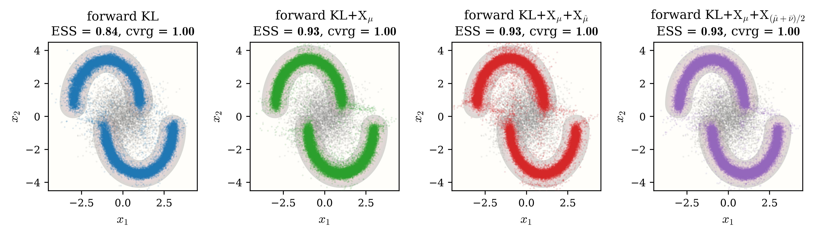
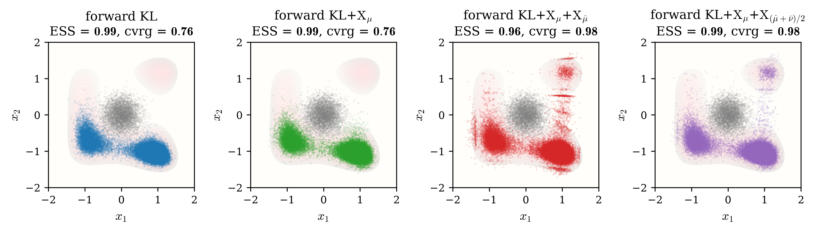
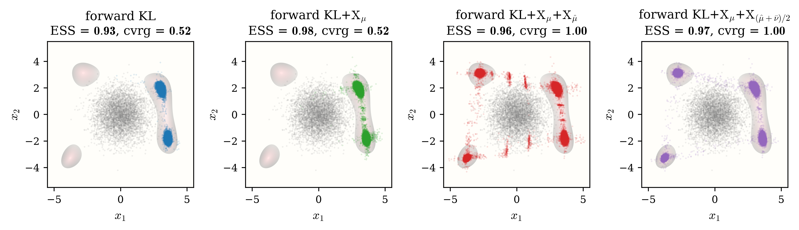
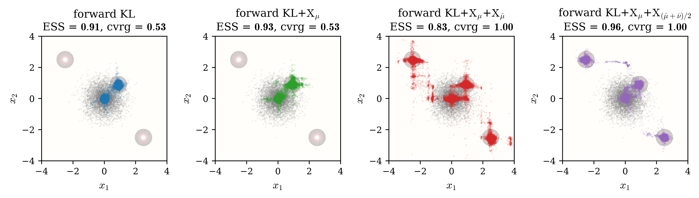

# 2D benchmarks — forward KL with log-ratio variation

Four targets isolate accuracy and mode discovery under the same family of
objectives. Two-Moon stresses small-batch fitting on distorted ridges;
Three-Well, Himmelblau, and Sparse place progressively harder modes outside
the support reached by the flow's own annealing chain. Every method starts from
the same identity NSF and is trained directly through `jflows.train`. The KLXX
runs use `pool_size=0`, so quench-and-temper acts on the complete fixed
validation population. Each ESS is computed on that full validation set.
Coverage uses an independent quench-and-temper reference set with $\kappa=5$,
exposing modes that a high support-local ESS can miss. As a k-NN estimate,
values close to one are consistent with the complete mode coverage visible in
the sample panels.

## Two-Moon

All methods cover both moons with measured coverage 1.000. KL + X_μ gives the
highest final ESS, while the equal-weight mixture is within 0.001 and remains
cleaner than the X_μ̂-only pushforward.

## Three-Well

Forward KL and KL + X_μ retain high ESS while missing the low-probability
well. Both quench-and-temper variants recover all three wells; their near-unity
coverage estimates agree with the complete coverage visible in the figures.
The equal-weight mixture retains ESS 0.989, nearly matching KL + X_μ at 0.990,
while recovering the missing well and producing the cleaner full-coverage
pushforward.

## Himmelblau

The first two objectives cover only the two right-hand wells despite ESS as
high as 0.981. Both quench-and-temper variants recover all four wells and raise
measured coverage from 0.516 to 1.000. The equal-weight mixture is cleaner than
the X_μ̂-only pushforward and raises full-coverage ESS from 0.956 to 0.974.

## Sparse

Forward KL and KL + X_μ model only the central pair. Both quench-and-temper
variants reach the isolated corner modes and raise measured coverage from
0.534 to 1.000. The equal-weight mixture suppresses much of the connecting
leakage seen in the X_μ̂-only pushforward and increases ESS from 0.826 to
0.956, the strongest result among all four methods.

## Final ESS and coverage

| Target | forward KL | KL + X_μ | KL + X_μ + X_μ̂ | KL + X_μ + X_(μ̂+ν̄)/2 |
|:---|---:|---:|---:|---:|
| Two-Moon | 0.845 (1.000) | **0.934** (1.000) | 0.927 (1.000) | 0.933 (1.000) |
| Three-Well | 0.988 (0.760) | 0.990 (0.760) | 0.961 (0.978) | **0.989** (0.977) |
| Himmelblau | 0.932 (0.516) | 0.981 (0.516) | 0.956 (1.000) | **0.974** (1.000) |
| Sparse | 0.912 (0.534) | 0.927 (0.534) | 0.826 (1.000) | **0.956** (1.000) |

*Final ESS, with $\kappa=5$ coverage in parentheses. Bold marks the highest-ESS
setting among methods whose sample panel covers every target mode. All methods
cover Two-Moon; for the other targets, a larger support-local ESS does not
override visibly missing modes.*

On Two-Moon, Three-Well, and Himmelblau, the two quench-and-temper objectives
remain in the same high-ESS range. Their sample quality differs more clearly:
the equal-weight $\mathrm{X}_{(\hat\mu+\bar\nu)/2}$ objective produces cleaner
pushforwards with less over-coverage of individual modes than the
$\mathrm{X}_{\hat\mu}$-only objective. Sparse strengthens rather than weakens
that comparison: the cleaner mixture also has substantially higher ESS.

## Verification summary

- All four full training scripts exited successfully and ended with `DONE`.
- All eight KLXX calls used `pool_size=0`; no separate training pool was
  resampled.
- All 16 final ESS/coverage pairs are finite; every reported coverage lies in
  `[0, 1]`.
- The four sample figures and four ESS-history figures were regenerated and
  visually inspected; no panel is blank or malformed. The figures confirm
  complete mode coverage for all KLXX runs, including the Three-Well runs
  whose approximate scalar coverage is slightly below one.
- The regenerated figures were compared with the backup under
  `/data/games/X-regularization_071826`; their qualitative mode-coverage
  patterns are unchanged. Fourteen of 16 coverage values match the backup
  exactly; the two Three-Well KLXX estimates changed from 0.9750 and 0.9855 to
  0.9783 and 0.9768.
- The figures and paired metrics separate calibration from discovery: a high
  ESS on reached support does not certify that every mode was found.
- Per-run logs and temporary data live below each target's `artifacts/`
  directory. The figures above are the final outputs below `results/`.
