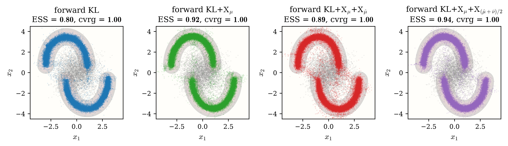
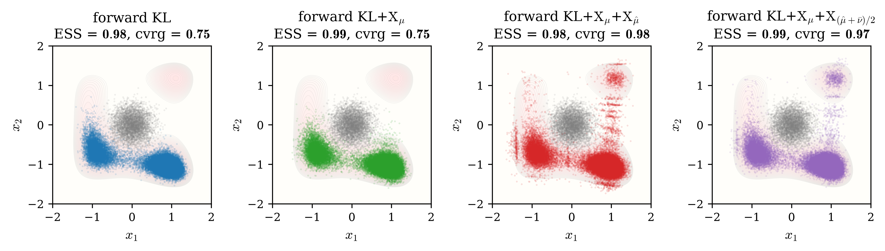
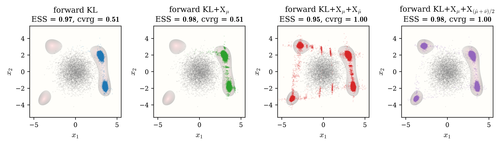
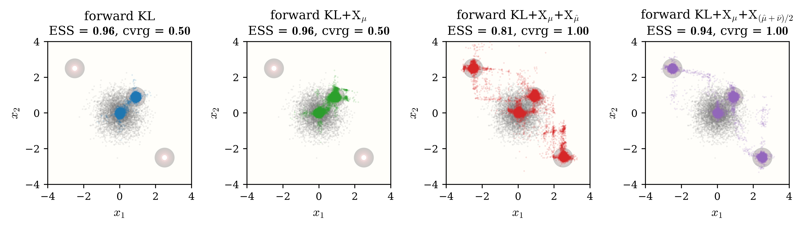

# 2D benchmarks — the X-regularized forward KL

Four 2D targets of increasing difficulty — **Two-Moon**, **Three-Well**, **Himmelblau**, **Sparse** — each trained by the same four objectives from the same identity-initialized flow, run by the `train.py` in each subfolder. The first benchmark isolates the *accuracy* mechanism: a deliberately small batch shows that $\mathrm{X}_\mu$ raises training accuracy in the small-batch regime, where the forward KL gradient is noisiest. The remaining three are *mode-collapse* benchmarks of increasing severity: Three-Well hides a low-probability well, Himmelblau spreads four well-separated wells around the source, and Sparse places two wells far outside the source's reach. In all three, the wells discovered by quench and temper feed the mixture term and train the flow to cover every mode on top of the bare forward KL — the objective's minimizer never changes.

## Common protocol

The four objectives, in every benchmark:

|      method       |                        loss                        |          driver          |
| :---------------: | :------------------------------------------------: | :----------------------: |
|    forward KL     |                  $\mathrm{KL}$                     | `train_forward_KLX_G`, `coeff_lambda = 0` |
| forward KL+$\mathrm{X}_\mu$ |          $\mathrm{KL} + \mathrm{X}_\mu$            | `train_forward_KLX_G`, `coeff_lambda = 1` |
| forward KL+$\mathrm{X}_\mu$+$\mathrm{X}_{\hat\mu}$ | $\mathrm{KL} + \mathrm{X}_\mu + \mathrm{X}_{\hat\mu}$ | `train_forward_KLXX_G`, $(\alpha, \beta) = (1, 0)$ |
| forward KL+$\mathrm{X}_\mu$+$\mathrm{X}_{(\hat\mu+\bar\nu)/2}$ | $\mathrm{KL} + \mathrm{X}_\mu + \mathrm{X}_{(\hat\mu+\bar\nu)/2}$ | `train_forward_KLXX_G`, $(\alpha, \beta) = (1/2, 1/2)$ |

- **Flow and pipeline**: NSF with 32 spline bins, 6 transforms, $(128, 128)$ conditioners, identity-initialized; target batches manufactured per step by single-rung AIS through the current flow; every Langevin kernel is MALA (`mc_adjust = True`) at `2e-3 × 50`.
- **Quench and temper**: melt scale $2.0$, armijo L-BFGS quench `0.5 × 200`. The `train_forward_KLXX_G` runs build their $\hat\mu$ pool internally per call; the coverage reference pool is built once per benchmark with a `2e-3 × 1000` temper.
- **Metrics**: the final **ESS** is the flow importance-sampling ESS on the full fixed source set — it measures density calibration *on the support the flow reaches*, and stays near $1$ even when a mode is absent. **Coverage** ($k = 5$, against the quench-and-temper reference pool) exposes exactly that failure: a missed well lowers the value by that well's share of the reference particles. The two metrics together separate "well-fitted" from "everything found".

Each subfolder's `train.py` writes `samples.png` (pushforward panels over the target energy, gray source samples for context), `ess.png` (per-step training ESS histories), and a timestamped `train_status.log`.

## Two-Moon — accuracy at small batch

Two interleaved crescent arcs, vertically stretched and pulled apart — a distorted, two-component target approximated by a Gaussian mixture with $48$ centers evenly spaced along each arc (stroke $\sigma = 0.15$, horizontal scale $2$, vertical stretch $1.4$, half-gap $0.25$).

- **Source**: Gaussian, $\sigma = 1.0$, sitting in the gap between the moons — both components lie within its reach, so no method collapses and the benchmark isolates fit quality.
- **Training**: `N_VALID = 50000`, **`N_BATCH = 200`** (deliberately small), `STEPS = 500`, `LR = 2e-3`, `N_POOL = 1000`.

|                    method                     | final ESS | coverage ($k=5$) |
| :-------------------------------------------: | :-------: | :--------------: |
|                  forward KL                   |  0.8021   |      1.0000      |
|         forward KL+$\mathrm{X}_\mu$           |  0.9157   |      1.0000      |
| forward KL+$\mathrm{X}_\mu$+$\mathrm{X}_{\hat\mu}$ |  0.8869   |      1.0000      |
| forward KL+$\mathrm{X}_\mu$+$\mathrm{X}_{(\hat\mu+\bar\nu)/2}$ |  0.9446   |      1.0000      |

At a batch of $200$ the bare forward KL gradient is noisy, and its ESS saturates near $0.80$ with visibly rough arcs; adding $\mathrm{X}_\mu$ lifts the ESS to $0.92$ at no extra flow evaluations — the pairwise term constrains the spread of the log-ratio that the mean-only objective leaves free, which is precisely the accuracy floor the small batch exposes. The equal-weight mixture adds a further increment (to $0.94$), while the $\mathrm{X}_{\hat\mu}$-only run sits slightly below. Coverage is $1$ across the board: this benchmark stresses accuracy on distorted ridges, not discovery.

## Three-Well — a low-probability well

The three-well potential $U(x) = 6\,\big((x_1^2 - 1)^2 + (x_2^2 - 1)^2 + \sin(x_1 + 2 x_2)\big)$: the quartic terms carve four basins and the $\sin$ tilt suppresses one, leaving three wells of unequal depth — one of distinctly low probability.

- **Source**: Gaussian, $\sigma = 0.25$ — far narrower than the well separation, covering no well.
- **Training**: `N_VALID = 80000`, `N_BATCH = 1000`, `STEPS = 500`, `LR = 1e-3`, `N_POOL = 4000`.

|                    method                     | final ESS | coverage ($k=5$) |
| :-------------------------------------------: | :-------: | :--------------: |
|                  forward KL                   |  0.9830   |      0.7525      |
|         forward KL+$\mathrm{X}_\mu$           |  0.9933   |      0.7525      |
| forward KL+$\mathrm{X}_\mu$+$\mathrm{X}_{\hat\mu}$ |  0.9771   |      0.9763      |
| forward KL+$\mathrm{X}_\mu$+$\mathrm{X}_{(\hat\mu+\bar\nu)/2}$ |  0.9858   |      0.9660      |

The forward KL and forward KL+$\mathrm{X}_\mu$ flows fill the two favored wells and report ESS $\geq 0.97$ while the low-probability well is silently absent — the AIS chain, initialized at the flow's own pushforward, only mixes among the wells the flow already covers, so the importance weights look benign on the reached support. Coverage exposes the miss at $0.75$. The quench discovers all three basins regardless of their probability (the optimizer sees only the geometry), and both mixture variants pull the flow onto the third well, raising coverage to $0.97$–$0.98$ at undiminished ESS.

## Himmelblau — four well-separated wells

The Himmelblau potential $U(x) = (x_1^2 + x_2 - 11)^2 + (x_1 + x_2^2 - 7)^2$: four sharp wells of equal depth at radius $\sim 3$–$4$, separated by high barriers in every direction.

- **Source**: Gaussian, $\sigma = 1.0$ at the origin — every well sits several $\sigma$ out.
- **Training**: `N_VALID = 50000`, `N_BATCH = 1000`, `STEPS = 1000`, `LR = 1e-3`, `N_POOL = 500`.

|                    method                     | final ESS | coverage ($k=5$) |
| :-------------------------------------------: | :-------: | :--------------: |
|                  forward KL                   |  0.9722   |      0.5140      |
|         forward KL+$\mathrm{X}_\mu$           |  0.9818   |      0.5140      |
| forward KL+$\mathrm{X}_\mu$+$\mathrm{X}_{\hat\mu}$ |  0.9516   |      1.0000      |
| forward KL+$\mathrm{X}_\mu$+$\mathrm{X}_{(\hat\mu+\bar\nu)/2}$ |  0.9757   |      1.0000      |

Half the target is missing: the forward KL and forward KL+$\mathrm{X}_\mu$ flows capture only the two wells on one side (coverage $0.51$) while reporting ESS near $0.98$ — the sharpest illustration that the ESS alone cannot detect collapse. Both mixture variants recover all four wells (coverage $1.0$). Between the two, the $(\hat\mu + \bar\nu)/2$ mixture is cleaner: the $\mathrm{X}_{\hat\mu}$-only run leaks thin trails of mass between the wells, and the $\bar\nu$ half — sampling the flow's own pushforward — penalizes exactly that leaked mass, closing the ESS gap ($0.95 \to 0.98$).

## Sparse — two isolated far wells

A four-mode Gaussian mixture with per-mode $\sigma = 0.08$: a dense pair at the source center ($[0, 0]$ and $[0.9, 0.9]$, easy) and two isolated modes in opposite corners ($[-2.5, 2.5]$ and $[2.5, -2.5]$), each over $5$ source standard deviations away — the source tail never reaches them, making this the most collapse-prone of the four targets.

- **Source**: Gaussian, $\sigma = 0.6$.
- **Training**: `N_VALID = 80000`, `N_BATCH = 1000`, `STEPS = 1000`, `LR = 5e-3`, `N_POOL = 4000`.

|                    method                     | final ESS | coverage ($k=5$) |
| :-------------------------------------------: | :-------: | :--------------: |
|                  forward KL                   |  0.9590   |      0.5038      |
|         forward KL+$\mathrm{X}_\mu$           |  0.9572   |      0.5038      |
| forward KL+$\mathrm{X}_\mu$+$\mathrm{X}_{\hat\mu}$ |  0.8112   |      1.0000      |
| forward KL+$\mathrm{X}_\mu$+$\mathrm{X}_{(\hat\mu+\bar\nu)/2}$ |  0.9417   |      1.0000      |

The bare forward KL gets no training signal at the corners — where the target provides no samples, the objective provides no gradient — so it collapses onto the dense pair (coverage $0.50$) with a deceptively high ESS of $0.96$; $\mathrm{X}_\mu$ alone shares the same sample source and cannot help. The quench, melted wide enough to touch every basin, places $\hat\mu$ particles on the corner modes, and both mixture variants recover them (coverage $1.0$). The corner modes are tight ($\sigma = 0.08$) and far, so covering them costs some calibration — the $\mathrm{X}_{\hat\mu}$-only run pays visibly (ESS $0.81$), while the $(\hat\mu + \bar\nu)/2$ mixture again recovers most of it ($0.94$) by suppressing the mass leaked en route to the corners.

## Reading across the four benchmarks

The coverage column tells the collapse story that the ESS column cannot: on every mode-collapse benchmark the bare forward KL reports ESS near $0.96$–$0.98$ while missing a quarter to a half of the target. The three ingredients act exactly where designed — $\mathrm{X}_\mu$ buys accuracy where the batch is small (Two-Moon, $+0.11$ ESS), $\hat\mu$ buys discovery where the source cannot reach (all three collapse benchmarks, coverage $\to 1.0$), and $\bar\nu$ buys back the calibration that aggressive discovery costs (Himmelblau and Sparse, ESS $+0.02$–$0.13$ over the $\hat\mu$-only run). The equal-weight mixture is the strongest overall setting on all four targets, recovering every mode at an ESS within $0.02$ of the best method on each benchmark.
