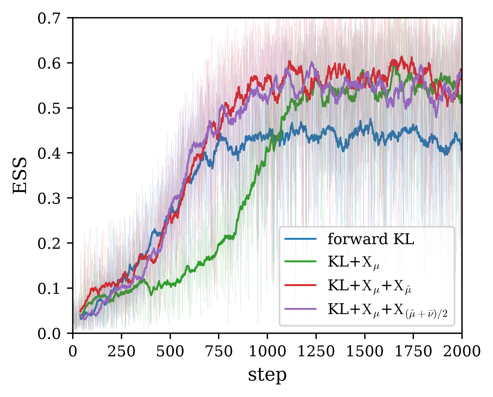

# High-dimensional product multi-well — ESS across dimension

The product multi-well on $\mathbb R^d$ with $d = 2^k$: the potential $U(x) = \frac12 \lVert x \rVert^2 + 12 \sum_{i \le k} e^{-x_i^2}$ makes the first $k$ coordinates symmetric double wells (minima at $\pm\sqrt{\ln 24}$, barrier $\approx 9.9$) and leaves the remaining $d - k$ standard Gaussian — exactly $2^k$ equal-weight modes indexed by the sign pattern of the well coordinates. Multimodality lives in a $k$-dimensional subspace while the log-weight variance loads on all $d$ coordinates, so the benchmark isolates how the final ESS scales with dimension. The dimension sweep runs $d = 2$ to $256$ under the four objectives (`train.py`); the tables are assembled from the saved `data_k*.npz` by `build_table.py`, and the per-step training ESS at the hardest dimension $d = 256$ is replotted from `data_k8.npz` by `plot_ess_k8.py`.

## Setup

- **Target**: $U(x) = \frac12 \lVert x \rVert^2 + 12 \sum_{i \le k} e^{-x_i^2}$ on $\mathbb R^{d}$, $d = 2^k$, $k = 1, \dots, 8$; source $\mathcal N(0, I_d)$.
- **Objectives**: forward KL (`train_forward_KLX_G`, `coeff_lambda = 0`); forward KL+$\mathrm{X}_\mu$ (`coeff_lambda = 1`); forward KL+$\mathrm{X}_\mu$+$\mathrm{X}_{\hat\mu}$ and forward KL+$\mathrm{X}_\mu$+$\mathrm{X}_{(\hat\mu+\bar\nu)/2}$ (`train_forward_KLXX_G`, $(\alpha, \beta) = (1, 0)$ and $(1/2, 1/2)$), all from the same identity-initialized flow.
- **Flow and training**: NSF on $[-4, 4]^d$ with 16 bins, 6 transforms, $(256, 256)$ conditioners; `N_BATCH = 250`, `STEPS = 2000`, `LR = 1e-3`, `g_clip = 1e2` at every $k$; source pool $10^4 \cdot 2^k$; single-hop AIS with MALA `2e-3 × 50`; float32 throughout.
- **Quench and temper**: pool $100 \cdot 2^k$, melt scale $2.0$, armijo L-BFGS `0.5 × 200`.
- **Metrics**: final ESS of the flow importance weights on a fresh set of $20000$ source samples; sign-pattern bucket counts of the pushforward's first $k$ coordinates give strict mode coverage (a mode counts only above half the uniform share).

## Results

| loss \ $d$ | 2 | 4 | 8 | 16 | 32 | 64 | 128 | 256 |
| :--- | :---: | :---: | :---: | :---: | :---: | :---: | :---: | :---: |
| forward KL | 0.9742 | 0.9424 | 0.9056 | 0.8778 | 0.7959 | 0.7036 | 0.6147 | 0.4201 |
| forward KL+$\mathrm{X}_\mu$ | 0.9969 | 0.9830 | 0.9581 | 0.9568 | 0.9089 | 0.8495 | 0.7436 | 0.5622 |
| forward KL+$\mathrm{X}_\mu$+$\mathrm{X}_{\hat\mu}$ | 0.9958 | 0.9832 | 0.9585 | 0.9515 | 0.9226 | 0.8751 | 0.7436 | 0.5851 |
| forward KL+$\mathrm{X}_\mu$+$\mathrm{X}_{(\hat\mu+\bar\nu)/2}$ | **0.9978** | **0.9852** | **0.9632** | **0.9602** | **0.9406** | **0.8865** | **0.7905** | **0.5955** |

Final ESS per loss and dimension (Table 1 of `tables.md`). Under the strict threshold every loss finds all $2^k$ modes at every $d$ (Table 2 of `tables.md`) — on this target the failure mode is not a lost mode but the decay of the ESS with dimension.

Per-step training ESS at $d = 256$, one color per objective: raw history (faint) and its moving average (bold). The forward KL climbs fastest over the first $\sim 500$ steps but saturates early near $0.44$; forward KL+$\mathrm{X}_\mu$ climbs more slowly — it trails forward KL through the first $\sim 750$ steps — yet keeps improving and ends higher, near $0.53$. The quench-and-temper mixtures take both halves: they track forward KL's fast early climb and continue past its plateau to the highest band ($0.55$–$0.60$), so they are as fast as forward KL early and higher than $\mathrm{X}_\mu$ at convergence.

### Reading the result

The forward KL row decays steadily with dimension, from $0.97$ at $d = 2$ to $0.42$ at $d = 256$: the per-coordinate fit error enters the log-weights additively over all $d$ coordinates, so the weight variance compounds even though every mode is found. The $\mathrm{X}_\mu$ term lifts the ESS at every dimension and the gap widens exactly where the problem hardens — $+0.15$ at $d = 64$, $+0.13$ at $d = 128$, $+0.14$ at $d = 256$ — consistent with $\mathrm{X}_\mu$ penalizing the pairwise spread of the log-weights directly. The quench-and-temper mixtures sit at the top of the table, and the equal-weight $(\hat\mu+\bar\nu)/2$ objective is the best loss at every dimension — holding $0.94$ at $d = 32$ and reaching $0.60$ at the hardest $d = 256$, a $1.4\times$ uprise over the bare forward KL. The $\mathrm{X}_{\hat\mu}$-only variant tracks it closely at the high-dimensional end but does not uniformly improve on $\mathrm{X}_\mu$.
