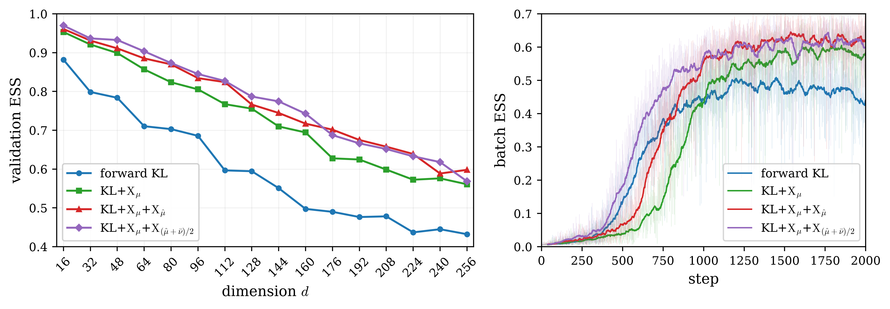

# High-dimensional product multi-well

The target is

$$
U(x)=\frac12\lVert x\rVert^2
+12\sum_{i=1}^{\lfloor\log_2 d\rfloor}e^{-x_i^2},
\qquad d=16,32,\ldots,256,
$$

so the first $\lfloor\log_2 d\rfloor$ coordinates are symmetric double wells.
The sweep contains 16 dimensions in increments of 16. Every run uses an
identity-initialized NSF with 16 bins, 6 transforms, and $(256,256)$ hidden
features; batch size 250; 2,000 optimizer steps; learning rate $10^{-3}$; and
single-level AIS with MALA step size $2\times10^{-3}$ and 50 MALA steps. The
validation population has size $5000d$, the quench-and-temper pool has size
$1000d$, and final validation ESS is computed from
$\max(200d,80000)$ independent source samples.

## Validation and batch ESS

The left panel shows validation ESS over dimension. Validation ESS decreases
with dimension for all four objectives, but every X-regularized objective
retains an obvious advantage over bare forward KL throughout the complete
sweep. At $d=256$, forward KL reaches ESS 0.4322, compared with 0.5608 for
KL+$\mathrm{X}_\mu$, 0.5979 for KL+$\mathrm{X}_\mu$+$\mathrm{X}_{\hat\mu}$,
and 0.5687 for KL+$\mathrm{X}_\mu$+$\mathrm{X}_{(\hat\mu+\bar\nu)/2}$.

The right panel shows batch ESS at $d=256$. The faint curves are raw batch-ESS
histories and the bold curves are 40-step moving averages. Bare forward KL
initially improves with the other objectives but plateaus substantially lower.
All three X-regularized objectives continue to improve, while the two KLXX
variants behave very similarly and finish at nearly the same batch ESS.

Overall, the finer dimension sweep gives the same conclusion as the earlier
experiment: X-regularization consistently mitigates the loss of ESS with
dimension, and the two KLXX objectives remain close across the tested regime.
