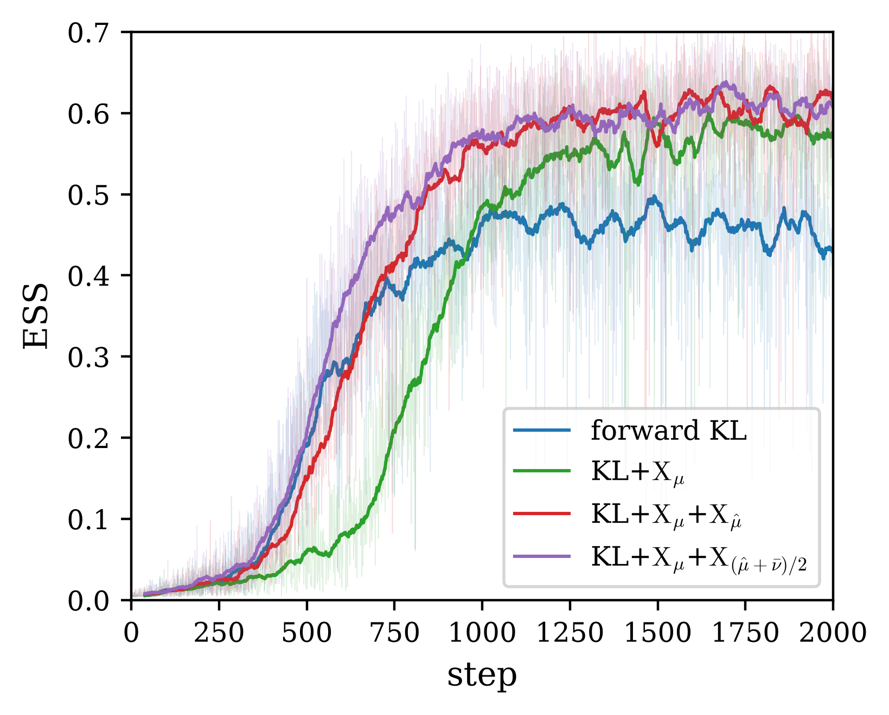

# High-dimensional product multi-well

The target is

$$
U(x)=\frac12\lVert x\rVert^2+12\sum_{i\leq k}e^{-x_i^2},
\qquad d=2^k,
$$

so its first $k$ coordinates are symmetric double wells and it has exactly
$2^k$ equal-weight modes. Every run uses an identity-initialized NSF with 16
bins, 6 transforms, and $(256,256)$ hidden features; batch size 250; 2,000
optimizer steps; learning rate $10^{-3}$; single-level AIS with MALA
$2\times10^{-3}\times50$; and 20,000 fresh source samples for final evaluation.

## Final ESS

| loss \ $d$ | 2 | 4 | 8 | 16 | 32 | 64 | 128 | 256 |
|:---|---:|---:|---:|---:|---:|---:|---:|---:|
| forward KL | 0.9601 | 0.9288 | 0.8885 | 0.8702 | 0.8081 | 0.7146 | 0.5479 | 0.3312 |
| KL + X_μ | 0.9974 | **0.9849** | 0.9565 | 0.9526 | 0.9033 | 0.8583 | 0.7533 | 0.5451 |
| KL + X_μ + X_μ̂ | 0.9970 | 0.9837 | 0.9553 | **0.9533** | 0.9263 | 0.8863 | 0.7187 | 0.5818 |
| KL + X_μ + X_(μ̂+ν̄)/2 | **0.9978** | 0.9847 | **0.9616** | 0.9521 | **0.9406** | **0.9022** | **0.7884** | **0.5834** |

*Final ESS on the product multi-well target. Every loss finds all $2^k$ modes
under the strict coverage threshold; bold marks the best ESS in each
dimension.*

The equal-weight quench-and-temper objective is strongest in the difficult
high-dimensional regime: it reaches ESS 0.7884 at $d=128$ and 0.5834 at
$d=256$, compared with 0.5479 and 0.3312 for bare forward KL.

## Mode coverage

Strict coverage uses a half-uniform-share threshold for each sign-pattern
bucket. Every method covers all $2^k$ modes at all eight dimensions.

| Method | Dimensions with full coverage |
|:---|---:|
| forward KL | 8 / 8 |
| KL + X_μ | 8 / 8 |
| KL + X_μ + X_μ̂ | 8 / 8 |
| KL + X_μ + X_(μ̂+ν̄)/2 | 8 / 8 |

## Training history at $d=256$

The faint curves are raw minibatch ESS histories and the bold curves are
40-step moving averages. Bare forward KL initially rises with the other
objectives but plateaus near 0.45. The three X-regularized objectives continue
improving, and the two quench-and-temper objectives finish around 0.60--0.62.

## Verification summary

- The full sweep from $d=256$ down to $d=2$ exited successfully and ended
  with `DONE`; the log contains no traceback or nonfinite diagnostic.
- All eight saved artifact files were checked. Every objective has a finite
  final ESS in $[0,1]$ and covers every strict sign-pattern mode.
- The final-ESS CSV and summary table were regenerated from the saved
  artifacts.
- The $d=256$ ESS-history figure was regenerated and visually inspected.
- Dimensional growth lowers importance-sampling ESS, X-regularization
  mitigates the decay, and the equal-weight objective gives the strongest
  high-dimensional results.
