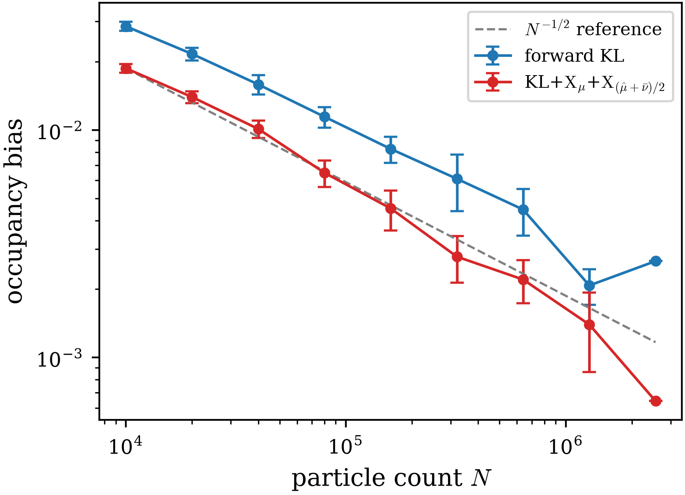

# p-state clock model — per-rung ESS on a shared ladder

The $p = 6$ clock model on the periodic $8 \times 8$ lattice, one angle per site ($d = 64$): $U(\boldsymbol\theta) = -\sum_x \big[ J \cos(\theta_x - \theta_{x+e_1}) + J \cos(\theta_x - \theta_{x+e_2}) + H \cos(p\,\theta_x) \big]$ with $J = 1$, $H = 0.5$ — the coupling aligns neighbors, the anisotropy locks each site to the six clock angles $2\pi s/6$, and the cold measure splits into $p$ symmetry-related sectors. The bridge ladder $U_t = t\,U$ starts from the uniform measure on the torus and is traversed by the annealed Boltzmann generator (run by `train.py`); every figure re-renders from saved data by its standalone `plot_*.py` script, with no retraining and no GPU.

The comparison is schedule-matched: at every batch size the bare forward KL runs the adaptive ladder (`boltzmann_forward_KL_G`, SMC pre-selection and ESS acceptance), and the X-regularized loss is then trained on the identical accepted `t_list` by the fixed-schedule driver (`boltzmann_forward_KLXX_G_fixed`, no gate, no acceptance) — the two losses see the same bridge increments, so per-rung differences reflect the loss, up to single-run fluctuation. One run per configuration.

## Setup

- **Target**: the clock potential above on $[-\pi, \pi)^{64}$; source: uniform on the torus.
- **Flow**: NCSF with 16 bins, 6 autoregressive transforms, $(256, 256)$ conditioners, identity-initialized; each stage trains the incremental map and warm-starts the next.
- **Objectives**: forward KL (`boltzmann_forward_KL_G`); forward KL+$\mathrm{X}_\mu$+$\mathrm{X}_{(\hat\mu+\bar\nu)/2}$ at the balanced hyperparameters $\lambda = 1$, $(\alpha, \beta) = (1/2, 1/2)$ (`boltzmann_forward_KLXX_G_fixed` on the kl-accepted ladder).
- **Training**: `N_VALID = 400000` particle set, `N_POOL = 100000` (SMC selection and QT pools), batch sizes $B = 2000, 1000, 500, 250, 125$ with `STEPS = 3000` Adam steps per stage at every $B$, `LR = 1e-3`, `e_clip = 1e3`, `g_clip = 1e2`; 4-rung training AIS with MALA `1e-3 × 100`; float32 throughout.
- **Adaptive ladder** (kl): `t_safe = 0.25`, SMC floor `tau_smc = 0.7`, acceptance `tau_ess = 0.4`, shrink 0.7, growth 2.0.
- **Quench and temper**: uniform melt on the torus, armijo L-BFGS `1e-2 × 100`.
- **Metrics**: validation ESS of the accepted increment on the full particle set at every rung (the acceptance-gate quantity); the per-stage sector occupancy printed live by the monitored drivers (`boltzmann.py`); and, post training, the occupancy-bias scaling of fresh staged rebuilds through the trained $B = 2000$ ladders.

## Results

Validation ESS on every accepted rung; bold marks the better loss on each rung. Within each pair the two losses traverse the same ladder; the ladder lengthens as the batch shrinks (6 rungs at $B = 2000$ and $1000$, 7 at $500$, 8 at $250$, 10 at $125$). The final column is the error-propagation factor $F = \prod_k \mathrm{ESS}_k^{-1}$ — the product of the per-rung inverse ESS, estimating the factor by which the staged reweighting enlarges the Monte Carlo error over the full ladder — where smaller is better and the bold marks the smaller $F$.

| stage $k$ | 1 | 2 | 3 | 4 | 5 | 6 | 7 | 8 | 9 | 10 | $F$ |
| :--- | :-: | :-: | :-: | :-: | :-: | :-: | :-: | :-: | :-: | :-: | :-: |
| $t_k$ ($B = 2000$) | 0.250 | 0.495 | 0.663 | 0.779 | 0.887 | 1.000 | — | — | — | — | — |
| forward KL | 0.752 | 0.572 | 0.499 | 0.506 | 0.527 | 0.630 | — | — | — | — | 27.7 |
| KL+$\mathrm{X}_\mu$+$\mathrm{X}_{(\hat\mu+\bar\nu)/2}$ | **0.919** | **0.767** | **0.643** | **0.587** | **0.578** | **0.664** | — | — | — | — | **9.8** |
| $t_k$ ($B = 1000$) | 0.250 | 0.495 | 0.663 | 0.779 | 0.887 | 1.000 | — | — | — | — | — |
| forward KL | 0.678 | 0.492 | 0.419 | 0.450 | 0.487 | 0.585 | — | — | — | — | 55.7 |
| KL+$\mathrm{X}_\mu$+$\mathrm{X}_{(\hat\mu+\bar\nu)/2}$ | **0.863** | **0.659** | **0.539** | **0.507** | **0.522** | **0.610** | — | — | — | — | **20.2** |
| $t_k$ ($B = 500$) | 0.250 | 0.421 | 0.590 | 0.705 | 0.818 | 0.945 | 1.000 | — | — | — | — |
| forward KL | 0.580 | 0.556 | 0.428 | 0.464 | 0.401 | 0.412 | 0.784 | — | — | — | 120.9 |
| KL+$\mathrm{X}_\mu$+$\mathrm{X}_{(\hat\mu+\bar\nu)/2}$ | **0.778** | **0.705** | **0.530** | **0.535** | **0.430** | **0.416** | 0.784 | — | — | — | **45.7** |
| $t_k$ ($B = 250$) | 0.250 | 0.421 | 0.539 | 0.654 | 0.734 | 0.811 | 0.887 | 1.000 | — | — | — |
| forward KL | 0.470 | 0.464 | 0.512 | 0.428 | 0.522 | 0.493 | 0.534 | 0.476 | — | — | 319.6 |
| KL+$\mathrm{X}_\mu$+$\mathrm{X}_{(\hat\mu+\bar\nu)/2}$ | **0.662** | **0.603** | **0.625** | **0.503** | **0.584** | **0.540** | **0.564** | 0.476 | — | — | **94.1** |
| $t_k$ ($B = 125$) | 0.175 | 0.295 | 0.413 | 0.528 | 0.607 | 0.685 | 0.761 | 0.835 | 0.908 | 1.000 | — |
| forward KL | 0.455 | 0.506 | 0.472 | 0.434 | 0.533 | 0.514 | **0.514** | **0.547** | **0.601** | **0.515** | 891.1 |
| KL+$\mathrm{X}_\mu$+$\mathrm{X}_{(\hat\mu+\bar\nu)/2}$ | **0.656** | **0.698** | **0.637** | **0.553** | **0.634** | **0.559** | 0.509 | 0.501 | 0.559 | 0.496 | **246.3** |

The per-rung geometric means summarize each run: forward KL $0.575, 0.512, 0.504, 0.486, 0.507$ against $\mathbf{0.684}, \mathbf{0.606}, \mathbf{0.579}, \mathbf{0.567}, \mathbf{0.577}$ for the X-regularized loss at $B = 2000, 1000, 500, 250, 125$ — a gap of $+0.07$ to $+0.11$ at every batch size. The error-propagation factor $F$ compresses each ladder to one number and tells the same story more sharply: $27.7, 55.7, 120.9, 319.6, 891.1$ for forward KL against $\mathbf{9.8}, \mathbf{20.2}, \mathbf{45.7}, \mathbf{94.1}, \mathbf{246.3}$ for the X-regularized loss — a factor $2.6$ to $3.6$ smaller at every batch size, with $F$ growing sharply for both losses as the ladder lengthens at the smaller batches.

Angle densities of the trained $B = 2000$ X-regularized sampler, from $2 \times 10^6$ fresh source draws advanced through the ladder by the full map–reweight–resample–MALA step. The single-site marginal (top) peaks at the six clock wells (guides at $k\pi/3$; the dashed line is the uniform density $\frac{1}{2\pi}$), and the pair-difference densities (bottom) at lattice offsets $(0,1)$, $(1,1)$, $(0,2)$ show an alignment peak at $0$ whose height decays with distance and a shoulder at the one-clock-step angle $\pi/3$ (dots; zoom window at the original aspect ratio) that grows as the peak decays: mass moves from the aligned well toward the neighbor wells and the tails as the sites separate.

### Occupancy-bias scaling of the staged sampler

The trained ladder is a staged sampler: each rung applies its map, reweights, resamples, and rejuvenates. Fresh sample sets of size $N = 10^4 \cdot 2^k$, $k = 0, \dots, 8$, are rebuilt through each trained $B = 2000$ ladder with $2^{8-k}$ independent rebuilds per size (equal total work, $2.56 \times 10^6$ particles per row), and each rebuild's occupancy bias $\frac{1}{6}\sum_s |p_s - \frac16|$ is recorded (`occupancy_bias_B2000.py`; the figure renders from the saved per-test data by `plot_occupancy_bias_B2000.py`).

Occupancy bias of fresh staged rebuilds versus rebuild size $N$, averaged over the independent rebuilds per size; error bars are $\pm 2$ standard errors, and the dashed line is the Monte Carlo reference $N^{-1/2}$ anchored at the smallest-$N$ X-regularized point. Both samplers contract at close to the Monte Carlo rate — fitted log–log slopes $-0.474$ (forward KL) and $-0.584$ (X-regularized) — and the X-regularized sampler carries the lower bias at every size, reaching $6.4 \times 10^{-4}$ at $N = 2.56 \times 10^6$. The largest-$N$ point of each curve is a single rebuild (no error bar) and pulls the fitted slope — the forward KL's rises above its neighbor — so the slope values carry single-rebuild fluctuation. Each curve replays the one trained ladder of its loss, so the cross-loss comparison shares the single-run caveat of the table.

### Reading the result

The X-regularized loss posts the higher validation ESS on the early and middle rungs at every batch size — up to $+0.20$ at $t \le 0.6$, where the bridge deformation is large but smooth and the training loss is plausibly the binding constraint. On the late rungs the gap closes and can reverse (the last four rungs at $B = 125$): as $t \to 1$ the sectors separate and the difficulty shifts from fitting a shape to moving mass between them, which a diffeomorphism cannot do — the reweighting common to both losses carries that redistribution, so the two behave alike. In this corner the quench-and-temper discovery, which finds the missed sectors but does not weight them correctly, can steer the X-regularized loss just below the bare forward KL; the effect is confined to $t \to 1$ at the smallest batch, and by $B \geq 1000$ the X-regularized loss again leads on every rung. At $B = 500$ and $250$ the two losses land within single-run fluctuation of each other on the final rung ($0.784$, $0.476$ to three decimals), where the shared final bridge increment and rejuvenation at $t = 1$ dominate the loss. The adaptive machinery converts the noisier small-batch training into schedule rather than failure: every ladder completes, lengthening from 6 rungs at $B = 2000$ to 10 at $B = 125$ with a smaller safe start ($0.175$), and all six sectors are found at every batch size (live monitor). Each configuration was run once, so individual rung values carry single-run fluctuation; the geometric-mean gap is consistent across all five batch sizes.
