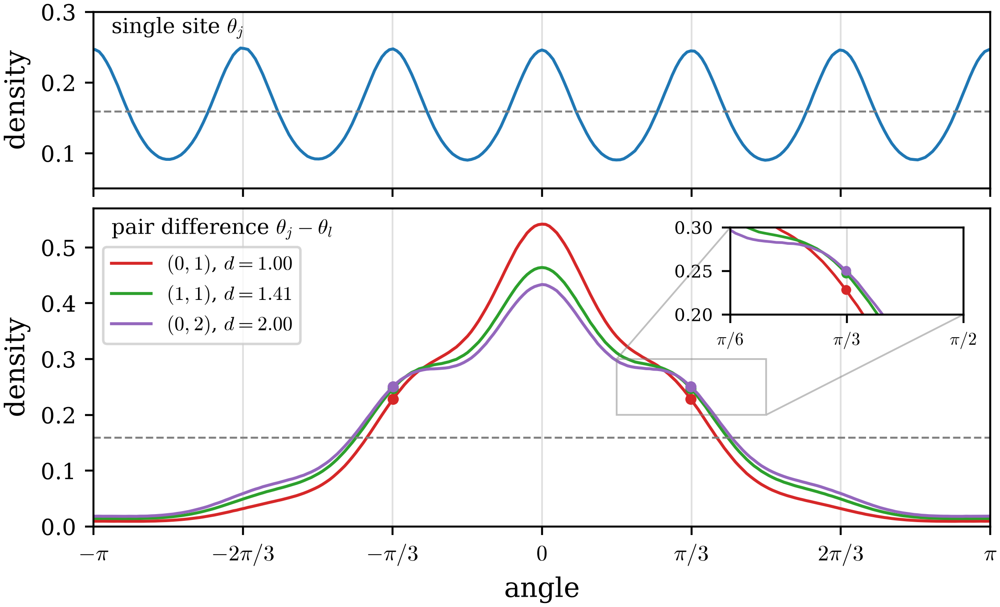
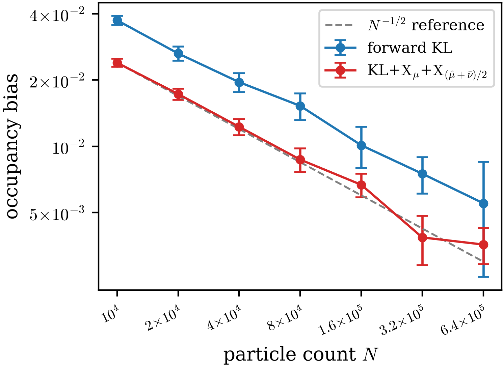

# Six-state clock Boltzmann generator

The target is the six-state clock model on a periodic $8\times8$ lattice. We
compare forward KL with
$\mathrm{KL}+\mathrm{X}_\mu+\mathrm{X}_{(\hat\mu+\bar\nu)/2}$ (KLXX) on
exactly the same accepted stage points at each batch size. Every value
below is the validation ESS over the complete validation set at one accepted stage; mini-batch monitors and
composed endpoint ESS are not used for this comparison.

## Schedule-matched validation ESS

The propagation factor is
$F=\prod_k\mathrm{ESS}_k^{-1}$, so smaller is better.

| stage $k$ | 1 | 2 | 3 | 4 | 5 | 6 | 7 | 8 | $F$ |
|:---|:---:|:---:|:---:|:---:|:---:|:---:|:---:|:---:|---:|
| $t_k$ ($B=2000$) | 0.250 | 0.495 | 0.663 | 0.779 | 0.887 | 1.000 | — | — | — |
| forward KL | 0.751 | 0.570 | 0.471 | 0.474 | 0.511 | 0.602 | — | — | 33.9 |
| KLXX | **0.921** | **0.759** | **0.608** | **0.562** | **0.558** | **0.649** | — | — | **11.6** |
| $t_k$ ($B=1000$) | 0.250 | 0.495 | 0.613 | 0.728 | 0.841 | 0.952 | 1.000 | — | — |
| forward KL | 0.672 | 0.479 | 0.580 | 0.463 | 0.427 | 0.520 | 0.830 | — | 63.0 |
| KLXX | **0.866** | **0.642** | **0.700** | **0.545** | **0.462** | **0.541** | **0.859** | — | **22.0** |
| $t_k$ ($B=500$) | 0.250 | 0.421 | 0.590 | 0.705 | 0.784 | 0.895 | 1.000 | — | — |
| forward KL | 0.580 | 0.549 | 0.408 | 0.432 | 0.525 | 0.417 | 0.530 | — | 153.5 |
| KLXX | **0.778** | **0.695** | **0.506** | **0.500** | **0.595** | **0.429** | **0.566** | — | **50.7** |
| $t_k$ ($B=250$) | 0.250 | 0.421 | 0.539 | 0.654 | 0.734 | 0.811 | 0.887 | 1.000 | — |
| forward KL | 0.468 | 0.448 | 0.495 | 0.428 | 0.506 | 0.484 | 0.514 | 0.424 | 421.2 |
| KLXX | **0.659** | **0.586** | **0.601** | **0.480** | **0.563** | **0.536** | **0.564** | **0.464** | **113.8** |

KLXX has higher validation ESS at all 28 shared stages, beating forward KL
throughout stage training for $B=2000$, $1000$, $500$, and $250$. Across these
batch sizes, KLXX reduces $F$ by factors 2.87--3.70.

## Fresh $B=2000$ staged samples

Two million fresh samples advanced through the trained KLXX stage sequence retain all
six global clock sectors. Nearest-neighbor angle differences are most
concentrated at zero; the alignment peak weakens with lattice separation while
the shoulders near $\pm\pi/3$ grow.

For the occupancy-scaling test, each row uses the same total particle work:
$N=10000\,2^k$ with $2^{8-k}$ independent rebuilds. The bias is
$\frac16\sum_{s=0}^{5}|p_s-1/6|$.

| $N$ | rebuilds | forward KL | KLXX |
|---:|---:|---:|---:|
| 10000 | 256 | 0.03735 ± 0.00090 | **0.02397 ± 0.00049** |
| 20000 | 128 | 0.02641 ± 0.00098 | **0.01728 ± 0.00050** |
| 40000 | 64 | 0.01956 ± 0.00095 | **0.01227 ± 0.00052** |
| 80000 | 32 | 0.01527 ± 0.00105 | **0.00871 ± 0.00054** |
| 160000 | 16 | 0.01012 ± 0.00107 | **0.00669 ± 0.00042** |
| 320000 | 8 | 0.00751 ± 0.00070 | **0.00386 ± 0.00049** |
| 640000 | 4 | 0.00552 ± 0.00148 | **0.00358 ± 0.00033** |

*Values are means ± one standard error. The study stops at $k=6$; the less
stable $k=7$ and $k=8$ settings are neither reported nor plotted.*

The log-log slopes over the seven reported particle counts are $-0.459$ for
forward KL and $-0.479$ for KLXX, close to the $N^{-1/2}$ Monte Carlo rate
rather than a persistent sector imbalance. KLXX has lower bias at every
reported particle count, and every reported rebuild retains all six sectors.

## Verification summary

- Every forward KL/KLXX pair uses an exactly shared accepted stage schedule.
- All per-stage values and $F$ factors were rebuilt from the live NPZ files.
- The marginal figure uses 2000000 fresh staged samples saved before plotting.
- Occupancy scaling was run as two independent method processes taking 3843
  and 3789 seconds;
  the merged archive retains every per-rebuild sector histogram and bias.
- The occupancy figure was regenerated from the merged archive and visually
  inspected; the marginal figure is unchanged.
