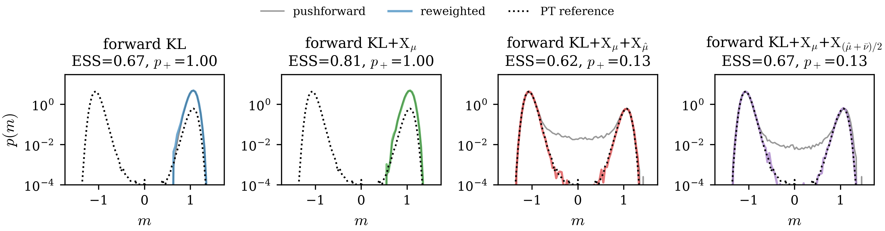

# Tilted phi^4 lattice — fake ESS at a collective barrier

The scalar $\phi^4$ field on a periodic $L \times L$ lattice, flattened to $\mathbb R^{d}$ with $d = L^2$, in the *tilted* broken $\mathbb Z_2$ phase: the lattice orders into two aligned vacua near $\pm v\,\mathbf 1$ separated by a **collective** barrier (the domain-wall free energy), and a small field $h > 0$ makes their weights unequal, so the minority-phase weight $p_+ = \mathbb P(m > 0)$ is a nontrivial number the sampler must reproduce. The order parameter is the magnetization $m(\boldsymbol\phi) = \frac1d \sum_j \phi_j$. This is the sharp fake-ESS benchmark: a flow that collapses onto one vacuum still reports a high ESS on the support it reaches, while $p_+$ comes out exactly $0$ or $1$. Four objectives, three seeds per size, run by `L6/train.py` and `L8/train.py`; figures are replotted from the saved `data.npz` by `plot_results.py`.

## Setup

- **Target**: $U(\boldsymbol\phi) = -2\kappa \sum_x \phi_x(\phi_{x+e_1} + \phi_{x+e_2}) + \sum_x \big[\phi_x^2 + \lambda(\phi_x^2 - 1)^2\big] + h \sum_x \phi_x$ with periodic neighbors; $\lambda = \tfrac12$, $\kappa = 0.40$ at both sizes; $h = 0.0257$ at $L = 6$ ($d = 36$) and $h = 0.0144$ at $L = 8$ ($d = 64$).
- **Objectives**: forward KL (`train_forward_KLX_G`, `coeff_lambda = 0`); forward KL+$\mathrm{X}_\mu$ (`coeff_lambda = 1`); forward KL+$\mathrm{X}_\mu$+$\mathrm{X}_{\hat\mu}$ and forward KL+$\mathrm{X}_\mu$+$\mathrm{X}_{(\hat\mu+\bar\nu)/2}$ (`train_forward_KLXX_G`, $(\alpha, \beta) = (1, 0)$ and $(1/2, 1/2)$), all from the same identity-initialized flow.
- **Flow and training**: NSF on $[-3, 3]^d$ with 16 bins, 6 transforms, $(256, 256)$ conditioners; source $\mathcal N(0, 0.25\,I_d)$ centered on the barrier top; `N_VALID = 100000` fixed source set (training pool + final evaluation), `N_BATCH = 500`, `STEPS = 2000`, `LR = 1e-3`, `g_clip = 1e3`; single-hop AIS with MALA `2e-3 × 50`; float32 throughout; seeds $(0, 1, 2)$.
- **Quench and temper**: pool `N_POOL = 2000`, melt scale $2.0$, armijo L-BFGS `0.1 × 200` — the small trial step keeps the quench of the stiff $d$-dimensional quartic finite in float32.
- **Reference**: computed by parallel tempering (`pt_reference.py`) — replicas span $\beta = 1$ (the target) up to a hot rung that melts the domain-wall barrier, and replica exchange carries barrier crossings down to $\beta = 1$ so the target replica visits both vacua in their correct ratio, making $p_+ = \mathbb P(m > 0)$ a direct sample fraction. It gives $p_+ = 0.125$ at $L = 6$ and $0.128$ at $L = 8$, consistent with an independent $\mathbb Z_2$-symmetry-confined MALA reweighting (`reference.py`).
- **Metrics**: final ESS of the flow importance weights on the full fixed set, and the reweighted $p_+ = \sum_{m_i > 0} \tilde w_i$; both per seed.

## Results

The final ESS and reweighted minority-phase weight $p_+$, three seeds ($s_0/s_1/s_2$) per size:

<table>
<thead>
<tr>
<th></th>
<th colspan="2">L = 6 (d = 36)</th>
<th colspan="2">L = 8 (d = 64)</th>
</tr>
<tr>
<th></th>
<th>ESS</th>
<th>$p_+$</th>
<th>ESS</th>
<th>$p_+$</th>
</tr>
</thead>
<tbody>
<tr>
<td>forward KL</td>
<td>0.78/0.82/0.82</td>
<td>1/1/0</td>
<td>0.67/0.68/0.67</td>
<td>1/0/1</td>
</tr>
<tr>
<td>forward KL+$\mathrm{X}_\mu$</td>
<td>0.93/0.93/0.94</td>
<td>1/1/0</td>
<td>0.81/0.82/0.82</td>
<td>1/0/0</td>
</tr>
<tr>
<td>forward KL+$\mathrm{X}_\mu$+$\mathrm{X}_{\hat\mu}$</td>
<td>0.88/0.87/0.87</td>
<td>0.127/0.128/0.126</td>
<td>0.62/0.61/0.63</td>
<td>0.127/0.126/0.124</td>
</tr>
<tr>
<td>forward KL+$\mathrm{X}_\mu$+$\mathrm{X}_{(\hat\mu+\bar\nu)/2}$</td>
<td>0.90/0.89/0.88</td>
<td>0.128/0.129/0.128</td>
<td>0.67/0.68/0.71</td>
<td>0.130/0.129/0.130</td>
</tr>
</tbody>
</table>

Each cell lists the three seeds ($s_0/s_1/s_2$). A $p_+$ printed as an integer $0$ or $1$ is the mode-collapse signature — the flow places all reweighted mass on one vacuum ($0$ majority, $1$ minority); a fractional triple is a recovered run that populates both vacua (the reference is $p_+ = 0.125$ at $L=6$ and $0.128$ at $L=8$).

Magnetization density $p(m)$ on the $L = 8$ lattice (seed 0), one panel per training loss: the pushforward density (gray), the reweighted density (color), and the reference (dotted); the title reports the final ESS and the reweighted $p_+$.

### Reading the result

Bare forward KL and forward KL+$\mathrm{X}_\mu$ collapse at every size and every seed: the AIS chain, initialized at the flow's own pushforward, cannot cross the collective barrier, so the loss never sees the second vacuum and the reweighted $p_+$ is exactly $0$ or $1$ — the estimated $\Delta F$ is infinite, or wrong in sign, where the truth is $\approx -1.9\,k_BT$. Which vacuum the collapse picks is unpredictable across seeds (the per-seed $0$/$1$ patterns in the table), while the fake ESS is high and reproducible — $0.93$ at $L = 6$ and $0.82$ at $L = 8$ for forward KL+$\mathrm{X}_\mu$, the *highest* ESS of the four losses at both sizes: $\mathrm{X}_\mu$ sharpens the in-well fit on the captured support, so the ESS is best exactly where the collapse is most severe.

The quench-and-temper losses repair both sizes at every seed: the quench lands in both vacua regardless of their weights, and the recovered $p_+ = 0.124$–$0.130$ sits within $0.004$ of the reference. The cost is the visible ESS gap ($0.61$–$0.71$ against $0.82$ at $L = 8$), and it has a topological reading: a diffeomorphism maps the connected Gaussian source to a connected pushforward — the strictly positive gray line across the barrier in panels 3 and 4 — so a flow covering both vacua must thread mass through the inter-phase region where the target is exponentially small, and that bridge carries near-zero weights. A collapsed flow has no bridge and a higher ESS; the ESS alone would never favor covering both vacua, and $\mathrm{X}_{\hat\mu}$ forces the discovery regardless. Between the two mixture weights, the $(\hat\mu+\bar\nu)/2$ variant buys back part of the bridge cost (ESS $0.69$ vs $0.62$ at $L = 8$): its $\bar\nu$ half penalizes exactly the leaked inter-well mass that the $\hat\mu$-only weight tolerates.
