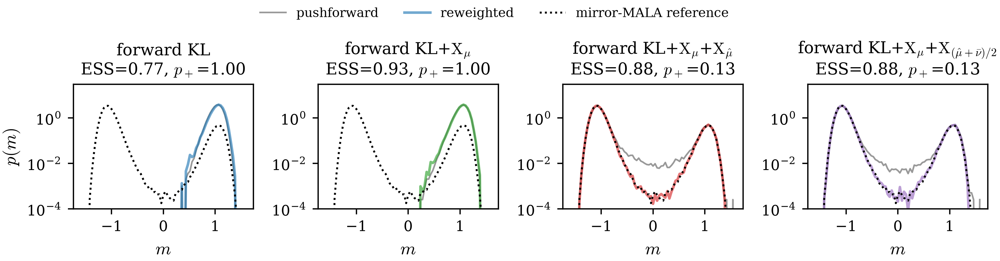
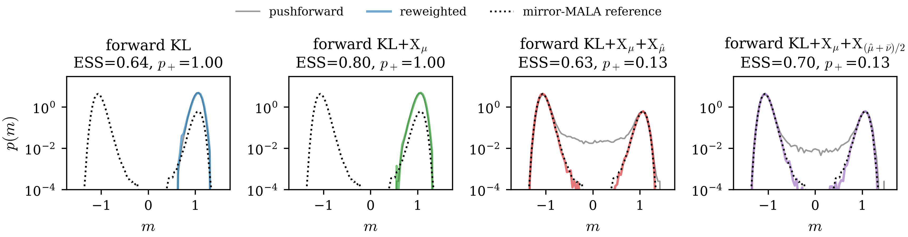

# Tilted lattice φ⁴

The target is the tilted scalar φ⁴ field on a periodic $L\times L$ lattice,

$$
U(\phi)=-2\kappa\sum_x\phi_x(\phi_{x+e_1}+\phi_{x+e_2})
+\sum_x\left[\phi_x^2+\lambda(\phi_x^2-1)^2+h\phi_x\right],
$$

with $\kappa=0.40$, $\lambda=0.50$, and a small positive field. We use
$h=0.0257$ at $L=6$ and $h=0.0144$ at $L=8$. This approximately holds the
extensive tilt fixed: $hL^2=0.9252$ and $0.9216$, respectively. Its two ordered
vacua are separated by a collective barrier. The minority-phase weight
$p_+=\mathbb P(m>0)$, where $m$ is the lattice magnetization, exposes mode
collapse that a support-local importance-sampling ESS can miss.

## Reference ensembles

Mirror-MALA samples one vacuum of
the symmetric action and uses exact Z₂ reflection plus field reweighting;
the values below are occupancies of the saved one-million-sample resampled
traces. Parallel tempering independently samples both vacua directly. The two
reference constructions are statistically consistent.

| L | d | h | Resampled mirror-MALA p₊ | PT p₊ | Barrier | PT guards |
|---:|---:|---:|---:|---:|---:|:---:|
| 6 | 36 | 0.0257 | 0.1260 | 0.1251 ± 0.0009 | 9.17 kT | PASS |
| 8 | 64 | 0.0144 | 0.1268 | 0.1284 ± 0.0014 | 11.51 kT | PASS |

*Minority-phase reference estimates for the two targets. The mirror-MALA
column is computed from the saved resampled trace; the independent reference
constructions are statistically consistent.*

The PT target replicas crossed the barrier frequently: the least-active
walker crossed 1,320 times at L=6 and 744 times at L=8. The worst adjacent
swap acceptances were 0.39 and 0.25, and the second-half estimates agreed
with the full traces.

## Training results

Every run uses an identity-initialized NSF with 16 bins, 6 transforms, and
$(256,256)$ hidden features; 100,000 fixed source particles; batch size 500;
2,000 optimizer steps; learning rate $10^{-3}$; single-level AIS with MALA
$2\times10^{-3}\times50$; and three seeds. Each cell lists seeds 0/1/2.

| Method | L=6, h=0.0257 ESS | L=6, h=0.0257 p₊ | L=8, h=0.0144 ESS | L=8, h=0.0144 p₊ |
|:---|:---:|:---:|:---:|:---:|
| forward KL | 0.7749 / 0.8232 / 0.8306 | 1 / 1 / 0 | 0.6417 / 0.6921 / 0.6629 | 1 / 0 / 1 |
| KL + X_μ | 0.9334 / 0.9336 / 0.9345 | 1 / 1 / 0 | 0.8034 / 0.8016 / 0.8182 | 1 / 0 / 0 |
| KL + X_μ + X_μ̂ | **0.8848** / 0.8704 / 0.8829 | 0.1265 / 0.1275 / 0.1263 | 0.6291 / 0.6390 / 0.6280 | 0.1258 / 0.1264 / 0.1256 |
| KL + X_μ + X_(μ̂+ν̄)/2 | 0.8844 / **0.8822 / 0.8988** | 0.1286 / 0.1281 / 0.1278 | **0.7025 / 0.6810 / 0.7042** | 0.1290 / 0.1273 / 0.1307 |
| PT reference | — | 0.1251 ± 0.0009 | — | 0.1284 ± 0.0014 |

*Final ESS and reweighted minority-phase weight $p_+$ for seeds 0/1/2. Integer
values 0 and 1 indicate collapse onto one vacuum. Bold ESS values are the
per-seed maxima among objectives that recover both phases; collapsed runs are
never eligible for emphasis, regardless of support-local ESS.*

All 12 KL/KL+Xμ runs collapse to exactly one vacuum despite their high ESS.
All 12 quench-and-temper runs cover both vacua and recover the reference
minority weight. At L=8, the equal-weight objective retains a mean ESS of
0.6959 while covering both phases, compared with 0.6320 for Xμ̂ alone.

## Magnetization densities

At L=6, the first two objectives model only one vacuum. The reweighted curves
for both quench-and-temper losses track the two-peak reference.

The higher L=8 barrier sharpens the distinction. KL+Xμ has the highest ESS
but zero support on one phase, while both coverage-pool objectives reproduce
the minority peak. The equal-weight variant reduces the low-target-density
bridge and recovers part of the ESS cost of covering both vacua.

## Verification summary

- Both 300,000-step mirror-MALA references, all 24 full training runs, both
  plotting scripts, and the two-size parallel-tempering cross-check exited
  successfully.
- All 48 saved magnetization/weight arrays have 100,000 finite entries. Every
  normalized weight vector is nonnegative and sums to one within float32
  tolerance.
- Both reference traces contain one million finite magnetizations, and both
  stored configuration sets have the expected shape.
- The two regenerated PNG files were visually inspected; no panel is blank,
  clipped, or malformed.
- Importance-sampling ESS alone can prefer a collapsed flow, whereas
  quench-and-temper coverage terms recover both phases and the correct
  minority weight.
