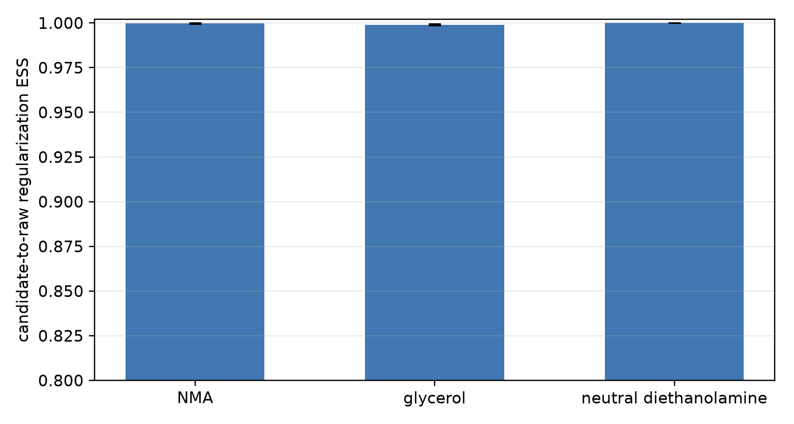

# Molecule-specific regularization choices for three achiral targets

## Recommendation

Use the following molecule-specific OpenMM regularization parameters:

| molecule | `rg_param = (e, r)` | completed full verification seeds | candidate-to-raw RESS [95% CI] |
|---|---:|---:|---:|
| NMA | `(100, 0.15)` | 2 | 0.999804703 [0.999508553, 0.999999625] |
| glycerol | `(100, 0.1)` | 2 | 0.999049750 [0.998525160, 0.999508148] |
| neutral diethanolamine | `(150, 0.1)` | 1 | 0.999999997 [0.999999997, 0.999999997] |

These choices pass the primary overlap test for the intended workflow: samples are drawn from the broader regularized candidate and sharpened to the raw singular target. Candidate-to-raw RESS is the normalized importance ESS for that direction. Reverse ESS is retained in `results/selected_metrics.json` only as an audit diagnostic; it is not a selection gate because raw samples need not efficiently represent the extra tail mass admitted by the regularized target.

They also define proper softened targets throughout the replica ladder. At the 400 K top replica, `2e/(k_B T)` is 60.136 for NMA and glycerol, exceeding dimensions 30 and 36, and 90.204 for neutral diethanolamine, exceeding dimension 48.

## Why the common `(100, 0.15)` choice was split

The original two-seed 5000-round screen found that `(100, 0.15)` is effectively identical to the raw NMA target: its 0.15 nm floor was never entered at 300 K. The same floor was too large for glycerol and neutral diethanolamine. It clipped common repulsive H--H contacts in 33.1% and 66.7% of their regularized 300 K frames, reducing candidate-to-raw RESS to 0.667695 and 0.332600, respectively.

Reducing the floor to 0.10 nm removes those sampled floor contacts. Glycerol retains `e=100`; neutral diethanolamine uses `e=150` so the high-energy softening also remains inactive on the tested 300 K ensemble. The more conservative `(200, 0.05)` candidate was therefore unnecessary.

## Selected-target diagnostics at 300 K

| molecule | modified frames | floor-entry frames | max torsion JS (bits) | max occupancy difference | energy cross-check (kJ/mol) |
|---|---:|---:|---:|---:|---:|
| NMA | 3.750e-04 | 0.000e+00 | 0.001349 | 0.004499 | 0.000e+00 |
| glycerol | 6.875e-03 | 0.000e+00 | 0.008384 | 0.088608 | 2.204e-04 |
| neutral diethanolamine | 0.000e+00 | 0.000e+00 | 0.008917 | 0.065579 | 2.962e-04 |

All reported distributional metrics use only the fixed 300 K replica after the 1000-round burn-in. The 300--400 K ladder is used only to aid mixing. NMA and glycerol each have two completed 5000-round verification seeds. Diethanolamine has one completed full verification seed (3401); seed 3402 was stopped at the user's request before any artifact was written.

## Sampling limitation

The parameter-overlap conclusion is stronger than the equilibrium-convergence conclusion. NMA's two seeds disagree on the slowly interconverting amide cis/trans mixture. Glycerol's selected chains miss the strict torsional mixing gate. The single full diethanolamine chain has candidate-to-raw RESS essentially one and passes its Markov ESS and split-R-hat checks, but its first-half/second-half marginal-state TV remains above the frozen threshold. Thus the regularization choices are supported for sharpening fidelity; formal convergence of every conformational population is not claimed.

## Reproducibility

The original common-pair settings are frozen in `config.json`; the candidate addendum is `candidate_config.json`. Complete raw and selected trajectories are under `data/production/` and `data/candidate_verification/`. Exact per-seed values, reverse-direction audit ESS, mixing statistics, signed-volume diagnostics, and artifact scope are in `results/selected_metrics.json`. The full protocol history is in `.aris/EXPERIMENT_PLAN.md`.
