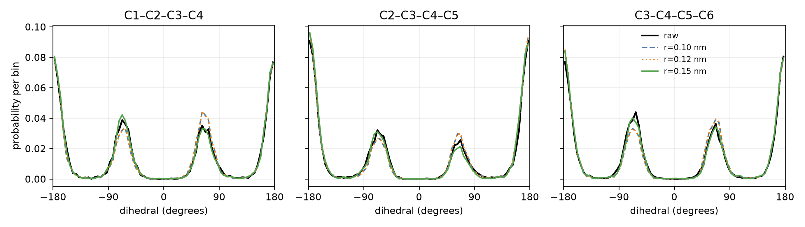

# Choosing a regularized OpenMM target for the n-alkane family

## Recommendation

Use

```text
rg_param = (100.0, 0.15)
```

as the default target for the n-alkane family through n-hexane (54 internal
dimensions). Here `e = 100 kJ/mol` is the high-energy softening scale and
`r = 0.15 nm` is the nonbonded distance floor.

Retain

```text
rg_param = (100.0, 0.12)
```

as the more conservative, closer-to-singular reserve. It follows the raw
potential more literally and still regularizes deliberately compressed
configurations strongly. There is no evidence-based reason to prefer
`r = 0.10 nm` over `r = 0.12 nm`: the two complete 5000-round, two-seed
n-hexane simulations produced bit-for-bit identical coordinates and energies,
whereas the `0.12 nm` stress-panel force attenuation was larger.

This is a practical target recommendation, not a claim that every
preregistered convergence gate passed. The direct distributional selection
evidence is for n-hexane, the largest and most torsionally complex member. New
parallel-tempering trajectories for methane through n-pentane were not run
before the study was stopped. The 10000-round raw and default chains also
remained above the deliberately strict half-window joint-rotamer TV cutoff,
even though their Markov ESS, split-R-hat, and replica-swap diagnostics passed.

## What the parameters do

The native `jflows_md.openmm` regularizer first evaluates nonbonded pair terms
at `max(distance, r)`. If the resulting energy difference from the reference
configuration is `delta`, it then uses

```text
E_regularized = E_reference + delta,                       delta <= e
E_regularized = E_reference + e + e log(delta / e),        delta > e.
```

Thus `r` removes the short-distance pair singularity and `e` softens the
remaining high-energy tail. The family-wide tail is normalizable only when
`2e/(k_B T) > d`. For `d = 54`, this requires `e > 67.35 kJ/mol` at 300 K and
`e > 89.80 kJ/mol` at the 400 K top replica. The choice `e = 100 kJ/mol`
therefore remains proper across the complete temperature ladder; smaller
values such as 25 or 50 do not.

## Native-OpenMM experiment

All dynamics, potential energies, and forces were evaluated by the
`jflows_md.openmm` OpenMM backend. No JAX molecular potential and no trained
Boltzmann generator were used. Each target used eight geometrically spaced
replicas from 300 to 400 K, a 1 fs Langevin-middle step, friction 1/ps, and 100
integration steps per exchange round. Two independent seeds used matched,
overdispersed starts generated by raw-potential 900 K Langevin dynamics.

The matched floor comparison used 5000 rounds per seed and discarded the first
1000. The raw and default `r=0.15` simulations were independently repeated at
10000 rounds per seed, again discarding 1000 rounds. Complete runs were saved
atomically with the full configuration and bundle hashes.

Raw-target importance weights on regularized frames were

```text
log w = -beta (E_raw - E_regularized).
```

The reported importance ESS is normalized to `[0,1]`; it measures target
overlap, not trajectory autocorrelation.

## Matched 5000-round floor comparison

<div align="center">

| `r` (nm) | raw-target ESS | 95% lower ESS | max JS (bits) | max occupancy error | joint rotamer TV | stress attenuation `log10(Fraw/Frg)` |
|---:|---:|---:|---:|---:|---:|---:|
| 0.10 | 0.994852 | 0.993288 | 0.006604 | 0.058239 | 0.103700 | 4.873 |
| 0.12 | 0.994852 | 0.993254 | 0.006604 | 0.058239 | 0.103700 | 6.433 |
| 0.15 | 0.995229 | 0.993854 | 0.004695 | 0.037493 | 0.107319 | 6.080 |

</div>

All three candidates have essentially unit raw-target overlap. At the matched
5000-round checkpoint, `r=0.15` has the largest ESS lower bound, the smallest
maximum marginal dihedral JS divergence, and the smallest maximum rotamer
occupancy error. Its joint-state TV is effectively tied with the smaller
floors and remains below the independent raw-versus-raw value of `0.157469`.

The stress number is a deliberately nonequilibrium diagnostic obtained by
compressing a fixed, nonbonded atom pair to distances down to 0.04 nm. It
should not be read as an equilibrium observable or expected to vary
monotonically with `r`, because the statistic is the maximum force over the
whole molecule after both pair flooring and high-energy softening.



The three panels show every n-hexane carbon-backbone torsion. All trans and
gauche modes remain present. Differences between the regularized and raw
curves are comparable to the independent raw-replicate sampling variation;
there is no visible mode deletion or artificial mode creation.

## 10000-round default confirmation

The longer `r=0.15` comparison gives:

<div align="center">

| quantity | result |
|---|---:|
| pooled raw-target importance ESS | 0.994252 |
| 95% block-bootstrap ESS interval | [0.993241, 0.995210] |
| per-seed importance ESS | 0.993779, 0.994725 |
| maximum marginal JS | 0.006548 bits |
| raw-versus-raw maximum marginal JS | 0.013932 bits |
| maximum rotamer occupancy error | 0.075216 |
| raw-versus-raw maximum occupancy difference | 0.084319 |
| joint rotamer TV | 0.107086 |
| raw-versus-raw joint rotamer TV | 0.136906 |
| maximum saved/recomputed energy error | 1.573e-5 kJ/mol |

</div>

The longer run therefore preserves the main selection conclusion: target
overlap is extremely high, all pooled dihedral discrepancies remain at or
below raw sampling noise, and the native OpenMM saved-energy cross-check is
well inside the frozen `5e-4 kJ/mol` tolerance.

The active nonbonded distance floor was never entered by a saved 300 K frame.
Across all eight replicas it was entered only about `6.5e-7` and `1.3e-6` of
active-pair observations in the two `r=0.15` runs. The larger floor therefore
acts mainly on rare high-temperature close contacts—the configurations for
which extra regularity is useful—without clipping the sampled 300 K target.

## Convergence limitation

At 10000 rounds, the raw and `r=0.15` chains had minimum torsional Markov ESS
of `177.84` and `197.31`, maximum split-R-hat of `1.01496` and `1.00944`, and
minimum adjacent-swap acceptance of `0.8214` and `0.6476`, respectively. All
of those diagnostics pass their frozen gates. The maximum first-half versus
second-half joint-rotamer TV remained `0.1857` for the raw target and `0.1998`
for the regularized target, above the preregistered `0.10` cutoff.

Because the same diagnostic fails for the raw control, it does not identify a
specific defect of `r=0.15`; it shows that the strict joint-state convergence
claim remains unresolved at this trajectory length. The cutoff was not
relaxed after observing the result. Accordingly, this report recommends a
BG target but does not claim a formal all-gates validation of the equilibrium
distribution.

## Why `0.15` is the default and `0.12` is the reserve

- `r=0.15` regularizes a wider short-distance region, yet it shows no 300 K
  clipping and no measurable loss of raw-target overlap or backbone modes.
- At the matched checkpoint, `r=0.15` is at least as faithful as the smaller
  floors by ESS, marginal JS, and occupancy error.
- `r=0.12` is closer to the raw singular potential. It is therefore the
  appropriate reserve when minimizing intervention is more important than
  maximizing protection from rare close contacts.
- `r=0.10` and `r=0.12` are empirically indistinguishable in the complete
  matched trajectories, while `r=0.12` behaves better on the controlled
  short-distance stress panel.

For subsequent Boltzmann-generator work, begin with `(100.0, 0.15)`. Use
`(100.0, 0.12)` only when a closer-to-singular target is specifically desired,
and retain raw-target reweighting and dihedral monitoring in either case.

## Evidence and reproducibility

- Frozen settings: [`config.json`](config.json)
- Experiment design and unchanged decision gates:
  [`.aris/EXPERIMENT_PLAN.md`](.aris/EXPERIMENT_PLAN.md)
- Matched floor metrics: [`results/pilot_metrics.json`](results/pilot_metrics.json)
- Longer default metrics:
  [`results/default_extended_metrics.json`](results/default_extended_metrics.json)
- Complete trajectories: `data/pilot/` and `data/pilot_extended/`
- Bundle and construction provenance: `bundle/hexane_54d/` and
  `provenance/hexane_54d/`

The interrupted 10000-round `r=0.12` attempt produced no saved or temporary
artifact. Its recommendation is based on the two complete 5000-round seeds.
