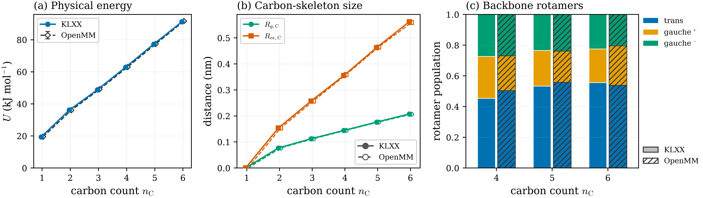

# Alkane-family ESS tables

Generated by `python build_table.py` from the accepted-stage metadata in each molecule's `artifacts` directory.

Each accepted stage reweights and resamples twice, first on the selected flow or identity proposal and then on the sharpening weight, so a run of $K$ accepted stages performs $2K$ steps. The total factor is

$$\sum_{k=0}^{2K} \prod_{j=k+1}^{2K} \operatorname{ESS}_j^{-1/2},$$

with the empty product equal to one, the steps indexed in the order the generator performs them. The sharpening step is charged on every accepted stage, because the generator resamples there whether or not the regularization path moves; on a fixed path its ESS is one and it contributes a summand but no growth. Every summand is at least one, so the factor is at least $2K+1$.

The molecule-level `1-RESS` is the ESS deficit when reweighting the final KLXX samples at `(100, 0.15)` toward the exact, unregularized molecular potential.

## Summary

<table>
<thead>
<tr><th>molecule</th><th>regularization</th><th>method</th><th>stages</th><th>total factor</th><th>total time</th></tr>
</thead>
<tbody>
<tr><td rowspan="3">methane (9d) 1-ress=0</td><td rowspan="3">raw</td><td>id</td><td>8</td><td>26.1254</td><td>1.4min</td></tr>
<tr><td>kl</td><td>3</td><td>7.46437</td><td>1.2min</td></tr>
<tr><td>klxx</td><td>3</td><td><strong>7.03325</strong></td><td>2.4min</td></tr>
<tr><td rowspan="3">ethane (18d) 1-ress=0</td><td rowspan="3">raw</td><td>id</td><td>9</td><td>50.0158</td><td>3.5min</td></tr>
<tr><td>kl</td><td>3</td><td>10.3572</td><td>1.8min</td></tr>
<tr><td>klxx</td><td>3</td><td><strong>7.30494</strong></td><td>4.1min</td></tr>
<tr><td rowspan="6">propane (27d) 1-ress=0</td><td rowspan="3">raw</td><td>id</td><td>11</td><td>93.2424</td><td>7.7min</td></tr>
<tr><td>kl</td><td>11</td><td>92.9697</td><td>13.4min</td></tr>
<tr><td>klxx</td><td>7</td><td><strong>20.0113</strong></td><td>23.0min</td></tr>
<tr><td rowspan="3">sharpening</td><td>id</td><td>10</td><td>65.0058</td><td>6.9min</td></tr>
<tr><td>kl</td><td>10</td><td>64.9916</td><td>12.1min</td></tr>
<tr><td>klxx</td><td>6</td><td><strong>19.4133</strong></td><td>18.3min</td></tr>
<tr><td rowspan="6">butane (36d) 1-ress=0</td><td rowspan="3">raw</td><td>id</td><td>12</td><td>138.579</td><td>13.3min</td></tr>
<tr><td>kl</td><td>12</td><td>138.569</td><td>20.3min</td></tr>
<tr><td>klxx</td><td>10</td><td><strong>37.486</strong></td><td>49.0min</td></tr>
<tr><td rowspan="3">sharpening</td><td>id</td><td>10</td><td>86.7459</td><td>10.8min</td></tr>
<tr><td>kl</td><td>10</td><td>86.6828</td><td>14.9min</td></tr>
<tr><td>klxx</td><td>10</td><td><strong>36.1948</strong></td><td>46.1min</td></tr>
<tr><td rowspan="6">pentane (45d) 1-ress=9.5e-6</td><td rowspan="3">raw</td><td>id</td><td>13</td><td>216.971</td><td>19.2min</td></tr>
<tr><td>kl</td><td>13</td><td>208.047</td><td>24.6min</td></tr>
<tr><td>klxx</td><td>12</td><td><strong>65.4275</strong></td><td>60.4min</td></tr>
<tr><td rowspan="3">sharpening</td><td>id</td><td>10</td><td>116.992</td><td>13.9min</td></tr>
<tr><td>kl</td><td>10</td><td>117.579</td><td>17.2min</td></tr>
<tr><td>klxx</td><td>9</td><td><strong>54.8944</strong></td><td>38.5min</td></tr>
<tr><td rowspan="6">hexane (54d) 1-ress=2.3e-5</td><td rowspan="3">raw</td><td>id</td><td>13</td><td>334.808</td><td>23.3min</td></tr>
<tr><td>kl</td><td>13</td><td>336.47</td><td>29.0min</td></tr>
<tr><td>klxx</td><td>12</td><td><strong>190.251</strong></td><td>69.9min</td></tr>
<tr><td rowspan="3">sharpening</td><td>id</td><td>10</td><td>171.251</td><td>17.4min</td></tr>
<tr><td>kl</td><td>10</td><td>170.077</td><td>22.7min</td></tr>
<tr><td>klxx</td><td>10</td><td><strong>114.492</strong></td><td>60.1min</td></tr>
</tbody>
</table>

## Direct KLXX macroscopic observables

These are unweighted sample statistics from the best completed KLXX final validation set for each molecule at `rg_param = (100, 0.15)`. No RESS resampling or reweighting is applied. The physical energy is evaluated under the raw, unregularized potential. Continuous quantities in the table are reported as mean ± thermal/sample standard deviation. `R_g,C` is the carbon-skeleton radius of gyration and `R_ee,C` is the terminal-carbon distance. Rotamer populations are pooled over all backbone C–C–C–C dihedrals, using trans when `|φ| ≥ 2π/3`.

The independent benchmark uses the native OpenMM backend on the raw potential with a 0.25 fs timestep and two seeds. Methane through propane use 300 K Langevin trajectories; butane through hexane use 300–800 K replica exchange to mix backbone rotamers. OpenMM error bars on continuous observables span the two seed means rather than treating correlated frames as independent; the rotamer bars pool both seeds. The comparison supports consistent energy and carbon-skeleton growth across the C1–C6 homologous series and agreement on the selected observables; it does not assert equality of the full distributions.

<table>
<thead>
<tr><th>molecule</th><th>benchmark</th><th>n</th><th>energy (kj/mol)</th><th>rg,c (nm)</th><th>ree,c (nm)</th><th>backbone φ</th><th>trans</th><th>gauche+</th><th>gauche−</th></tr>
</thead>
<tbody>
<tr><td>methane (9d)</td><td>raw klxx</td><td>100000</td><td>19.4 ± 5.3</td><td>0.0000 ± 0.0000</td><td>0.0000 ± 0.0000</td><td>0</td><td>—</td><td>—</td><td>—</td></tr>
<tr><td>ethane (18d)</td><td>raw klxx</td><td>120000</td><td>36.1 ± 7.6</td><td>0.0769 ± 0.0018</td><td>0.1538 ± 0.0036</td><td>0</td><td>—</td><td>—</td><td>—</td></tr>
<tr><td>propane (27d)</td><td>raw klxx</td><td>160000</td><td>48.8 ± 9.2</td><td>0.1125 ± 0.0022</td><td>0.2575 ± 0.0064</td><td>0</td><td>—</td><td>—</td><td>—</td></tr>
<tr><td>butane (36d)</td><td>sharpening klxx</td><td>200000</td><td>62.9 ± 10.7</td><td>0.1443 ± 0.0058</td><td>0.3552 ± 0.0372</td><td>1</td><td>0.453</td><td>0.274</td><td>0.273</td></tr>
<tr><td>pentane (45d)</td><td>sharpening klxx</td><td>200000</td><td>77.3 ± 12.2</td><td>0.1764 ± 0.0083</td><td>0.4628 ± 0.0439</td><td>2</td><td>0.533</td><td>0.233</td><td>0.234</td></tr>
<tr><td>hexane (54d)</td><td>sharpening klxx</td><td>200000</td><td>91.3 ± 13.3</td><td>0.2077 ± 0.0102</td><td>0.5619 ± 0.0526</td><td>3</td><td>0.556</td><td>0.220</td><td>0.225</td></tr>
</tbody>
</table>

## Methane (9D)

### Raw — ID

<table>
<thead>
<tr><th>stage</th><th>interval</th><th>step</th><th>ess</th><th>1/sqrt(ess)</th></tr>
</thead>
<tbody>
<tr><td>1</td><td>0.000000 → 0.029412</td><td>identity</td><td>0.433682</td><td>1.5185</td></tr>
<tr><td>1</td><td>0.000000 → 0.029412</td><td>sharpening</td><td>1</td><td>1</td></tr>
<tr><td>2</td><td>0.029412 → 0.073531</td><td>identity</td><td>0.448039</td><td>1.49397</td></tr>
<tr><td>2</td><td>0.029412 → 0.073531</td><td>sharpening</td><td>1</td><td>1</td></tr>
<tr><td>3</td><td>0.073531 → 0.139708</td><td>identity</td><td>0.699067</td><td>1.19603</td></tr>
<tr><td>3</td><td>0.073531 → 0.139708</td><td>sharpening</td><td>1</td><td>1</td></tr>
<tr><td>4</td><td>0.139708 → 0.238975</td><td>identity</td><td>0.80962</td><td>1.11137</td></tr>
<tr><td>4</td><td>0.139708 → 0.238975</td><td>sharpening</td><td>1</td><td>1</td></tr>
<tr><td>5</td><td>0.238975 → 0.387874</td><td>identity</td><td>0.84237</td><td>1.08955</td></tr>
<tr><td>5</td><td>0.238975 → 0.387874</td><td>sharpening</td><td>1</td><td>1</td></tr>
<tr><td>6</td><td>0.387874 → 0.611223</td><td>identity</td><td>0.856386</td><td>1.0806</td></tr>
<tr><td>6</td><td>0.387874 → 0.611223</td><td>sharpening</td><td>1</td><td>1</td></tr>
<tr><td>7</td><td>0.611223 → 0.946247</td><td>identity</td><td>0.860658</td><td>1.07792</td></tr>
<tr><td>7</td><td>0.611223 → 0.946247</td><td>sharpening</td><td>1</td><td>1</td></tr>
<tr><td>8</td><td>0.946247 → 1.000000</td><td>identity</td><td>0.996727</td><td>1.00164</td></tr>
<tr><td>8</td><td>0.946247 → 1.000000</td><td>sharpening</td><td>1</td><td>1</td></tr>
</tbody>
</table>

### Raw — KL

<table>
<thead>
<tr><th>stage</th><th>interval</th><th>step</th><th>ess</th><th>1/sqrt(ess)</th></tr>
</thead>
<tbody>
<tr><td>1</td><td>0.000000 → 0.250000</td><td>flow</td><td>0.84443</td><td>1.08822</td></tr>
<tr><td>1</td><td>0.000000 → 0.250000</td><td>sharpening</td><td>1</td><td>1</td></tr>
<tr><td>2</td><td>0.250000 → 0.625000</td><td>flow</td><td>0.91103</td><td>1.04769</td></tr>
<tr><td>2</td><td>0.250000 → 0.625000</td><td>sharpening</td><td>1</td><td>1</td></tr>
<tr><td>3</td><td>0.625000 → 1.000000</td><td>flow</td><td>0.917989</td><td>1.04371</td></tr>
<tr><td>3</td><td>0.625000 → 1.000000</td><td>sharpening</td><td>1</td><td>1</td></tr>
</tbody>
</table>

### Raw — KLXX

<table>
<thead>
<tr><th>stage</th><th>interval</th><th>step</th><th>ess</th><th>1/sqrt(ess)</th></tr>
</thead>
<tbody>
<tr><td>1</td><td>0.000000 → 0.250000</td><td>flow</td><td>0.955816</td><td>1.02285</td></tr>
<tr><td>1</td><td>0.000000 → 0.250000</td><td>sharpening</td><td>1</td><td>1</td></tr>
<tr><td>2</td><td>0.250000 → 0.625000</td><td>flow</td><td>0.994939</td><td>1.00254</td></tr>
<tr><td>2</td><td>0.250000 → 0.625000</td><td>sharpening</td><td>1</td><td>1</td></tr>
<tr><td>3</td><td>0.625000 → 1.000000</td><td>flow</td><td>0.998919</td><td>1.00054</td></tr>
<tr><td>3</td><td>0.625000 → 1.000000</td><td>sharpening</td><td>1</td><td>1</td></tr>
</tbody>
</table>

## Ethane (18D)

### Raw — ID

<table>
<thead>
<tr><th>stage</th><th>interval</th><th>step</th><th>ess</th><th>1/sqrt(ess)</th></tr>
</thead>
<tbody>
<tr><td>1</td><td>0.000000 → 0.029412</td><td>identity</td><td>0.551301</td><td>1.34681</td></tr>
<tr><td>1</td><td>0.000000 → 0.029412</td><td>sharpening</td><td>1</td><td>1</td></tr>
<tr><td>2</td><td>0.029412 → 0.060295</td><td>identity</td><td>0.405643</td><td>1.5701</td></tr>
<tr><td>2</td><td>0.029412 → 0.060295</td><td>sharpening</td><td>1</td><td>1</td></tr>
<tr><td>3</td><td>0.060295 → 0.092722</td><td>identity</td><td>0.492434</td><td>1.42504</td></tr>
<tr><td>3</td><td>0.060295 → 0.092722</td><td>sharpening</td><td>1</td><td>1</td></tr>
<tr><td>4</td><td>0.092722 → 0.141363</td><td>identity</td><td>0.609115</td><td>1.2813</td></tr>
<tr><td>4</td><td>0.092722 → 0.141363</td><td>sharpening</td><td>1</td><td>1</td></tr>
<tr><td>5</td><td>0.141363 → 0.214323</td><td>identity</td><td>0.730247</td><td>1.17021</td></tr>
<tr><td>5</td><td>0.141363 → 0.214323</td><td>sharpening</td><td>1</td><td>1</td></tr>
<tr><td>6</td><td>0.214323 → 0.323765</td><td>identity</td><td>0.752578</td><td>1.15272</td></tr>
<tr><td>6</td><td>0.214323 → 0.323765</td><td>sharpening</td><td>1</td><td>1</td></tr>
<tr><td>7</td><td>0.323765 → 0.487926</td><td>identity</td><td>0.742036</td><td>1.16088</td></tr>
<tr><td>7</td><td>0.323765 → 0.487926</td><td>sharpening</td><td>1</td><td>1</td></tr>
<tr><td>8</td><td>0.487926 → 0.734169</td><td>identity</td><td>0.719644</td><td>1.1788</td></tr>
<tr><td>8</td><td>0.487926 → 0.734169</td><td>sharpening</td><td>1</td><td>1</td></tr>
<tr><td>9</td><td>0.734169 → 1.000000</td><td>identity</td><td>0.806623</td><td>1.11343</td></tr>
<tr><td>9</td><td>0.734169 → 1.000000</td><td>sharpening</td><td>1</td><td>1</td></tr>
</tbody>
</table>

### Raw — KL

<table>
<thead>
<tr><th>stage</th><th>interval</th><th>step</th><th>ess</th><th>1/sqrt(ess)</th></tr>
</thead>
<tbody>
<tr><td>1</td><td>0.000000 → 0.250000</td><td>flow</td><td>0.440145</td><td>1.50731</td></tr>
<tr><td>1</td><td>0.000000 → 0.250000</td><td>sharpening</td><td>1</td><td>1</td></tr>
<tr><td>2</td><td>0.250000 → 0.625000</td><td>flow</td><td>0.556554</td><td>1.34044</td></tr>
<tr><td>2</td><td>0.250000 → 0.625000</td><td>sharpening</td><td>1</td><td>1</td></tr>
<tr><td>3</td><td>0.625000 → 1.000000</td><td>flow</td><td>0.642979</td><td>1.2471</td></tr>
<tr><td>3</td><td>0.625000 → 1.000000</td><td>sharpening</td><td>1</td><td>1</td></tr>
</tbody>
</table>

### Raw — KLXX

<table>
<thead>
<tr><th>stage</th><th>interval</th><th>step</th><th>ess</th><th>1/sqrt(ess)</th></tr>
</thead>
<tbody>
<tr><td>1</td><td>0.000000 → 0.250000</td><td>flow</td><td>0.76164</td><td>1.14584</td></tr>
<tr><td>1</td><td>0.000000 → 0.250000</td><td>sharpening</td><td>1</td><td>1</td></tr>
<tr><td>2</td><td>0.250000 → 0.625000</td><td>flow</td><td>0.950338</td><td>1.0258</td></tr>
<tr><td>2</td><td>0.250000 → 0.625000</td><td>sharpening</td><td>1</td><td>1</td></tr>
<tr><td>3</td><td>0.625000 → 1.000000</td><td>flow</td><td>0.970828</td><td>1.01491</td></tr>
<tr><td>3</td><td>0.625000 → 1.000000</td><td>sharpening</td><td>1</td><td>1</td></tr>
</tbody>
</table>

## Propane (27D)

### Raw — ID

<table>
<thead>
<tr><th>stage</th><th>interval</th><th>step</th><th>ess</th><th>1/sqrt(ess)</th></tr>
</thead>
<tbody>
<tr><td>1</td><td>0.000000 → 0.034300</td><td>identity</td><td>0.552666</td><td>1.34514</td></tr>
<tr><td>1</td><td>0.000000 → 0.034300</td><td>sharpening</td><td>1</td><td>1</td></tr>
<tr><td>2</td><td>0.034300 → 0.059510</td><td>identity</td><td>0.625423</td><td>1.26448</td></tr>
<tr><td>2</td><td>0.034300 → 0.059510</td><td>sharpening</td><td>1</td><td>1</td></tr>
<tr><td>3</td><td>0.059510 → 0.085982</td><td>identity</td><td>0.490822</td><td>1.42737</td></tr>
<tr><td>3</td><td>0.059510 → 0.085982</td><td>sharpening</td><td>1</td><td>1</td></tr>
<tr><td>4</td><td>0.085982 → 0.113776</td><td>identity</td><td>0.507032</td><td>1.40437</td></tr>
<tr><td>4</td><td>0.085982 → 0.113776</td><td>sharpening</td><td>1</td><td>1</td></tr>
<tr><td>5</td><td>0.113776 → 0.155468</td><td>identity</td><td>0.550924</td><td>1.34727</td></tr>
<tr><td>5</td><td>0.113776 → 0.155468</td><td>sharpening</td><td>1</td><td>1</td></tr>
<tr><td>6</td><td>0.155468 → 0.218006</td><td>identity</td><td>0.673069</td><td>1.21891</td></tr>
<tr><td>6</td><td>0.155468 → 0.218006</td><td>sharpening</td><td>1</td><td>1</td></tr>
<tr><td>7</td><td>0.218006 → 0.311812</td><td>identity</td><td>0.697904</td><td>1.19702</td></tr>
<tr><td>7</td><td>0.218006 → 0.311812</td><td>sharpening</td><td>1</td><td>1</td></tr>
<tr><td>8</td><td>0.311812 → 0.452522</td><td>identity</td><td>0.667824</td><td>1.22368</td></tr>
<tr><td>8</td><td>0.311812 → 0.452522</td><td>sharpening</td><td>1</td><td>1</td></tr>
<tr><td>9</td><td>0.452522 → 0.663588</td><td>identity</td><td>0.626293</td><td>1.2636</td></tr>
<tr><td>9</td><td>0.452522 → 0.663588</td><td>sharpening</td><td>1</td><td>1</td></tr>
<tr><td>10</td><td>0.663588 → 0.980185</td><td>identity</td><td>0.588736</td><td>1.30329</td></tr>
<tr><td>10</td><td>0.663588 → 0.980185</td><td>sharpening</td><td>1</td><td>1</td></tr>
<tr><td>11</td><td>0.980185 → 1.000000</td><td>identity</td><td>0.998098</td><td>1.00095</td></tr>
<tr><td>11</td><td>0.980185 → 1.000000</td><td>sharpening</td><td>1</td><td>1</td></tr>
</tbody>
</table>

### Raw — KL

<table>
<thead>
<tr><th>stage</th><th>interval</th><th>step</th><th>ess</th><th>1/sqrt(ess)</th></tr>
</thead>
<tbody>
<tr><td>1</td><td>0.000000 → 0.034300</td><td>flow</td><td>0.552666</td><td>1.34514</td></tr>
<tr><td>1</td><td>0.000000 → 0.034300</td><td>sharpening</td><td>1</td><td>1</td></tr>
<tr><td>2</td><td>0.034300 → 0.059510</td><td>flow</td><td>0.625452</td><td>1.26445</td></tr>
<tr><td>2</td><td>0.034300 → 0.059510</td><td>sharpening</td><td>1</td><td>1</td></tr>
<tr><td>3</td><td>0.059510 → 0.085982</td><td>flow</td><td>0.486744</td><td>1.43334</td></tr>
<tr><td>3</td><td>0.059510 → 0.085982</td><td>sharpening</td><td>1</td><td>1</td></tr>
<tr><td>4</td><td>0.085982 → 0.113776</td><td>flow</td><td>0.509051</td><td>1.40158</td></tr>
<tr><td>4</td><td>0.085982 → 0.113776</td><td>sharpening</td><td>1</td><td>1</td></tr>
<tr><td>5</td><td>0.113776 → 0.155468</td><td>flow</td><td>0.553009</td><td>1.34473</td></tr>
<tr><td>5</td><td>0.113776 → 0.155468</td><td>sharpening</td><td>1</td><td>1</td></tr>
<tr><td>6</td><td>0.155468 → 0.218006</td><td>flow</td><td>0.674416</td><td>1.21769</td></tr>
<tr><td>6</td><td>0.155468 → 0.218006</td><td>sharpening</td><td>1</td><td>1</td></tr>
<tr><td>7</td><td>0.218006 → 0.311812</td><td>flow</td><td>0.697742</td><td>1.19716</td></tr>
<tr><td>7</td><td>0.218006 → 0.311812</td><td>sharpening</td><td>1</td><td>1</td></tr>
<tr><td>8</td><td>0.311812 → 0.452522</td><td>flow</td><td>0.669706</td><td>1.22196</td></tr>
<tr><td>8</td><td>0.311812 → 0.452522</td><td>sharpening</td><td>1</td><td>1</td></tr>
<tr><td>9</td><td>0.452522 → 0.663588</td><td>flow</td><td>0.626668</td><td>1.26323</td></tr>
<tr><td>9</td><td>0.452522 → 0.663588</td><td>sharpening</td><td>1</td><td>1</td></tr>
<tr><td>10</td><td>0.663588 → 0.980185</td><td>flow</td><td>0.589017</td><td>1.30298</td></tr>
<tr><td>10</td><td>0.663588 → 0.980185</td><td>sharpening</td><td>1</td><td>1</td></tr>
<tr><td>11</td><td>0.980185 → 1.000000</td><td>flow</td><td>0.998083</td><td>1.00096</td></tr>
<tr><td>11</td><td>0.980185 → 1.000000</td><td>sharpening</td><td>1</td><td>1</td></tr>
</tbody>
</table>

### Raw — KLXX

<table>
<thead>
<tr><th>stage</th><th>interval</th><th>step</th><th>ess</th><th>1/sqrt(ess)</th></tr>
</thead>
<tbody>
<tr><td>1</td><td>0.000000 → 0.070000</td><td>flow</td><td>0.547959</td><td>1.35091</td></tr>
<tr><td>1</td><td>0.000000 → 0.070000</td><td>sharpening</td><td>1</td><td>1</td></tr>
<tr><td>2</td><td>0.070000 → 0.121450</td><td>flow</td><td>0.419072</td><td>1.54474</td></tr>
<tr><td>2</td><td>0.070000 → 0.121450</td><td>sharpening</td><td>1</td><td>1</td></tr>
<tr><td>3</td><td>0.121450 → 0.198625</td><td>flow</td><td>0.680887</td><td>1.21189</td></tr>
<tr><td>3</td><td>0.121450 → 0.198625</td><td>sharpening</td><td>1</td><td>1</td></tr>
<tr><td>4</td><td>0.198625 → 0.314388</td><td>flow</td><td>0.93679</td><td>1.03319</td></tr>
<tr><td>4</td><td>0.198625 → 0.314388</td><td>sharpening</td><td>1</td><td>1</td></tr>
<tr><td>5</td><td>0.314388 → 0.488031</td><td>flow</td><td>0.958519</td><td>1.02141</td></tr>
<tr><td>5</td><td>0.314388 → 0.488031</td><td>sharpening</td><td>1</td><td>1</td></tr>
<tr><td>6</td><td>0.488031 → 0.748497</td><td>flow</td><td>0.949287</td><td>1.02636</td></tr>
<tr><td>6</td><td>0.488031 → 0.748497</td><td>sharpening</td><td>1</td><td>1</td></tr>
<tr><td>7</td><td>0.748497 → 1.000000</td><td>flow</td><td>0.969603</td><td>1.01555</td></tr>
<tr><td>7</td><td>0.748497 → 1.000000</td><td>sharpening</td><td>1</td><td>1</td></tr>
</tbody>
</table>

### Sharpening — ID

<table>
<thead>
<tr><th>stage</th><th>interval</th><th>step</th><th>ess</th><th>1/sqrt(ess)</th></tr>
</thead>
<tbody>
<tr><td>1</td><td>0.000000 → 0.070000</td><td>identity</td><td>0.517955</td><td>1.38949</td></tr>
<tr><td>1</td><td>0.000000 → 0.070000</td><td>sharpening</td><td>0.997002</td><td>1.0015</td></tr>
<tr><td>2</td><td>0.070000 → 0.121450</td><td>identity</td><td>0.51771</td><td>1.38981</td></tr>
<tr><td>2</td><td>0.070000 → 0.121450</td><td>sharpening</td><td>0.991325</td><td>1.00437</td></tr>
<tr><td>3</td><td>0.121450 → 0.159266</td><td>identity</td><td>0.583629</td><td>1.30898</td></tr>
<tr><td>3</td><td>0.121450 → 0.159266</td><td>sharpening</td><td>0.988791</td><td>1.00565</td></tr>
<tr><td>4</td><td>0.159266 → 0.198972</td><td>identity</td><td>0.57516</td><td>1.31858</td></tr>
<tr><td>4</td><td>0.159266 → 0.198972</td><td>sharpening</td><td>0.98618</td><td>1.00698</td></tr>
<tr><td>5</td><td>0.198972 → 0.258532</td><td>identity</td><td>0.596362</td><td>1.29493</td></tr>
<tr><td>5</td><td>0.198972 → 0.258532</td><td>sharpening</td><td>0.989042</td><td>1.00552</td></tr>
<tr><td>6</td><td>0.258532 → 0.347872</td><td>identity</td><td>0.697474</td><td>1.19739</td></tr>
<tr><td>6</td><td>0.258532 → 0.347872</td><td>sharpening</td><td>0.996153</td><td>1.00193</td></tr>
<tr><td>7</td><td>0.347872 → 0.481881</td><td>identity</td><td>0.710429</td><td>1.18642</td></tr>
<tr><td>7</td><td>0.347872 → 0.481881</td><td>sharpening</td><td>0.999443</td><td>1.00028</td></tr>
<tr><td>8</td><td>0.481881 → 0.682896</td><td>identity</td><td>0.668812</td><td>1.22278</td></tr>
<tr><td>8</td><td>0.481881 → 0.682896</td><td>sharpening</td><td>0.999981</td><td>1.00001</td></tr>
<tr><td>9</td><td>0.682896 → 0.984417</td><td>identity</td><td>0.623361</td><td>1.26657</td></tr>
<tr><td>9</td><td>0.682896 → 0.984417</td><td>sharpening</td><td>1</td><td>1</td></tr>
<tr><td>10</td><td>0.984417 → 1.000000</td><td>identity</td><td>0.998811</td><td>1.0006</td></tr>
<tr><td>10</td><td>0.984417 → 1.000000</td><td>sharpening</td><td>1</td><td>1</td></tr>
</tbody>
</table>

### Sharpening — KL

<table>
<thead>
<tr><th>stage</th><th>interval</th><th>step</th><th>ess</th><th>1/sqrt(ess)</th></tr>
</thead>
<tbody>
<tr><td>1</td><td>0.000000 → 0.070000</td><td>flow</td><td>0.517955</td><td>1.38949</td></tr>
<tr><td>1</td><td>0.000000 → 0.070000</td><td>sharpening</td><td>0.997002</td><td>1.0015</td></tr>
<tr><td>2</td><td>0.070000 → 0.121450</td><td>flow</td><td>0.51771</td><td>1.38981</td></tr>
<tr><td>2</td><td>0.070000 → 0.121450</td><td>sharpening</td><td>0.991325</td><td>1.00437</td></tr>
<tr><td>3</td><td>0.121450 → 0.159266</td><td>flow</td><td>0.58243</td><td>1.31032</td></tr>
<tr><td>3</td><td>0.121450 → 0.159266</td><td>sharpening</td><td>0.988734</td><td>1.00568</td></tr>
<tr><td>4</td><td>0.159266 → 0.198972</td><td>flow</td><td>0.57741</td><td>1.31601</td></tr>
<tr><td>4</td><td>0.159266 → 0.198972</td><td>sharpening</td><td>0.986256</td><td>1.00694</td></tr>
<tr><td>5</td><td>0.198972 → 0.258532</td><td>flow</td><td>0.597975</td><td>1.29318</td></tr>
<tr><td>5</td><td>0.198972 → 0.258532</td><td>sharpening</td><td>0.988968</td><td>1.00556</td></tr>
<tr><td>6</td><td>0.258532 → 0.347872</td><td>flow</td><td>0.697222</td><td>1.19761</td></tr>
<tr><td>6</td><td>0.258532 → 0.347872</td><td>sharpening</td><td>0.996118</td><td>1.00195</td></tr>
<tr><td>7</td><td>0.347872 → 0.481881</td><td>flow</td><td>0.709727</td><td>1.18701</td></tr>
<tr><td>7</td><td>0.347872 → 0.481881</td><td>sharpening</td><td>0.999497</td><td>1.00025</td></tr>
<tr><td>8</td><td>0.481881 → 0.682896</td><td>flow</td><td>0.669014</td><td>1.22259</td></tr>
<tr><td>8</td><td>0.481881 → 0.682896</td><td>sharpening</td><td>0.999992</td><td>1</td></tr>
<tr><td>9</td><td>0.682896 → 0.984417</td><td>flow</td><td>0.621979</td><td>1.26798</td></tr>
<tr><td>9</td><td>0.682896 → 0.984417</td><td>sharpening</td><td>0.999998</td><td>1</td></tr>
<tr><td>10</td><td>0.984417 → 1.000000</td><td>flow</td><td>0.998816</td><td>1.00059</td></tr>
<tr><td>10</td><td>0.984417 → 1.000000</td><td>sharpening</td><td>1</td><td>1</td></tr>
</tbody>
</table>

### Sharpening — KLXX

<table>
<thead>
<tr><th>stage</th><th>interval</th><th>step</th><th>ess</th><th>1/sqrt(ess)</th></tr>
</thead>
<tbody>
<tr><td>1</td><td>0.000000 → 0.100000</td><td>flow</td><td>0.74513</td><td>1.15847</td></tr>
<tr><td>1</td><td>0.000000 → 0.100000</td><td>sharpening</td><td>0.983438</td><td>1.00839</td></tr>
<tr><td>2</td><td>0.100000 → 0.173500</td><td>flow</td><td>0.525911</td><td>1.37894</td></tr>
<tr><td>2</td><td>0.100000 → 0.173500</td><td>sharpening</td><td>0.950788</td><td>1.02555</td></tr>
<tr><td>3</td><td>0.173500 → 0.283750</td><td>flow</td><td>0.450171</td><td>1.49043</td></tr>
<tr><td>3</td><td>0.173500 → 0.283750</td><td>sharpening</td><td>0.974674</td><td>1.01291</td></tr>
<tr><td>4</td><td>0.283750 → 0.449125</td><td>flow</td><td>0.89186</td><td>1.05889</td></tr>
<tr><td>4</td><td>0.283750 → 0.449125</td><td>sharpening</td><td>0.998313</td><td>1.00084</td></tr>
<tr><td>5</td><td>0.449125 → 0.697187</td><td>flow</td><td>0.94209</td><td>1.03028</td></tr>
<tr><td>5</td><td>0.449125 → 0.697187</td><td>sharpening</td><td>0.999983</td><td>1.00001</td></tr>
<tr><td>6</td><td>0.697187 → 1.000000</td><td>flow</td><td>0.953443</td><td>1.02412</td></tr>
<tr><td>6</td><td>0.697187 → 1.000000</td><td>sharpening</td><td>1</td><td>1</td></tr>
</tbody>
</table>

## Butane (36D)

### Raw — ID

<table>
<thead>
<tr><th>stage</th><th>interval</th><th>step</th><th>ess</th><th>1/sqrt(ess)</th></tr>
</thead>
<tbody>
<tr><td>1</td><td>0.000000 → 0.034300</td><td>identity</td><td>0.621024</td><td>1.26895</td></tr>
<tr><td>1</td><td>0.000000 → 0.034300</td><td>sharpening</td><td>1</td><td>1</td></tr>
<tr><td>2</td><td>0.034300 → 0.067914</td><td>identity</td><td>0.539684</td><td>1.36123</td></tr>
<tr><td>2</td><td>0.034300 → 0.067914</td><td>sharpening</td><td>1</td><td>1</td></tr>
<tr><td>3</td><td>0.067914 → 0.090973</td><td>identity</td><td>0.671268</td><td>1.22054</td></tr>
<tr><td>3</td><td>0.067914 → 0.090973</td><td>sharpening</td><td>1</td><td>1</td></tr>
<tr><td>4</td><td>0.090973 → 0.113571</td><td>identity</td><td>0.589756</td><td>1.30216</td></tr>
<tr><td>4</td><td>0.090973 → 0.113571</td><td>sharpening</td><td>1</td><td>1</td></tr>
<tr><td>5</td><td>0.113571 → 0.145208</td><td>identity</td><td>0.40715</td><td>1.56719</td></tr>
<tr><td>5</td><td>0.113571 → 0.145208</td><td>sharpening</td><td>1</td><td>1</td></tr>
<tr><td>6</td><td>0.145208 → 0.189501</td><td>identity</td><td>0.502343</td><td>1.41091</td></tr>
<tr><td>6</td><td>0.145208 → 0.189501</td><td>sharpening</td><td>1</td><td>1</td></tr>
<tr><td>7</td><td>0.189501 → 0.251510</td><td>identity</td><td>0.651989</td><td>1.23845</td></tr>
<tr><td>7</td><td>0.189501 → 0.251510</td><td>sharpening</td><td>1</td><td>1</td></tr>
<tr><td>8</td><td>0.251510 → 0.338322</td><td>identity</td><td>0.687832</td><td>1.20575</td></tr>
<tr><td>8</td><td>0.251510 → 0.338322</td><td>sharpening</td><td>1</td><td>1</td></tr>
<tr><td>9</td><td>0.338322 → 0.459860</td><td>identity</td><td>0.66761</td><td>1.22388</td></tr>
<tr><td>9</td><td>0.338322 → 0.459860</td><td>sharpening</td><td>1</td><td>1</td></tr>
<tr><td>10</td><td>0.459860 → 0.630012</td><td>identity</td><td>0.631332</td><td>1.25855</td></tr>
<tr><td>10</td><td>0.459860 → 0.630012</td><td>sharpening</td><td>1</td><td>1</td></tr>
<tr><td>11</td><td>0.630012 → 0.868226</td><td>identity</td><td>0.598025</td><td>1.29312</td></tr>
<tr><td>11</td><td>0.630012 → 0.868226</td><td>sharpening</td><td>1</td><td>1</td></tr>
<tr><td>12</td><td>0.868226 → 1.000000</td><td>identity</td><td>0.887524</td><td>1.06148</td></tr>
<tr><td>12</td><td>0.868226 → 1.000000</td><td>sharpening</td><td>1</td><td>1</td></tr>
</tbody>
</table>

### Raw — KL

<table>
<thead>
<tr><th>stage</th><th>interval</th><th>step</th><th>ess</th><th>1/sqrt(ess)</th></tr>
</thead>
<tbody>
<tr><td>1</td><td>0.000000 → 0.034300</td><td>flow</td><td>0.621024</td><td>1.26895</td></tr>
<tr><td>1</td><td>0.000000 → 0.034300</td><td>sharpening</td><td>1</td><td>1</td></tr>
<tr><td>2</td><td>0.034300 → 0.067914</td><td>flow</td><td>0.539683</td><td>1.36123</td></tr>
<tr><td>2</td><td>0.034300 → 0.067914</td><td>sharpening</td><td>1</td><td>1</td></tr>
<tr><td>3</td><td>0.067914 → 0.090973</td><td>flow</td><td>0.671496</td><td>1.22033</td></tr>
<tr><td>3</td><td>0.067914 → 0.090973</td><td>sharpening</td><td>1</td><td>1</td></tr>
<tr><td>4</td><td>0.090973 → 0.113571</td><td>flow</td><td>0.592928</td><td>1.29867</td></tr>
<tr><td>4</td><td>0.090973 → 0.113571</td><td>sharpening</td><td>1</td><td>1</td></tr>
<tr><td>5</td><td>0.113571 → 0.145208</td><td>flow</td><td>0.404902</td><td>1.57154</td></tr>
<tr><td>5</td><td>0.113571 → 0.145208</td><td>sharpening</td><td>1</td><td>1</td></tr>
<tr><td>6</td><td>0.145208 → 0.189501</td><td>flow</td><td>0.50191</td><td>1.41152</td></tr>
<tr><td>6</td><td>0.145208 → 0.189501</td><td>sharpening</td><td>1</td><td>1</td></tr>
<tr><td>7</td><td>0.189501 → 0.251510</td><td>flow</td><td>0.651674</td><td>1.23875</td></tr>
<tr><td>7</td><td>0.189501 → 0.251510</td><td>sharpening</td><td>1</td><td>1</td></tr>
<tr><td>8</td><td>0.251510 → 0.338322</td><td>flow</td><td>0.687466</td><td>1.20608</td></tr>
<tr><td>8</td><td>0.251510 → 0.338322</td><td>sharpening</td><td>1</td><td>1</td></tr>
<tr><td>9</td><td>0.338322 → 0.459860</td><td>flow</td><td>0.667473</td><td>1.22401</td></tr>
<tr><td>9</td><td>0.338322 → 0.459860</td><td>sharpening</td><td>1</td><td>1</td></tr>
<tr><td>10</td><td>0.459860 → 0.630012</td><td>flow</td><td>0.631</td><td>1.25888</td></tr>
<tr><td>10</td><td>0.459860 → 0.630012</td><td>sharpening</td><td>1</td><td>1</td></tr>
<tr><td>11</td><td>0.630012 → 0.868226</td><td>flow</td><td>0.599375</td><td>1.29167</td></tr>
<tr><td>11</td><td>0.630012 → 0.868226</td><td>sharpening</td><td>1</td><td>1</td></tr>
<tr><td>12</td><td>0.868226 → 1.000000</td><td>flow</td><td>0.888183</td><td>1.06108</td></tr>
<tr><td>12</td><td>0.868226 → 1.000000</td><td>sharpening</td><td>1</td><td>1</td></tr>
</tbody>
</table>

### Raw — KLXX

<table>
<thead>
<tr><th>stage</th><th>interval</th><th>step</th><th>ess</th><th>1/sqrt(ess)</th></tr>
</thead>
<tbody>
<tr><td>1</td><td>0.000000 → 0.070000</td><td>flow</td><td>0.490188</td><td>1.4283</td></tr>
<tr><td>1</td><td>0.000000 → 0.070000</td><td>sharpening</td><td>1</td><td>1</td></tr>
<tr><td>2</td><td>0.070000 → 0.103614</td><td>flow</td><td>0.560914</td><td>1.33522</td></tr>
<tr><td>2</td><td>0.070000 → 0.103614</td><td>sharpening</td><td>1</td><td>1</td></tr>
<tr><td>3</td><td>0.103614 → 0.136556</td><td>flow</td><td>0.453187</td><td>1.48546</td></tr>
<tr><td>3</td><td>0.103614 → 0.136556</td><td>sharpening</td><td>1</td><td>1</td></tr>
<tr><td>4</td><td>0.136556 → 0.182674</td><td>flow</td><td>0.488469</td><td>1.43081</td></tr>
<tr><td>4</td><td>0.136556 → 0.182674</td><td>sharpening</td><td>1</td><td>1</td></tr>
<tr><td>5</td><td>0.182674 → 0.247240</td><td>flow</td><td>0.798037</td><td>1.11941</td></tr>
<tr><td>5</td><td>0.182674 → 0.247240</td><td>sharpening</td><td>1</td><td>1</td></tr>
<tr><td>6</td><td>0.247240 → 0.337632</td><td>flow</td><td>0.922012</td><td>1.04143</td></tr>
<tr><td>6</td><td>0.247240 → 0.337632</td><td>sharpening</td><td>1</td><td>1</td></tr>
<tr><td>7</td><td>0.337632 → 0.464181</td><td>flow</td><td>0.937448</td><td>1.03282</td></tr>
<tr><td>7</td><td>0.337632 → 0.464181</td><td>sharpening</td><td>1</td><td>1</td></tr>
<tr><td>8</td><td>0.464181 → 0.641349</td><td>flow</td><td>0.933522</td><td>1.03499</td></tr>
<tr><td>8</td><td>0.464181 → 0.641349</td><td>sharpening</td><td>1</td><td>1</td></tr>
<tr><td>9</td><td>0.641349 → 0.889385</td><td>flow</td><td>0.925449</td><td>1.0395</td></tr>
<tr><td>9</td><td>0.641349 → 0.889385</td><td>sharpening</td><td>1</td><td>1</td></tr>
<tr><td>10</td><td>0.889385 → 1.000000</td><td>flow</td><td>0.982561</td><td>1.00884</td></tr>
<tr><td>10</td><td>0.889385 → 1.000000</td><td>sharpening</td><td>1</td><td>1</td></tr>
</tbody>
</table>

### Sharpening — ID

<table>
<thead>
<tr><th>stage</th><th>interval</th><th>step</th><th>ess</th><th>1/sqrt(ess)</th></tr>
</thead>
<tbody>
<tr><td>1</td><td>0.000000 → 0.100000</td><td>identity</td><td>0.409199</td><td>1.56327</td></tr>
<tr><td>1</td><td>0.000000 → 0.100000</td><td>sharpening</td><td>0.990798</td><td>1.00463</td></tr>
<tr><td>2</td><td>0.100000 → 0.148020</td><td>identity</td><td>0.689772</td><td>1.20406</td></tr>
<tr><td>2</td><td>0.100000 → 0.148020</td><td>sharpening</td><td>0.992091</td><td>1.00398</td></tr>
<tr><td>3</td><td>0.148020 → 0.195080</td><td>identity</td><td>0.498992</td><td>1.41564</td></tr>
<tr><td>3</td><td>0.148020 → 0.195080</td><td>sharpening</td><td>0.975098</td><td>1.01269</td></tr>
<tr><td>4</td><td>0.195080 → 0.241198</td><td>identity</td><td>0.42608</td><td>1.53198</td></tr>
<tr><td>4</td><td>0.195080 → 0.241198</td><td>sharpening</td><td>0.962201</td><td>1.01945</td></tr>
<tr><td>5</td><td>0.241198 → 0.305764</td><td>identity</td><td>0.46674</td><td>1.46374</td></tr>
<tr><td>5</td><td>0.241198 → 0.305764</td><td>sharpening</td><td>0.972324</td><td>1.01413</td></tr>
<tr><td>6</td><td>0.305764 → 0.396156</td><td>identity</td><td>0.641378</td><td>1.24866</td></tr>
<tr><td>6</td><td>0.305764 → 0.396156</td><td>sharpening</td><td>0.991318</td><td>1.00437</td></tr>
<tr><td>7</td><td>0.396156 → 0.522705</td><td>identity</td><td>0.686527</td><td>1.2069</td></tr>
<tr><td>7</td><td>0.396156 → 0.522705</td><td>sharpening</td><td>0.998767</td><td>1.00062</td></tr>
<tr><td>8</td><td>0.522705 → 0.699873</td><td>identity</td><td>0.659901</td><td>1.23101</td></tr>
<tr><td>8</td><td>0.522705 → 0.699873</td><td>sharpening</td><td>0.999954</td><td>1.00002</td></tr>
<tr><td>9</td><td>0.699873 → 0.947909</td><td>identity</td><td>0.622738</td><td>1.26721</td></tr>
<tr><td>9</td><td>0.699873 → 0.947909</td><td>sharpening</td><td>1</td><td>0.999999</td></tr>
<tr><td>10</td><td>0.947909 → 1.000000</td><td>identity</td><td>0.981749</td><td>1.00925</td></tr>
<tr><td>10</td><td>0.947909 → 1.000000</td><td>sharpening</td><td>1</td><td>1</td></tr>
</tbody>
</table>

### Sharpening — KL

<table>
<thead>
<tr><th>stage</th><th>interval</th><th>step</th><th>ess</th><th>1/sqrt(ess)</th></tr>
</thead>
<tbody>
<tr><td>1</td><td>0.000000 → 0.100000</td><td>flow</td><td>0.409199</td><td>1.56327</td></tr>
<tr><td>1</td><td>0.000000 → 0.100000</td><td>sharpening</td><td>0.990798</td><td>1.00463</td></tr>
<tr><td>2</td><td>0.100000 → 0.148020</td><td>flow</td><td>0.689591</td><td>1.20422</td></tr>
<tr><td>2</td><td>0.100000 → 0.148020</td><td>sharpening</td><td>0.992138</td><td>1.00395</td></tr>
<tr><td>3</td><td>0.148020 → 0.195080</td><td>flow</td><td>0.507972</td><td>1.40307</td></tr>
<tr><td>3</td><td>0.148020 → 0.195080</td><td>sharpening</td><td>0.975288</td><td>1.01259</td></tr>
<tr><td>4</td><td>0.195080 → 0.241198</td><td>flow</td><td>0.426051</td><td>1.53204</td></tr>
<tr><td>4</td><td>0.195080 → 0.241198</td><td>sharpening</td><td>0.961826</td><td>1.01965</td></tr>
<tr><td>5</td><td>0.241198 → 0.305764</td><td>flow</td><td>0.465145</td><td>1.46624</td></tr>
<tr><td>5</td><td>0.241198 → 0.305764</td><td>sharpening</td><td>0.971884</td><td>1.01436</td></tr>
<tr><td>6</td><td>0.305764 → 0.396156</td><td>flow</td><td>0.639333</td><td>1.25065</td></tr>
<tr><td>6</td><td>0.305764 → 0.396156</td><td>sharpening</td><td>0.991151</td><td>1.00445</td></tr>
<tr><td>7</td><td>0.396156 → 0.522705</td><td>flow</td><td>0.684204</td><td>1.20895</td></tr>
<tr><td>7</td><td>0.396156 → 0.522705</td><td>sharpening</td><td>0.998772</td><td>1.00061</td></tr>
<tr><td>8</td><td>0.522705 → 0.699873</td><td>flow</td><td>0.659205</td><td>1.23166</td></tr>
<tr><td>8</td><td>0.522705 → 0.699873</td><td>sharpening</td><td>0.999945</td><td>1.00003</td></tr>
<tr><td>9</td><td>0.699873 → 0.947909</td><td>flow</td><td>0.62363</td><td>1.2663</td></tr>
<tr><td>9</td><td>0.699873 → 0.947909</td><td>sharpening</td><td>1</td><td>1</td></tr>
<tr><td>10</td><td>0.947909 → 1.000000</td><td>flow</td><td>0.981742</td><td>1.00926</td></tr>
<tr><td>10</td><td>0.947909 → 1.000000</td><td>sharpening</td><td>1</td><td>1</td></tr>
</tbody>
</table>

### Sharpening — KLXX

<table>
<thead>
<tr><th>stage</th><th>interval</th><th>step</th><th>ess</th><th>1/sqrt(ess)</th></tr>
</thead>
<tbody>
<tr><td>1</td><td>0.000000 → 0.100000</td><td>flow</td><td>0.781083</td><td>1.13149</td></tr>
<tr><td>1</td><td>0.000000 → 0.100000</td><td>sharpening</td><td>0.990869</td><td>1.0046</td></tr>
<tr><td>2</td><td>0.100000 → 0.168600</td><td>flow</td><td>0.658525</td><td>1.23229</td></tr>
<tr><td>2</td><td>0.100000 → 0.168600</td><td>sharpening</td><td>0.974392</td><td>1.01306</td></tr>
<tr><td>3</td><td>0.168600 → 0.215660</td><td>flow</td><td>0.589459</td><td>1.30249</td></tr>
<tr><td>3</td><td>0.168600 → 0.215660</td><td>sharpening</td><td>0.964601</td><td>1.01818</td></tr>
<tr><td>4</td><td>0.215660 → 0.261778</td><td>flow</td><td>0.55247</td><td>1.34538</td></tr>
<tr><td>4</td><td>0.215660 → 0.261778</td><td>sharpening</td><td>0.958234</td><td>1.02156</td></tr>
<tr><td>5</td><td>0.261778 → 0.326344</td><td>flow</td><td>0.663573</td><td>1.2276</td></tr>
<tr><td>5</td><td>0.261778 → 0.326344</td><td>sharpening</td><td>0.976217</td><td>1.01211</td></tr>
<tr><td>6</td><td>0.326344 → 0.416736</td><td>flow</td><td>0.868104</td><td>1.07328</td></tr>
<tr><td>6</td><td>0.326344 → 0.416736</td><td>sharpening</td><td>0.993936</td><td>1.00305</td></tr>
<tr><td>7</td><td>0.416736 → 0.543285</td><td>flow</td><td>0.92709</td><td>1.03858</td></tr>
<tr><td>7</td><td>0.416736 → 0.543285</td><td>sharpening</td><td>0.999169</td><td>1.00042</td></tr>
<tr><td>8</td><td>0.543285 → 0.720453</td><td>flow</td><td>0.933732</td><td>1.03488</td></tr>
<tr><td>8</td><td>0.543285 → 0.720453</td><td>sharpening</td><td>0.999958</td><td>1.00002</td></tr>
<tr><td>9</td><td>0.720453 → 0.968489</td><td>flow</td><td>0.932657</td><td>1.03547</td></tr>
<tr><td>9</td><td>0.720453 → 0.968489</td><td>sharpening</td><td>1</td><td>1</td></tr>
<tr><td>10</td><td>0.968489 → 1.000000</td><td>flow</td><td>0.994894</td><td>1.00256</td></tr>
<tr><td>10</td><td>0.968489 → 1.000000</td><td>sharpening</td><td>1</td><td>1</td></tr>
</tbody>
</table>

## Pentane (45D)

### Raw — ID

<table>
<thead>
<tr><th>stage</th><th>interval</th><th>step</th><th>ess</th><th>1/sqrt(ess)</th></tr>
</thead>
<tbody>
<tr><td>1</td><td>0.000000 → 0.036000</td><td>identity</td><td>0.619928</td><td>1.27008</td></tr>
<tr><td>1</td><td>0.000000 → 0.036000</td><td>sharpening</td><td>1</td><td>1</td></tr>
<tr><td>2</td><td>0.036000 → 0.066240</td><td>identity</td><td>0.702908</td><td>1.19275</td></tr>
<tr><td>2</td><td>0.036000 → 0.066240</td><td>sharpening</td><td>1</td><td>1</td></tr>
<tr><td>3</td><td>0.066240 → 0.091642</td><td>identity</td><td>0.752947</td><td>1.15244</td></tr>
<tr><td>3</td><td>0.066240 → 0.091642</td><td>sharpening</td><td>1</td><td>1</td></tr>
<tr><td>4</td><td>0.091642 → 0.127204</td><td>identity</td><td>0.460596</td><td>1.47346</td></tr>
<tr><td>4</td><td>0.091642 → 0.127204</td><td>sharpening</td><td>1</td><td>1</td></tr>
<tr><td>5</td><td>0.127204 → 0.157076</td><td>identity</td><td>0.494248</td><td>1.42242</td></tr>
<tr><td>5</td><td>0.127204 → 0.157076</td><td>sharpening</td><td>1</td><td>1</td></tr>
<tr><td>6</td><td>0.157076 → 0.182169</td><td>identity</td><td>0.617076</td><td>1.27301</td></tr>
<tr><td>6</td><td>0.157076 → 0.182169</td><td>sharpening</td><td>1</td><td>1</td></tr>
<tr><td>7</td><td>0.182169 → 0.217299</td><td>identity</td><td>0.553786</td><td>1.34378</td></tr>
<tr><td>7</td><td>0.182169 → 0.217299</td><td>sharpening</td><td>1</td><td>1</td></tr>
<tr><td>8</td><td>0.217299 → 0.266480</td><td>identity</td><td>0.594598</td><td>1.29685</td></tr>
<tr><td>8</td><td>0.217299 → 0.266480</td><td>sharpening</td><td>1</td><td>1</td></tr>
<tr><td>9</td><td>0.266480 → 0.335335</td><td>identity</td><td>0.64126</td><td>1.24877</td></tr>
<tr><td>9</td><td>0.266480 → 0.335335</td><td>sharpening</td><td>1</td><td>1</td></tr>
<tr><td>10</td><td>0.335335 → 0.431731</td><td>identity</td><td>0.651646</td><td>1.23878</td></tr>
<tr><td>10</td><td>0.335335 → 0.431731</td><td>sharpening</td><td>1</td><td>1</td></tr>
<tr><td>11</td><td>0.431731 → 0.566686</td><td>identity</td><td>0.627685</td><td>1.2622</td></tr>
<tr><td>11</td><td>0.431731 → 0.566686</td><td>sharpening</td><td>1</td><td>1</td></tr>
<tr><td>12</td><td>0.566686 → 0.755622</td><td>identity</td><td>0.585656</td><td>1.30671</td></tr>
<tr><td>12</td><td>0.566686 → 0.755622</td><td>sharpening</td><td>1</td><td>1</td></tr>
<tr><td>13</td><td>0.755622 → 1.000000</td><td>identity</td><td>0.585051</td><td>1.30738</td></tr>
<tr><td>13</td><td>0.755622 → 1.000000</td><td>sharpening</td><td>1</td><td>1</td></tr>
</tbody>
</table>

### Raw — KL

<table>
<thead>
<tr><th>stage</th><th>interval</th><th>step</th><th>ess</th><th>1/sqrt(ess)</th></tr>
</thead>
<tbody>
<tr><td>1</td><td>0.000000 → 0.036000</td><td>flow</td><td>0.619928</td><td>1.27008</td></tr>
<tr><td>1</td><td>0.000000 → 0.036000</td><td>sharpening</td><td>1</td><td>1</td></tr>
<tr><td>2</td><td>0.036000 → 0.066240</td><td>flow</td><td>0.702931</td><td>1.19273</td></tr>
<tr><td>2</td><td>0.036000 → 0.066240</td><td>sharpening</td><td>1</td><td>1</td></tr>
<tr><td>3</td><td>0.066240 → 0.108576</td><td>flow</td><td>0.410111</td><td>1.56153</td></tr>
<tr><td>3</td><td>0.066240 → 0.108576</td><td>sharpening</td><td>1</td><td>1</td></tr>
<tr><td>4</td><td>0.108576 → 0.129913</td><td>flow</td><td>0.749478</td><td>1.1551</td></tr>
<tr><td>4</td><td>0.108576 → 0.129913</td><td>sharpening</td><td>1</td><td>1</td></tr>
<tr><td>5</td><td>0.129913 → 0.159786</td><td>flow</td><td>0.490286</td><td>1.42815</td></tr>
<tr><td>5</td><td>0.129913 → 0.159786</td><td>sharpening</td><td>1</td><td>1</td></tr>
<tr><td>6</td><td>0.159786 → 0.184878</td><td>flow</td><td>0.624656</td><td>1.26526</td></tr>
<tr><td>6</td><td>0.159786 → 0.184878</td><td>sharpening</td><td>1</td><td>1</td></tr>
<tr><td>7</td><td>0.184878 → 0.220008</td><td>flow</td><td>0.570035</td><td>1.32449</td></tr>
<tr><td>7</td><td>0.184878 → 0.220008</td><td>sharpening</td><td>1</td><td>1</td></tr>
<tr><td>8</td><td>0.220008 → 0.269190</td><td>flow</td><td>0.60779</td><td>1.28269</td></tr>
<tr><td>8</td><td>0.220008 → 0.269190</td><td>sharpening</td><td>1</td><td>1</td></tr>
<tr><td>9</td><td>0.269190 → 0.338044</td><td>flow</td><td>0.649349</td><td>1.24097</td></tr>
<tr><td>9</td><td>0.269190 → 0.338044</td><td>sharpening</td><td>1</td><td>1</td></tr>
<tr><td>10</td><td>0.338044 → 0.434440</td><td>flow</td><td>0.656096</td><td>1.23457</td></tr>
<tr><td>10</td><td>0.338044 → 0.434440</td><td>sharpening</td><td>1</td><td>1</td></tr>
<tr><td>11</td><td>0.434440 → 0.569395</td><td>flow</td><td>0.630993</td><td>1.25889</td></tr>
<tr><td>11</td><td>0.434440 → 0.569395</td><td>sharpening</td><td>1</td><td>1</td></tr>
<tr><td>12</td><td>0.569395 → 0.758332</td><td>flow</td><td>0.586383</td><td>1.3059</td></tr>
<tr><td>12</td><td>0.569395 → 0.758332</td><td>sharpening</td><td>1</td><td>1</td></tr>
<tr><td>13</td><td>0.758332 → 1.000000</td><td>flow</td><td>0.591446</td><td>1.3003</td></tr>
<tr><td>13</td><td>0.758332 → 1.000000</td><td>sharpening</td><td>1</td><td>1</td></tr>
</tbody>
</table>

### Raw — KLXX

<table>
<thead>
<tr><th>stage</th><th>interval</th><th>step</th><th>ess</th><th>1/sqrt(ess)</th></tr>
</thead>
<tbody>
<tr><td>1</td><td>0.000000 → 0.060000</td><td>flow</td><td>0.602523</td><td>1.28829</td></tr>
<tr><td>1</td><td>0.000000 → 0.060000</td><td>sharpening</td><td>1</td><td>1</td></tr>
<tr><td>2</td><td>0.060000 → 0.110400</td><td>flow</td><td>0.486954</td><td>1.43303</td></tr>
<tr><td>2</td><td>0.060000 → 0.110400</td><td>sharpening</td><td>1</td><td>1</td></tr>
<tr><td>3</td><td>0.110400 → 0.152736</td><td>flow</td><td>0.426108</td><td>1.53193</td></tr>
<tr><td>3</td><td>0.110400 → 0.152736</td><td>sharpening</td><td>1</td><td>1</td></tr>
<tr><td>4</td><td>0.152736 → 0.188298</td><td>flow</td><td>0.50376</td><td>1.40893</td></tr>
<tr><td>4</td><td>0.152736 → 0.188298</td><td>sharpening</td><td>1</td><td>1</td></tr>
<tr><td>5</td><td>0.188298 → 0.218171</td><td>flow</td><td>0.695205</td><td>1.19934</td></tr>
<tr><td>5</td><td>0.188298 → 0.218171</td><td>sharpening</td><td>1</td><td>1</td></tr>
<tr><td>6</td><td>0.218171 → 0.259992</td><td>flow</td><td>0.738504</td><td>1.16365</td></tr>
<tr><td>6</td><td>0.218171 → 0.259992</td><td>sharpening</td><td>1</td><td>1</td></tr>
<tr><td>7</td><td>0.259992 → 0.318541</td><td>flow</td><td>0.781319</td><td>1.13132</td></tr>
<tr><td>7</td><td>0.259992 → 0.318541</td><td>sharpening</td><td>1</td><td>1</td></tr>
<tr><td>8</td><td>0.318541 → 0.400511</td><td>flow</td><td>0.83791</td><td>1.09245</td></tr>
<tr><td>8</td><td>0.318541 → 0.400511</td><td>sharpening</td><td>1</td><td>1</td></tr>
<tr><td>9</td><td>0.400511 → 0.515268</td><td>flow</td><td>0.8574</td><td>1.07996</td></tr>
<tr><td>9</td><td>0.400511 → 0.515268</td><td>sharpening</td><td>1</td><td>1</td></tr>
<tr><td>10</td><td>0.515268 → 0.675929</td><td>flow</td><td>0.842589</td><td>1.08941</td></tr>
<tr><td>10</td><td>0.515268 → 0.675929</td><td>sharpening</td><td>1</td><td>1</td></tr>
<tr><td>11</td><td>0.675929 → 0.900853</td><td>flow</td><td>0.833303</td><td>1.09546</td></tr>
<tr><td>11</td><td>0.675929 → 0.900853</td><td>sharpening</td><td>1</td><td>1</td></tr>
<tr><td>12</td><td>0.900853 → 1.000000</td><td>flow</td><td>0.948773</td><td>1.02664</td></tr>
<tr><td>12</td><td>0.900853 → 1.000000</td><td>sharpening</td><td>1</td><td>1</td></tr>
</tbody>
</table>

### Sharpening — ID

<table>
<thead>
<tr><th>stage</th><th>interval</th><th>step</th><th>ess</th><th>1/sqrt(ess)</th></tr>
</thead>
<tbody>
<tr><td>1</td><td>0.000000 → 0.100000</td><td>identity</td><td>0.504906</td><td>1.40733</td></tr>
<tr><td>1</td><td>0.000000 → 0.100000</td><td>sharpening</td><td>0.992954</td><td>1.00354</td></tr>
<tr><td>2</td><td>0.100000 → 0.184000</td><td>identity</td><td>0.441321</td><td>1.5053</td></tr>
<tr><td>2</td><td>0.100000 → 0.184000</td><td>sharpening</td><td>0.971363</td><td>1.01463</td></tr>
<tr><td>3</td><td>0.184000 → 0.226336</td><td>identity</td><td>0.709134</td><td>1.18751</td></tr>
<tr><td>3</td><td>0.184000 → 0.226336</td><td>sharpening</td><td>0.983119</td><td>1.00855</td></tr>
<tr><td>4</td><td>0.226336 → 0.261898</td><td>identity</td><td>0.70878</td><td>1.1878</td></tr>
<tr><td>4</td><td>0.226336 → 0.261898</td><td>sharpening</td><td>0.979292</td><td>1.01052</td></tr>
<tr><td>5</td><td>0.261898 → 0.311685</td><td>identity</td><td>0.501319</td><td>1.41235</td></tr>
<tr><td>5</td><td>0.261898 → 0.311685</td><td>sharpening</td><td>0.948315</td><td>1.02689</td></tr>
<tr><td>6</td><td>0.311685 → 0.381387</td><td>identity</td><td>0.479608</td><td>1.44397</td></tr>
<tr><td>6</td><td>0.311685 → 0.381387</td><td>sharpening</td><td>0.932081</td><td>1.03579</td></tr>
<tr><td>7</td><td>0.381387 → 0.478970</td><td>identity</td><td>0.534473</td><td>1.36785</td></tr>
<tr><td>7</td><td>0.381387 → 0.478970</td><td>sharpening</td><td>0.942701</td><td>1.02994</td></tr>
<tr><td>8</td><td>0.478970 → 0.615586</td><td>identity</td><td>0.586812</td><td>1.30542</td></tr>
<tr><td>8</td><td>0.478970 → 0.615586</td><td>sharpening</td><td>0.980518</td><td>1.00989</td></tr>
<tr><td>9</td><td>0.615586 → 0.806848</td><td>identity</td><td>0.600002</td><td>1.29099</td></tr>
<tr><td>9</td><td>0.615586 → 0.806848</td><td>sharpening</td><td>0.998222</td><td>1.00089</td></tr>
<tr><td>10</td><td>0.806848 → 1.000000</td><td>identity</td><td>0.716756</td><td>1.18117</td></tr>
<tr><td>10</td><td>0.806848 → 1.000000</td><td>sharpening</td><td>0.999949</td><td>1.00003</td></tr>
</tbody>
</table>

### Sharpening — KL

<table>
<thead>
<tr><th>stage</th><th>interval</th><th>step</th><th>ess</th><th>1/sqrt(ess)</th></tr>
</thead>
<tbody>
<tr><td>1</td><td>0.000000 → 0.100000</td><td>flow</td><td>0.504906</td><td>1.40733</td></tr>
<tr><td>1</td><td>0.000000 → 0.100000</td><td>sharpening</td><td>0.992953</td><td>1.00354</td></tr>
<tr><td>2</td><td>0.100000 → 0.184000</td><td>flow</td><td>0.436772</td><td>1.51312</td></tr>
<tr><td>2</td><td>0.100000 → 0.184000</td><td>sharpening</td><td>0.971148</td><td>1.01475</td></tr>
<tr><td>3</td><td>0.184000 → 0.226336</td><td>flow</td><td>0.710092</td><td>1.1867</td></tr>
<tr><td>3</td><td>0.184000 → 0.226336</td><td>sharpening</td><td>0.983314</td><td>1.00845</td></tr>
<tr><td>4</td><td>0.226336 → 0.261898</td><td>flow</td><td>0.708112</td><td>1.18836</td></tr>
<tr><td>4</td><td>0.226336 → 0.261898</td><td>sharpening</td><td>0.979314</td><td>1.01051</td></tr>
<tr><td>5</td><td>0.261898 → 0.311685</td><td>flow</td><td>0.496713</td><td>1.41888</td></tr>
<tr><td>5</td><td>0.261898 → 0.311685</td><td>sharpening</td><td>0.948297</td><td>1.0269</td></tr>
<tr><td>6</td><td>0.311685 → 0.381387</td><td>flow</td><td>0.479095</td><td>1.44474</td></tr>
<tr><td>6</td><td>0.311685 → 0.381387</td><td>sharpening</td><td>0.93206</td><td>1.03581</td></tr>
<tr><td>7</td><td>0.381387 → 0.478970</td><td>flow</td><td>0.535378</td><td>1.36669</td></tr>
<tr><td>7</td><td>0.381387 → 0.478970</td><td>sharpening</td><td>0.942315</td><td>1.03015</td></tr>
<tr><td>8</td><td>0.478970 → 0.615586</td><td>flow</td><td>0.585102</td><td>1.30733</td></tr>
<tr><td>8</td><td>0.478970 → 0.615586</td><td>sharpening</td><td>0.980481</td><td>1.0099</td></tr>
<tr><td>9</td><td>0.615586 → 0.806848</td><td>flow</td><td>0.601466</td><td>1.28942</td></tr>
<tr><td>9</td><td>0.615586 → 0.806848</td><td>sharpening</td><td>0.998174</td><td>1.00091</td></tr>
<tr><td>10</td><td>0.806848 → 1.000000</td><td>flow</td><td>0.717769</td><td>1.18034</td></tr>
<tr><td>10</td><td>0.806848 → 1.000000</td><td>sharpening</td><td>0.999968</td><td>1.00002</td></tr>
</tbody>
</table>

### Sharpening — KLXX

<table>
<thead>
<tr><th>stage</th><th>interval</th><th>step</th><th>ess</th><th>1/sqrt(ess)</th></tr>
</thead>
<tbody>
<tr><td>1</td><td>0.000000 → 0.100000</td><td>flow</td><td>0.804943</td><td>1.1146</td></tr>
<tr><td>1</td><td>0.000000 → 0.100000</td><td>sharpening</td><td>0.993006</td><td>1.00352</td></tr>
<tr><td>2</td><td>0.100000 → 0.184000</td><td>flow</td><td>0.696664</td><td>1.19809</td></tr>
<tr><td>2</td><td>0.100000 → 0.184000</td><td>sharpening</td><td>0.972227</td><td>1.01418</td></tr>
<tr><td>3</td><td>0.184000 → 0.254560</td><td>flow</td><td>0.542101</td><td>1.35819</td></tr>
<tr><td>3</td><td>0.184000 → 0.254560</td><td>sharpening</td><td>0.931006</td><td>1.03639</td></tr>
<tr><td>4</td><td>0.254560 → 0.313830</td><td>flow</td><td>0.506265</td><td>1.40544</td></tr>
<tr><td>4</td><td>0.254560 → 0.313830</td><td>sharpening</td><td>0.914909</td><td>1.04547</td></tr>
<tr><td>5</td><td>0.313830 → 0.396809</td><td>flow</td><td>0.496409</td><td>1.41932</td></tr>
<tr><td>5</td><td>0.313830 → 0.396809</td><td>sharpening</td><td>0.902527</td><td>1.05262</td></tr>
<tr><td>6</td><td>0.396809 → 0.512979</td><td>flow</td><td>0.676382</td><td>1.21592</td></tr>
<tr><td>6</td><td>0.396809 → 0.512979</td><td>sharpening</td><td>0.940817</td><td>1.03097</td></tr>
<tr><td>7</td><td>0.512979 → 0.675617</td><td>flow</td><td>0.780139</td><td>1.13218</td></tr>
<tr><td>7</td><td>0.512979 → 0.675617</td><td>sharpening</td><td>0.987103</td><td>1.00651</td></tr>
<tr><td>8</td><td>0.675617 → 0.903310</td><td>flow</td><td>0.782338</td><td>1.13058</td></tr>
<tr><td>8</td><td>0.675617 → 0.903310</td><td>sharpening</td><td>0.999314</td><td>1.00034</td></tr>
<tr><td>9</td><td>0.903310 → 1.000000</td><td>flow</td><td>0.942683</td><td>1.02995</td></tr>
<tr><td>9</td><td>0.903310 → 1.000000</td><td>sharpening</td><td>0.99999</td><td>1</td></tr>
</tbody>
</table>

## Hexane (54D)

### Raw — ID

<table>
<thead>
<tr><th>stage</th><th>interval</th><th>step</th><th>ess</th><th>1/sqrt(ess)</th></tr>
</thead>
<tbody>
<tr><td>1</td><td>0.000000 → 0.036000</td><td>identity</td><td>0.62795</td><td>1.26194</td></tr>
<tr><td>1</td><td>0.000000 → 0.036000</td><td>sharpening</td><td>1</td><td>1</td></tr>
<tr><td>2</td><td>0.036000 → 0.066240</td><td>identity</td><td>0.728493</td><td>1.17162</td></tr>
<tr><td>2</td><td>0.036000 → 0.066240</td><td>sharpening</td><td>1</td><td>1</td></tr>
<tr><td>3</td><td>0.066240 → 0.108576</td><td>identity</td><td>0.501336</td><td>1.41233</td></tr>
<tr><td>3</td><td>0.066240 → 0.108576</td><td>sharpening</td><td>1</td><td>1</td></tr>
<tr><td>4</td><td>0.108576 → 0.144138</td><td>identity</td><td>0.522988</td><td>1.38278</td></tr>
<tr><td>4</td><td>0.108576 → 0.144138</td><td>sharpening</td><td>1</td><td>1</td></tr>
<tr><td>5</td><td>0.144138 → 0.174011</td><td>identity</td><td>0.546876</td><td>1.35225</td></tr>
<tr><td>5</td><td>0.144138 → 0.174011</td><td>sharpening</td><td>1</td><td>1</td></tr>
<tr><td>6</td><td>0.174011 → 0.199103</td><td>identity</td><td>0.6184</td><td>1.27164</td></tr>
<tr><td>6</td><td>0.174011 → 0.199103</td><td>sharpening</td><td>1</td><td>1</td></tr>
<tr><td>7</td><td>0.199103 → 0.234233</td><td>identity</td><td>0.477123</td><td>1.44772</td></tr>
<tr><td>7</td><td>0.199103 → 0.234233</td><td>sharpening</td><td>1</td><td>1</td></tr>
<tr><td>8</td><td>0.234233 → 0.283415</td><td>identity</td><td>0.482434</td><td>1.43973</td></tr>
<tr><td>8</td><td>0.234233 → 0.283415</td><td>sharpening</td><td>1</td><td>1</td></tr>
<tr><td>9</td><td>0.283415 → 0.352269</td><td>identity</td><td>0.53637</td><td>1.36543</td></tr>
<tr><td>9</td><td>0.283415 → 0.352269</td><td>sharpening</td><td>1</td><td>1</td></tr>
<tr><td>10</td><td>0.352269 → 0.448665</td><td>identity</td><td>0.572503</td><td>1.32163</td></tr>
<tr><td>10</td><td>0.352269 → 0.448665</td><td>sharpening</td><td>1</td><td>1</td></tr>
<tr><td>11</td><td>0.448665 → 0.583620</td><td>identity</td><td>0.570479</td><td>1.32398</td></tr>
<tr><td>11</td><td>0.448665 → 0.583620</td><td>sharpening</td><td>1</td><td>1</td></tr>
<tr><td>12</td><td>0.583620 → 0.772557</td><td>identity</td><td>0.529664</td><td>1.37404</td></tr>
<tr><td>12</td><td>0.583620 → 0.772557</td><td>sharpening</td><td>1</td><td>1</td></tr>
<tr><td>13</td><td>0.772557 → 1.000000</td><td>identity</td><td>0.564978</td><td>1.33041</td></tr>
<tr><td>13</td><td>0.772557 → 1.000000</td><td>sharpening</td><td>1</td><td>1</td></tr>
</tbody>
</table>

### Raw — KL

<table>
<thead>
<tr><th>stage</th><th>interval</th><th>step</th><th>ess</th><th>1/sqrt(ess)</th></tr>
</thead>
<tbody>
<tr><td>1</td><td>0.000000 → 0.036000</td><td>flow</td><td>0.62795</td><td>1.26194</td></tr>
<tr><td>1</td><td>0.000000 → 0.036000</td><td>sharpening</td><td>1</td><td>1</td></tr>
<tr><td>2</td><td>0.036000 → 0.066240</td><td>flow</td><td>0.728428</td><td>1.17167</td></tr>
<tr><td>2</td><td>0.036000 → 0.066240</td><td>sharpening</td><td>1</td><td>1</td></tr>
<tr><td>3</td><td>0.066240 → 0.108576</td><td>flow</td><td>0.499756</td><td>1.41456</td></tr>
<tr><td>3</td><td>0.066240 → 0.108576</td><td>sharpening</td><td>1</td><td>1</td></tr>
<tr><td>4</td><td>0.108576 → 0.144138</td><td>flow</td><td>0.518175</td><td>1.38919</td></tr>
<tr><td>4</td><td>0.108576 → 0.144138</td><td>sharpening</td><td>1</td><td>1</td></tr>
<tr><td>5</td><td>0.144138 → 0.174011</td><td>flow</td><td>0.543438</td><td>1.35652</td></tr>
<tr><td>5</td><td>0.144138 → 0.174011</td><td>sharpening</td><td>1</td><td>1</td></tr>
<tr><td>6</td><td>0.174011 → 0.199103</td><td>flow</td><td>0.615882</td><td>1.27424</td></tr>
<tr><td>6</td><td>0.174011 → 0.199103</td><td>sharpening</td><td>1</td><td>1</td></tr>
<tr><td>7</td><td>0.199103 → 0.234233</td><td>flow</td><td>0.476948</td><td>1.44799</td></tr>
<tr><td>7</td><td>0.199103 → 0.234233</td><td>sharpening</td><td>1</td><td>1</td></tr>
<tr><td>8</td><td>0.234233 → 0.283415</td><td>flow</td><td>0.482461</td><td>1.43969</td></tr>
<tr><td>8</td><td>0.234233 → 0.283415</td><td>sharpening</td><td>1</td><td>1</td></tr>
<tr><td>9</td><td>0.283415 → 0.352269</td><td>flow</td><td>0.537468</td><td>1.36403</td></tr>
<tr><td>9</td><td>0.283415 → 0.352269</td><td>sharpening</td><td>1</td><td>1</td></tr>
<tr><td>10</td><td>0.352269 → 0.448665</td><td>flow</td><td>0.573975</td><td>1.31994</td></tr>
<tr><td>10</td><td>0.352269 → 0.448665</td><td>sharpening</td><td>1</td><td>1</td></tr>
<tr><td>11</td><td>0.448665 → 0.583620</td><td>flow</td><td>0.570607</td><td>1.32383</td></tr>
<tr><td>11</td><td>0.448665 → 0.583620</td><td>sharpening</td><td>1</td><td>1</td></tr>
<tr><td>12</td><td>0.583620 → 0.772557</td><td>flow</td><td>0.528477</td><td>1.37558</td></tr>
<tr><td>12</td><td>0.583620 → 0.772557</td><td>sharpening</td><td>1</td><td>1</td></tr>
<tr><td>13</td><td>0.772557 → 1.000000</td><td>flow</td><td>0.567215</td><td>1.32778</td></tr>
<tr><td>13</td><td>0.772557 → 1.000000</td><td>sharpening</td><td>1</td><td>1</td></tr>
</tbody>
</table>

### Raw — KLXX

<table>
<thead>
<tr><th>stage</th><th>interval</th><th>step</th><th>ess</th><th>1/sqrt(ess)</th></tr>
</thead>
<tbody>
<tr><td>1</td><td>0.000000 → 0.060000</td><td>flow</td><td>0.53746</td><td>1.36404</td></tr>
<tr><td>1</td><td>0.000000 → 0.060000</td><td>sharpening</td><td>1</td><td>1</td></tr>
<tr><td>2</td><td>0.060000 → 0.110400</td><td>flow</td><td>0.49606</td><td>1.41982</td></tr>
<tr><td>2</td><td>0.060000 → 0.110400</td><td>sharpening</td><td>1</td><td>1</td></tr>
<tr><td>3</td><td>0.110400 → 0.152736</td><td>flow</td><td>0.486914</td><td>1.43309</td></tr>
<tr><td>3</td><td>0.110400 → 0.152736</td><td>sharpening</td><td>1</td><td>1</td></tr>
<tr><td>4</td><td>0.152736 → 0.188298</td><td>flow</td><td>0.492249</td><td>1.4253</td></tr>
<tr><td>4</td><td>0.152736 → 0.188298</td><td>sharpening</td><td>1</td><td>1</td></tr>
<tr><td>5</td><td>0.188298 → 0.218171</td><td>flow</td><td>0.488764</td><td>1.43038</td></tr>
<tr><td>5</td><td>0.188298 → 0.218171</td><td>sharpening</td><td>1</td><td>1</td></tr>
<tr><td>6</td><td>0.218171 → 0.259992</td><td>flow</td><td>0.442635</td><td>1.50306</td></tr>
<tr><td>6</td><td>0.218171 → 0.259992</td><td>sharpening</td><td>1</td><td>1</td></tr>
<tr><td>7</td><td>0.259992 → 0.318541</td><td>flow</td><td>0.515723</td><td>1.39249</td></tr>
<tr><td>7</td><td>0.259992 → 0.318541</td><td>sharpening</td><td>1</td><td>1</td></tr>
<tr><td>8</td><td>0.318541 → 0.400511</td><td>flow</td><td>0.566665</td><td>1.32842</td></tr>
<tr><td>8</td><td>0.318541 → 0.400511</td><td>sharpening</td><td>1</td><td>1</td></tr>
<tr><td>9</td><td>0.400511 → 0.515268</td><td>flow</td><td>0.725731</td><td>1.17385</td></tr>
<tr><td>9</td><td>0.400511 → 0.515268</td><td>sharpening</td><td>1</td><td>1</td></tr>
<tr><td>10</td><td>0.515268 → 0.675929</td><td>flow</td><td>0.73603</td><td>1.16561</td></tr>
<tr><td>10</td><td>0.515268 → 0.675929</td><td>sharpening</td><td>1</td><td>1</td></tr>
<tr><td>11</td><td>0.675929 → 0.900853</td><td>flow</td><td>0.502452</td><td>1.41076</td></tr>
<tr><td>11</td><td>0.675929 → 0.900853</td><td>sharpening</td><td>1</td><td>1</td></tr>
<tr><td>12</td><td>0.900853 → 1.000000</td><td>flow</td><td>0.89874</td><td>1.05483</td></tr>
<tr><td>12</td><td>0.900853 → 1.000000</td><td>sharpening</td><td>1</td><td>1</td></tr>
</tbody>
</table>

### Sharpening — ID

<table>
<thead>
<tr><th>stage</th><th>interval</th><th>step</th><th>ess</th><th>1/sqrt(ess)</th></tr>
</thead>
<tbody>
<tr><td>1</td><td>0.000000 → 0.100000</td><td>identity</td><td>0.546129</td><td>1.35317</td></tr>
<tr><td>1</td><td>0.000000 → 0.100000</td><td>sharpening</td><td>0.995552</td><td>1.00223</td></tr>
<tr><td>2</td><td>0.100000 → 0.184000</td><td>identity</td><td>0.537606</td><td>1.36385</td></tr>
<tr><td>2</td><td>0.100000 → 0.184000</td><td>sharpening</td><td>0.984021</td><td>1.00809</td></tr>
<tr><td>3</td><td>0.184000 → 0.254560</td><td>identity</td><td>0.484307</td><td>1.43694</td></tr>
<tr><td>3</td><td>0.184000 → 0.254560</td><td>sharpening</td><td>0.965079</td><td>1.01793</td></tr>
<tr><td>4</td><td>0.254560 → 0.313830</td><td>identity</td><td>0.421599</td><td>1.5401</td></tr>
<tr><td>4</td><td>0.254560 → 0.313830</td><td>sharpening</td><td>0.932501</td><td>1.03556</td></tr>
<tr><td>5</td><td>0.313830 → 0.363618</td><td>identity</td><td>0.507342</td><td>1.40394</td></tr>
<tr><td>5</td><td>0.313830 → 0.363618</td><td>sharpening</td><td>0.931068</td><td>1.03636</td></tr>
<tr><td>6</td><td>0.363618 → 0.433320</td><td>identity</td><td>0.477839</td><td>1.44664</td></tr>
<tr><td>6</td><td>0.363618 → 0.433320</td><td>sharpening</td><td>0.899107</td><td>1.05462</td></tr>
<tr><td>7</td><td>0.433320 → 0.530902</td><td>identity</td><td>0.493003</td><td>1.42421</td></tr>
<tr><td>7</td><td>0.433320 → 0.530902</td><td>sharpening</td><td>0.869553</td><td>1.07239</td></tr>
<tr><td>8</td><td>0.530902 → 0.667518</td><td>identity</td><td>0.543158</td><td>1.35687</td></tr>
<tr><td>8</td><td>0.530902 → 0.667518</td><td>sharpening</td><td>0.959653</td><td>1.02081</td></tr>
<tr><td>9</td><td>0.667518 → 0.858780</td><td>identity</td><td>0.570997</td><td>1.32338</td></tr>
<tr><td>9</td><td>0.667518 → 0.858780</td><td>sharpening</td><td>0.997817</td><td>1.00109</td></tr>
<tr><td>10</td><td>0.858780 → 1.000000</td><td>identity</td><td>0.804357</td><td>1.115</td></tr>
<tr><td>10</td><td>0.858780 → 1.000000</td><td>sharpening</td><td>0.999939</td><td>1.00003</td></tr>
</tbody>
</table>

### Sharpening — KL

<table>
<thead>
<tr><th>stage</th><th>interval</th><th>step</th><th>ess</th><th>1/sqrt(ess)</th></tr>
</thead>
<tbody>
<tr><td>1</td><td>0.000000 → 0.100000</td><td>flow</td><td>0.546129</td><td>1.35317</td></tr>
<tr><td>1</td><td>0.000000 → 0.100000</td><td>sharpening</td><td>0.995552</td><td>1.00223</td></tr>
<tr><td>2</td><td>0.100000 → 0.184000</td><td>flow</td><td>0.537292</td><td>1.36425</td></tr>
<tr><td>2</td><td>0.100000 → 0.184000</td><td>sharpening</td><td>0.98405</td><td>1.00807</td></tr>
<tr><td>3</td><td>0.184000 → 0.254560</td><td>flow</td><td>0.493488</td><td>1.42351</td></tr>
<tr><td>3</td><td>0.184000 → 0.254560</td><td>sharpening</td><td>0.964967</td><td>1.01799</td></tr>
<tr><td>4</td><td>0.254560 → 0.313830</td><td>flow</td><td>0.4241</td><td>1.53556</td></tr>
<tr><td>4</td><td>0.254560 → 0.313830</td><td>sharpening</td><td>0.932494</td><td>1.03556</td></tr>
<tr><td>5</td><td>0.313830 → 0.363618</td><td>flow</td><td>0.505422</td><td>1.40661</td></tr>
<tr><td>5</td><td>0.313830 → 0.363618</td><td>sharpening</td><td>0.930836</td><td>1.03649</td></tr>
<tr><td>6</td><td>0.363618 → 0.433320</td><td>flow</td><td>0.477508</td><td>1.44714</td></tr>
<tr><td>6</td><td>0.363618 → 0.433320</td><td>sharpening</td><td>0.898731</td><td>1.05484</td></tr>
<tr><td>7</td><td>0.433320 → 0.530902</td><td>flow</td><td>0.490928</td><td>1.42722</td></tr>
<tr><td>7</td><td>0.433320 → 0.530902</td><td>sharpening</td><td>0.870565</td><td>1.07176</td></tr>
<tr><td>8</td><td>0.530902 → 0.667518</td><td>flow</td><td>0.543742</td><td>1.35614</td></tr>
<tr><td>8</td><td>0.530902 → 0.667518</td><td>sharpening</td><td>0.959884</td><td>1.02068</td></tr>
<tr><td>9</td><td>0.667518 → 0.858780</td><td>flow</td><td>0.573053</td><td>1.321</td></tr>
<tr><td>9</td><td>0.667518 → 0.858780</td><td>sharpening</td><td>0.997862</td><td>1.00107</td></tr>
<tr><td>10</td><td>0.858780 → 1.000000</td><td>flow</td><td>0.80459</td><td>1.11484</td></tr>
<tr><td>10</td><td>0.858780 → 1.000000</td><td>sharpening</td><td>0.99995</td><td>1.00002</td></tr>
</tbody>
</table>

### Sharpening — KLXX

<table>
<thead>
<tr><th>stage</th><th>interval</th><th>step</th><th>ess</th><th>1/sqrt(ess)</th></tr>
</thead>
<tbody>
<tr><td>1</td><td>0.000000 → 0.100000</td><td>flow</td><td>0.799331</td><td>1.1185</td></tr>
<tr><td>1</td><td>0.000000 → 0.100000</td><td>sharpening</td><td>0.995628</td><td>1.00219</td></tr>
<tr><td>2</td><td>0.100000 → 0.184000</td><td>flow</td><td>0.722492</td><td>1.17648</td></tr>
<tr><td>2</td><td>0.100000 → 0.184000</td><td>sharpening</td><td>0.984511</td><td>1.00784</td></tr>
<tr><td>3</td><td>0.184000 → 0.254560</td><td>flow</td><td>0.611627</td><td>1.27866</td></tr>
<tr><td>3</td><td>0.184000 → 0.254560</td><td>sharpening</td><td>0.967049</td><td>1.01689</td></tr>
<tr><td>4</td><td>0.254560 → 0.313830</td><td>flow</td><td>0.542169</td><td>1.3581</td></tr>
<tr><td>4</td><td>0.254560 → 0.313830</td><td>sharpening</td><td>0.93617</td><td>1.03353</td></tr>
<tr><td>5</td><td>0.313830 → 0.363618</td><td>flow</td><td>0.546173</td><td>1.35312</td></tr>
<tr><td>5</td><td>0.313830 → 0.363618</td><td>sharpening</td><td>0.914109</td><td>1.04593</td></tr>
<tr><td>6</td><td>0.363618 → 0.433320</td><td>flow</td><td>0.467329</td><td>1.46281</td></tr>
<tr><td>6</td><td>0.363618 → 0.433320</td><td>sharpening</td><td>0.868951</td><td>1.07276</td></tr>
<tr><td>7</td><td>0.433320 → 0.530902</td><td>flow</td><td>0.580959</td><td>1.31198</td></tr>
<tr><td>7</td><td>0.433320 → 0.530902</td><td>sharpening</td><td>0.855407</td><td>1.08122</td></tr>
<tr><td>8</td><td>0.530902 → 0.667518</td><td>flow</td><td>0.679635</td><td>1.213</td></tr>
<tr><td>8</td><td>0.530902 → 0.667518</td><td>sharpening</td><td>0.949112</td><td>1.02646</td></tr>
<tr><td>9</td><td>0.667518 → 0.858780</td><td>flow</td><td>0.561651</td><td>1.33434</td></tr>
<tr><td>9</td><td>0.667518 → 0.858780</td><td>sharpening</td><td>0.997476</td><td>1.00126</td></tr>
<tr><td>10</td><td>0.858780 → 1.000000</td><td>flow</td><td>0.802261</td><td>1.11646</td></tr>
<tr><td>10</td><td>0.858780 → 1.000000</td><td>sharpening</td><td>0.999935</td><td>1.00003</td></tr>
</tbody>
</table>

