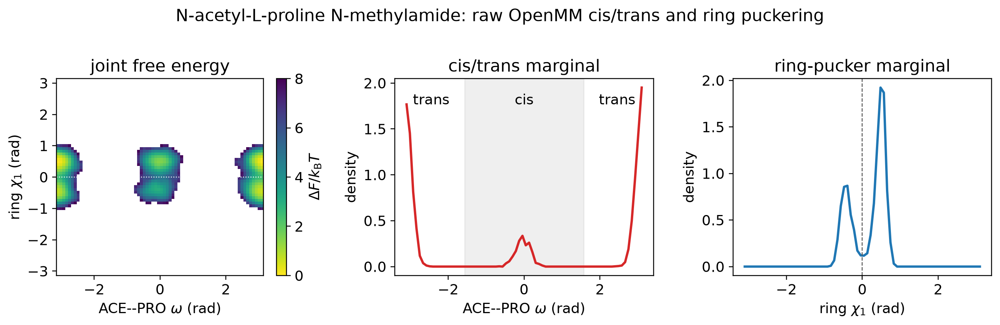

# Ac-Pro-NHMe raw OpenMM multimodality probe

The saved raw-potential replica-exchange trajectory uses 16 temperatures from 300 K to 1200 K, 5000 rounds, and 100 OpenMM steps per round. The first 1000 rounds are excluded below.

The 300 K slot contains 4000 analyzed samples and occupies 4 cis/trans--pucker joint states above 1%. Cis/trans occupancies are 0.1500/0.8500; pucker +/- occupancies are 0.6525/0.3475.

| joint state | 300 K occupancy |
|---|---:|
| trans / pucker - | 0.317750 |
| trans / pucker + | 0.532250 |
| cis / pucker - | 0.029750 |
| cis / pucker + | 0.120250 |

The cold slot records 370 cis/trans changes and 676 pucker-sign changes after burn-in. These counts include configurations entering through replica swaps and therefore establish visited support, not kinetic transition rates. The trajectory preserved the fixed L-proline center with minimum signed-volume margin 6.275e-04 nm^3.

This enhanced-sampling probe demonstrates nontrivial conformational support when both cis/trans sectors and both pucker signs are occupied. Its finite length does not certify fully converged 300 K basin weights.

