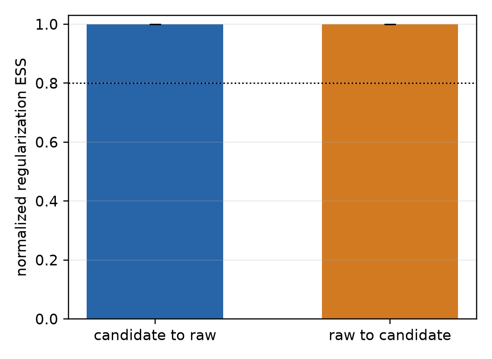
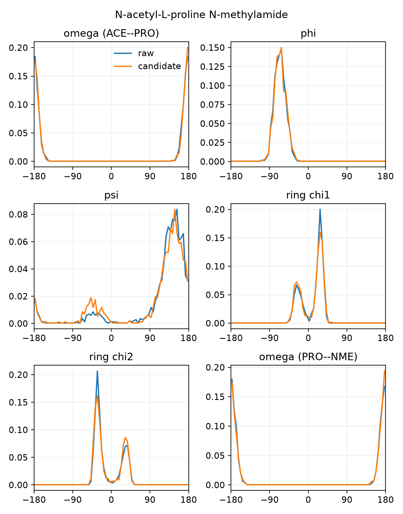
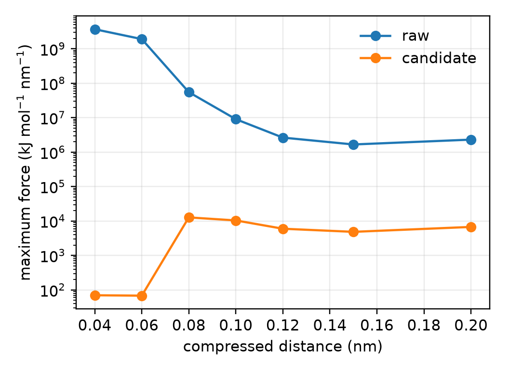

# Ac-Pro-NHMe regularization choice

## Recommendation

Use `rg_param = (150, 0.10)` for the 72-dimensional
N-acetyl-L-proline N-methylamide target. The default `(100, 0.10)` is not
eligible under the same finite-second-moment tail criterion used for the other
chiral targets.

| candidate | tail exponent at 400 K | required exponent | trajectory result | decision |
|---:|---:|---:|---|:---:|
| `(100, 0.10)` | 60.136178 | `> 74` | not run after analytic rejection | reject |
| `(150, 0.10)` | 90.204266 | `> 74` | pilot candidate-to-raw RESS `0.999999999` | select |

The selected-candidate pilot used seed 4401, 1,500 replica-exchange rounds,
eight replicas from 300 K to 400 K, and 100 OpenMM steps per round. Its 95%
bootstrap interval for candidate-to-raw RESS is
`[0.999999999, 0.999999999]`. Reverse RESS is `0.999999999` and is retained
only as an audit diagnostic.

No sampled 300 K frame entered the pair-distance floor or was materially
changed by regularization. The maximum raw/candidate torsion JS divergence is
`0.022731` bits, joint-state total variation is `0.072867`, and the same-CUDA
energy cross-check error is `0.0 kJ/mol`. Every saved frame retained the fixed
S proline center; the minimum signed-volume margins were
`1.636e-3 nm^3` for raw and `1.585e-3 nm^3` for the candidate.

The pilot's parameter-fidelity gate passes. The conformational-equilibrium
audit remains unresolved because the candidate trajectory's maximum
half-window marginal TV is `0.119701`, above the `0.10` gate. This does not
weaken the sharpening-fidelity conclusion, but it means this pilot must not be
presented as proof that the slow cis/trans and proline-puckering populations
are fully equilibrated. A separate higher-temperature multimodality probe is
used for that structural question.

## Figures

