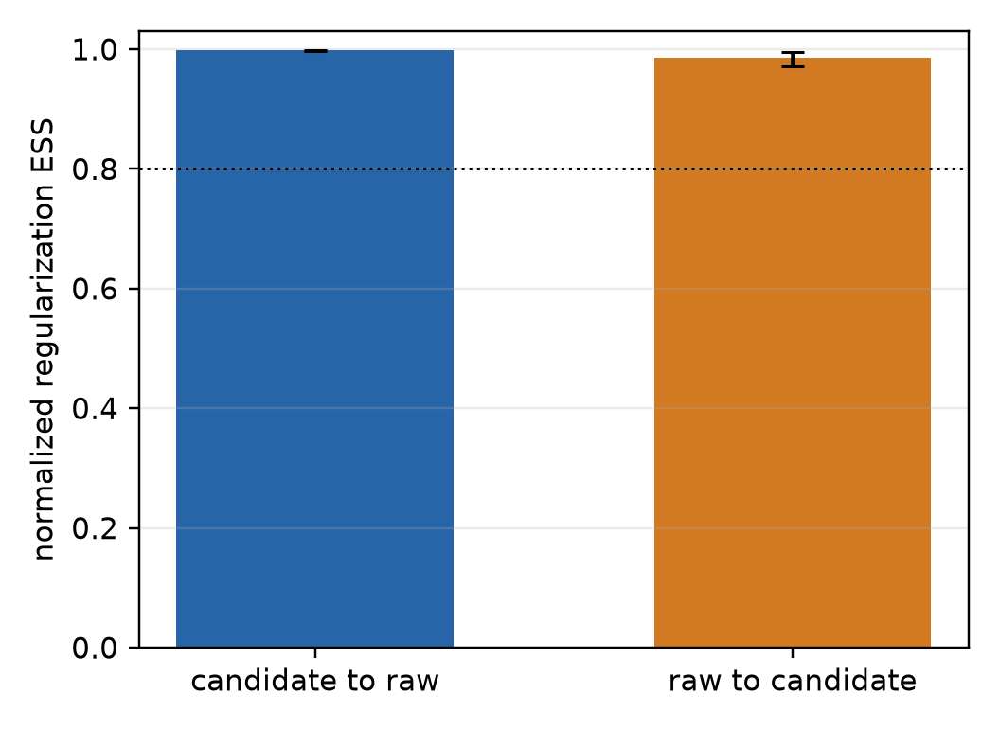
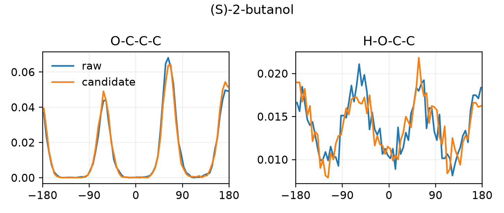
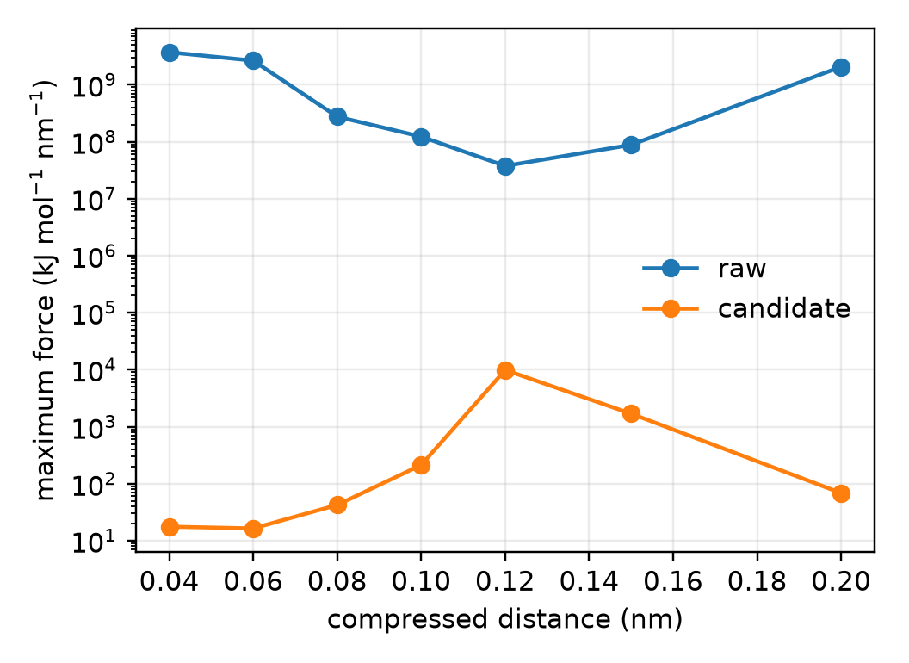
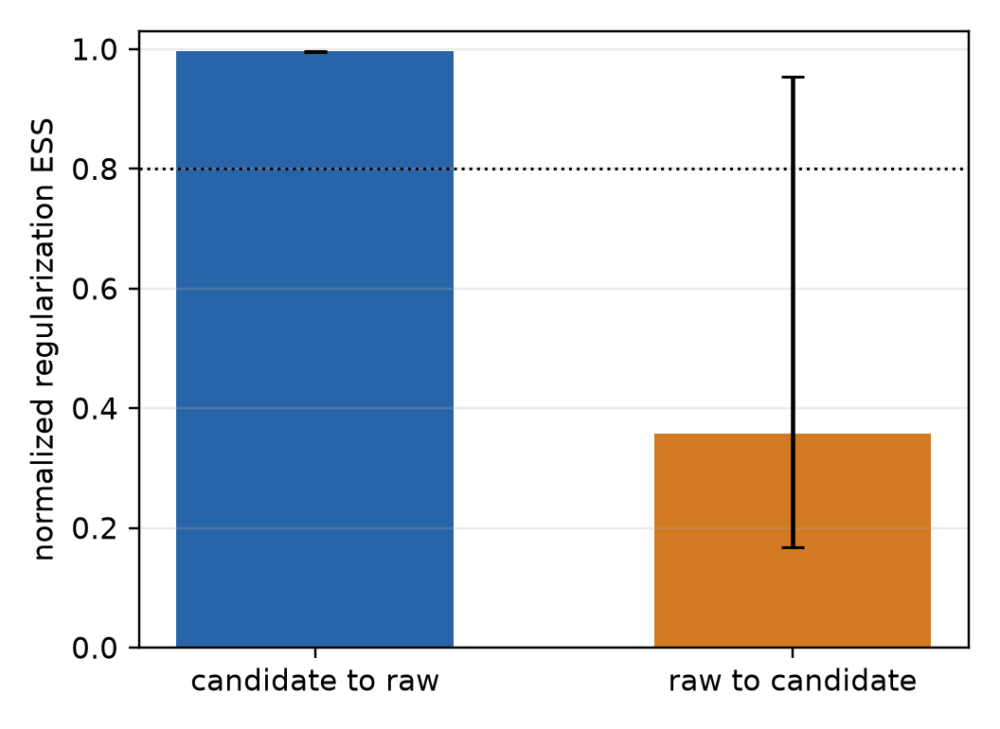
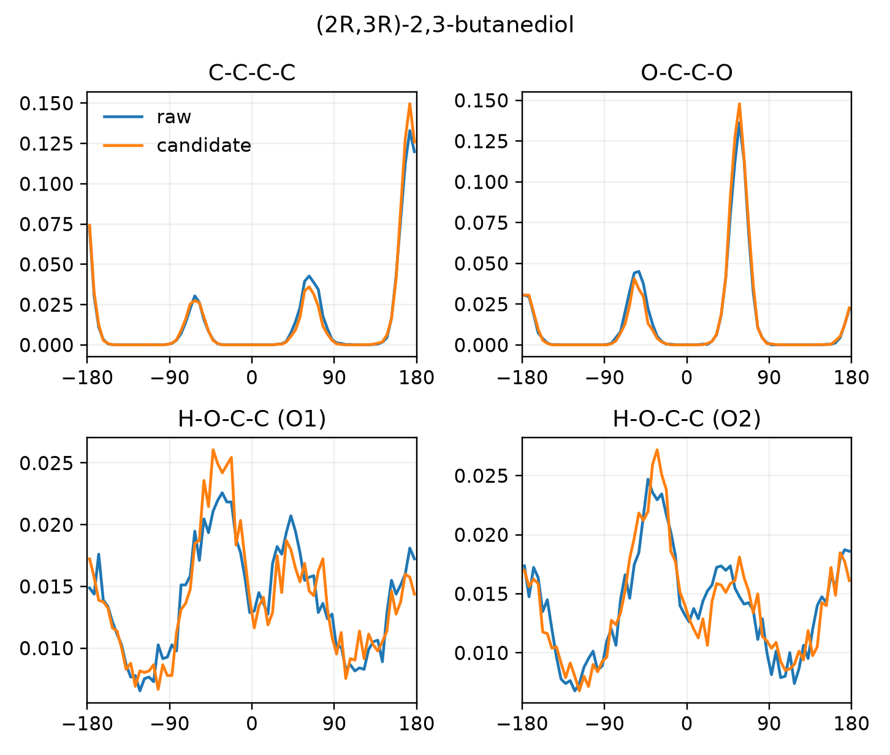
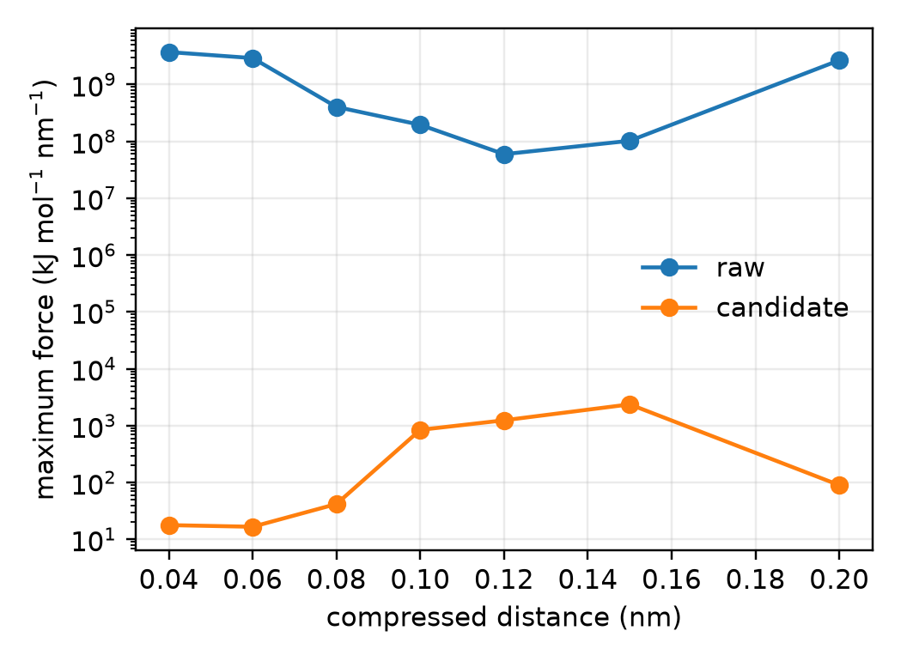
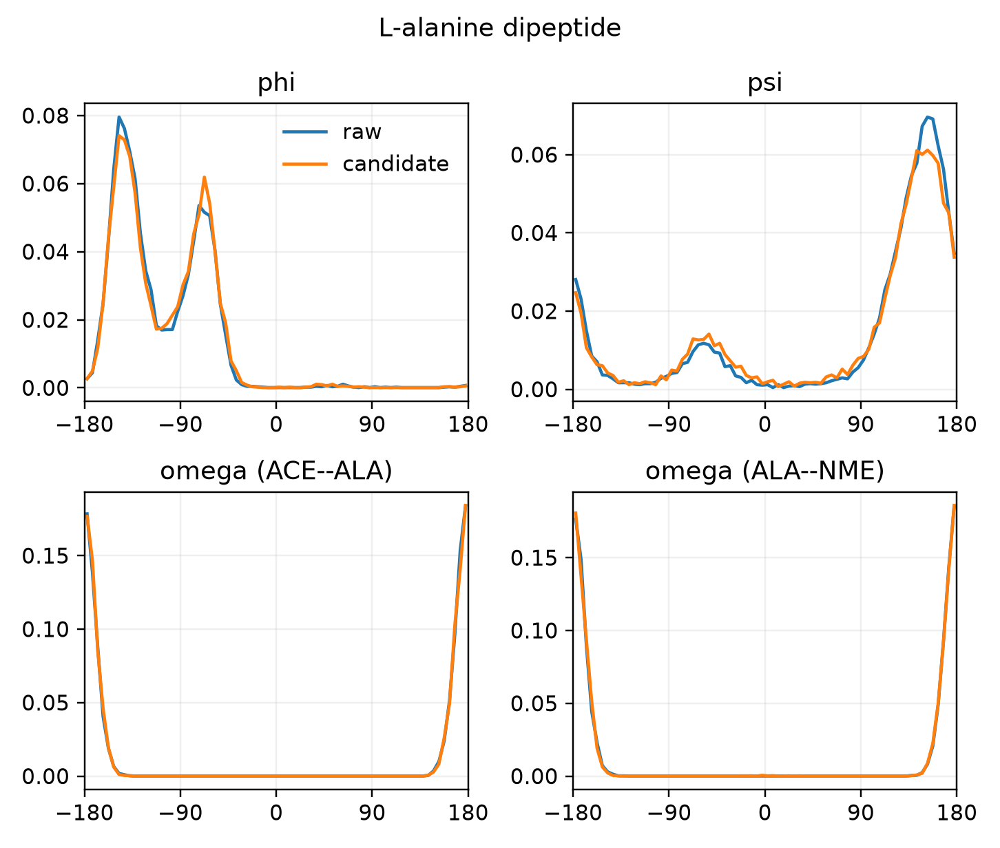
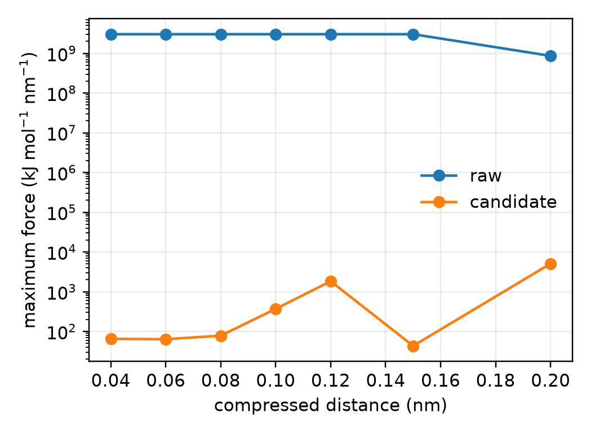

# Regularization choices for three chiral targets

## Recommendation

The parameter-fidelity gates pass, but at least one conformational equilibrium audit is unresolved; the choices are supported for sharpening fidelity, not as proof that every equilibrium population converged.

| molecule | `rg_param = (e, r)` | verification seeds | candidate-to-raw RESS [95% CI] | equilibrium audit |
|---|---:|---:|---:|:---:|
| (S)-2-butanol | `(100, 0.1)` | 2 | 0.998284407 [0.997520588, 0.998941375] | unresolved |
| (2R,3R)-2,3-butanediol | `(100, 0.1)` | 2 | 0.996026257 [0.994784561, 0.997139381] | unresolved |
| L-alanine dipeptide | `(125, 0.1)` | 2 | 0.999839779 [0.999575698, 0.999996268] | pass |

Candidate-to-raw RESS is the primary sharpening metric. Raw-to-candidate RESS is reported below only as an audit because the singular raw target need not represent the broader regularized tail efficiently.

The default `(100, 0.10)` is eligible for both alcohols. For 60D ADP it gives tail exponent 60.136 at 400 K and fails the preregistered finite-second-moment requirement `exponent > d + 2`; therefore ADP starts at the stricter `(125, 0.10)` candidate.

## Numerical audit

| molecule | reverse RESS | max torsion JS (bits) | joint TV | changed frames | floor-entry frames | max energy error (kJ/mol) |
|---|---:|---:|---:|---:|---:|---:|
| (S)-2-butanol | 0.984953561 | 0.004630 | 0.040227 | 8.000e-03 | 0.000e+00 | 0.000e+00 |
| (2R,3R)-2,3-butanediol | 0.358289068 | 0.005641 | 0.061439 | 1.912e-02 | 0.000e+00 | 0.000e+00 |
| L-alanine dipeptide | 0.999998315 | 0.006170 | 0.049624 | 5.000e-04 | 0.000e+00 | 0.000e+00 |

The energy-parity gate is a same-platform CUDA mixed-precision check. Independent CPU re-evaluation differed from CUDA by as much as `4.36e-3 kJ/mol`, so the `5e-4 kJ/mol` gate must not be interpreted as cross-platform bitwise parity.

## Stereochemical support

Every saved frame at every replica retained every named signed-volume component with margin above `1e-6 nm^3`. The check covers saved frames at 100-step intervals; it does not prove that unconstrained Cartesian dynamics could not cross and recross between observations.

| molecule | raw minimum margins (nm^3) | candidate minimum margins (nm^3) |
|---|---|---|
| (S)-2-butanol | butanol_C2_S: 1.339e-03 | butanol_C2_S: 1.056e-03 |
| (2R,3R)-2,3-butanediol | butanediol_C2_R: 1.233e-03, butanediol_C3_R: 1.127e-03 | butanediol_C2_R: 8.605e-04, butanediol_C3_R: 1.161e-03 |
| L-alanine dipeptide | alanine_ca_L: 1.381e-03 | alanine_ca_L: 9.359e-04 |

## Mixing and structural scope

| molecule | raw/candidate min Markov ESS | raw/candidate max R-hat | raw/candidate min swap | raw/candidate round trips per seed |
|---|---:|---:|---:|---|
| (S)-2-butanol | 107.41/45.46 | 1.00549/1.00552 | 0.848/0.850 | [899, 891]/[891, 873] |
| (2R,3R)-2,3-butanediol | 25.74/24.14 | 1.08219/1.03300 | 0.837/0.822 | [863, 838]/[770, 786] |
| L-alanine dipeptide | 771.98/219.71 | 1.00645/1.00276 | 0.834/0.830 | [833, 823]/[815, 808] |

Exact per-seed RESS intervals, raw-seed structural baselines, half-window diagnostics, force quantiles, distance diagnostics, stress arrays, hashes, and artifact paths are in `results/selected_metrics.json`. The frozen protocol and independent review are in `.aris/`.

## Provenance limitation

The exact start and run NPZ bytes used by every metric are SHA-256-bound in the metric JSON, and `results/provenance.json` inventories every current data artifact. The local `run.py` source hash was not embedded in the NPZ metadata when trajectories were generated. Its current hash is recorded post hoc, so it identifies the audited validator/runner snapshot but is not cryptographic proof of the historical generation source. The live source commit identifies `jflows_md` behavior, but its source release is 0.5.3 while installed distribution metadata reports 0.5.2. At finalization this entire study tree was absent from the project `HEAD`: code and results were untracked, while `.aris`, logs, and NPZs were ignored, so Git did not provide immutable provenance.

## Figures

### (S)-2-butanol

### (2R,3R)-2,3-butanediol

### L-alanine dipeptide

