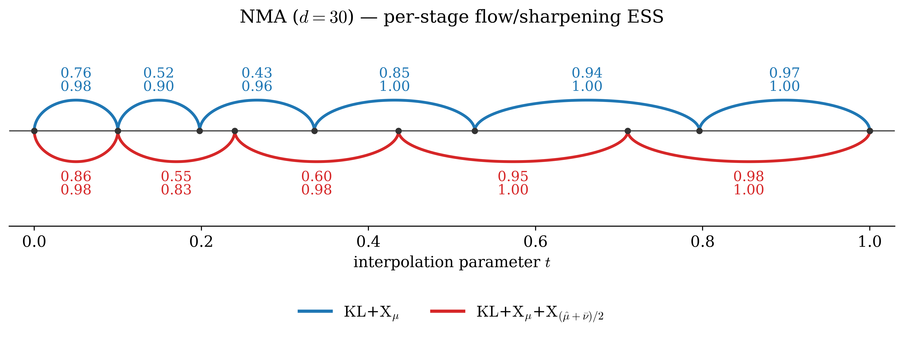
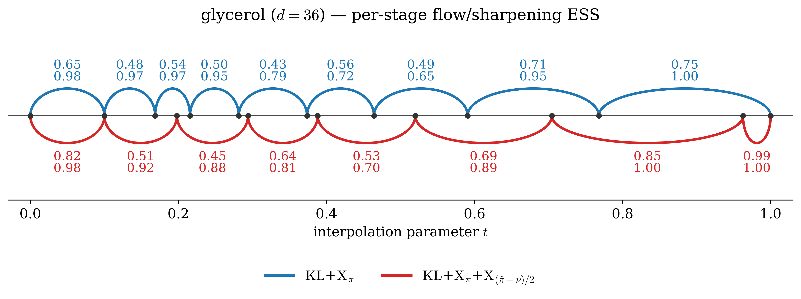
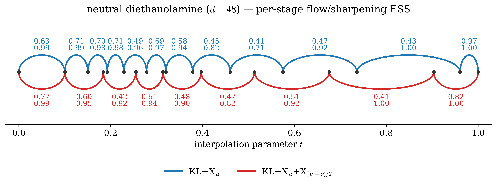
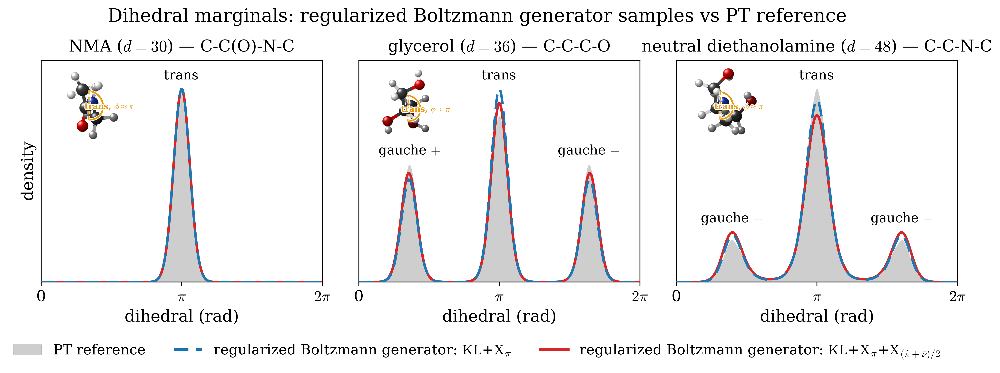
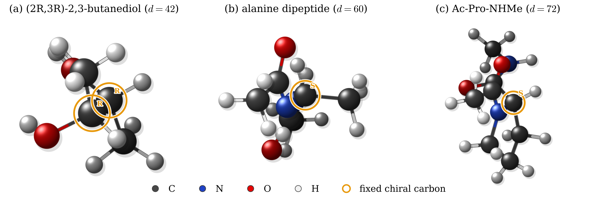
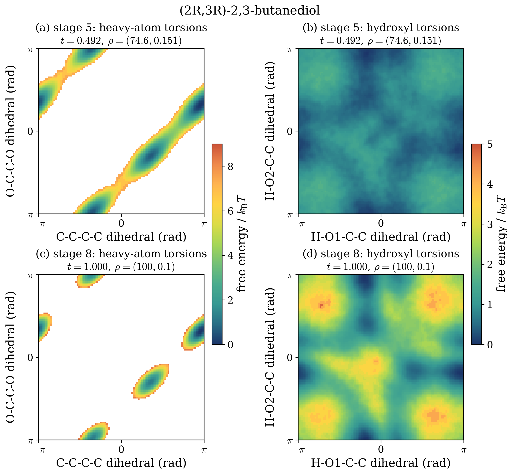
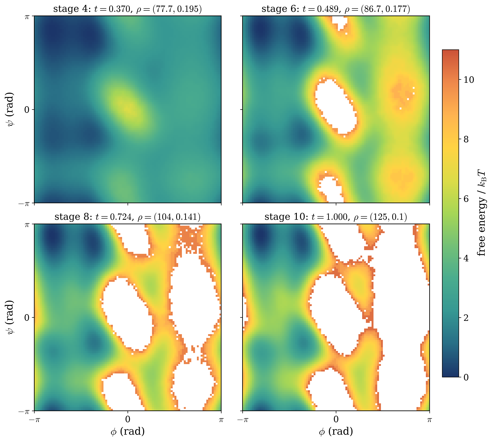
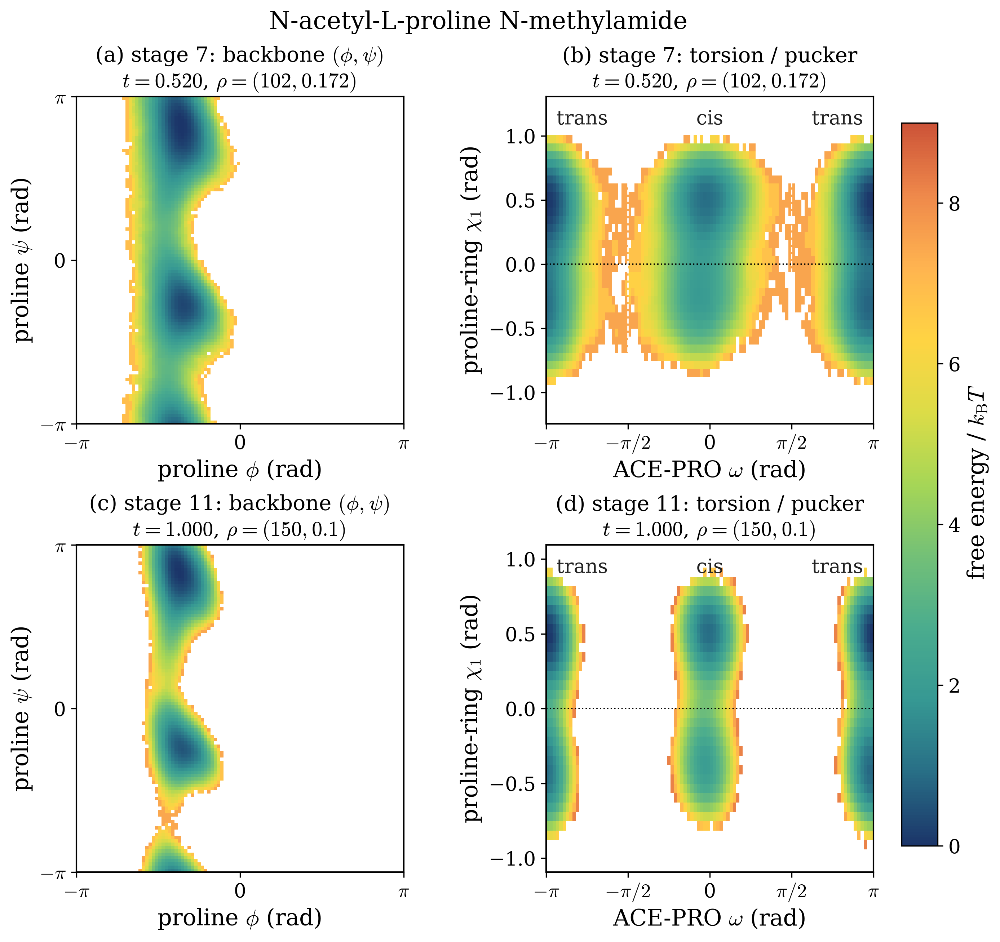

# Molecular Boltzmann generators

This benchmark follows the homologous series from methane to n-hexane, with
mixed-coordinate dimensions 9, 18, …, 54. Every reported run uses seed 0 and
reaches the final bridge coefficient $t=1$. The endpoint training target
uses the molecular regularization parameters `(100, 0.15)`. The fixed runs use
this endpoint throughout; the sharpening runs begin from the path shown in the
table and finish at the same endpoint.

All six frozen molecular bundles represent neutral all-atom alkanes at 300 K.
Their physical potential uses GAFF2 with AM1-BCC charges followed by the
recorded graph-symmetry and neutrality projection. Solvation is modeled by
OBC1 (`igb=2`) implicit solvent with `mbondi2` radii and the ACE nonpolar term;
nonbonded interactions use `NoCutoff`, and no bond constraints are imposed.
The mixed-coordinate target is the corresponding Boltzmann density on the
rigid-motion quotient, including its coordinate-measure Jacobian.

We compare three adaptive generators. **ID** uses identity transport at every
stage and therefore performs no flow training. **KL** trains the forward KL
objective. **KLXX** augments forward KL with both log-ratio variation terms and
uses quench-and-temper samples in the second term. The trained generators start
    each stage from the identity map and select the trained or identity proposal by
    ESS over the complete validation population. All three methods retain the same SMC endpoint selection,
resampling, and MALA population updates; ID also retains sharpening when the
    two regularization endpoints differ. KLXX uses `pool_size=0`, so its
    quench-and-temper population starts from `VALID_SIZE` fresh source draws
    rather than from a separately sized pool.

## Propagation factors

For accepted stages $s$, the reported total factor is

$$
F=\prod_s\frac{1}{\operatorname{ESS}_{s}}
  \prod_{s\in\mathcal S_{\rm sharp}}
  \frac{1}{\operatorname{ESS}^{\rm sharp}_{s}}.
$$

Thus $F=1$ is ideal and smaller is better. Each method group reports the
factor, number of accepted stages, and recorded time in minutes. Recorded time
is the sum of the persisted stage elapsed times. Bold marks the smallest factor
in each matched regularization setting.

<table>
<thead>
<tr><th rowspan="2">molecule</th><th rowspan="2">regularization path</th><th colspan="3">ID</th><th colspan="3">KL</th><th colspan="3">KLXX</th></tr>
<tr><th>factor</th><th>stages</th><th>time (min)</th><th>factor</th><th>stages</th><th>time (min)</th><th>factor</th><th>stages</th><th>time (min)</th></tr>
</thead>
<tbody>
<tr><td>methane (9d)</td><td>(100, 0.15) fixed</td><td>14.6938</td><td>8</td><td>1.4</td><td>1.41601</td><td>3</td><td>1.2</td><td><strong>1.05269</strong></td><td>3</td><td>2.4</td></tr>
<tr><td>ethane (18d)</td><td>(100, 0.15) fixed</td><td>62.9774</td><td>9</td><td>3.5</td><td>6.34893</td><td>3</td><td>1.8</td><td><strong>1.42308</strong></td><td>3</td><td>4.1</td></tr>
<tr><td rowspan="2">propane (27d)</td><td>(100, 0.15) fixed</td><td>182.778</td><td>11</td><td>7.7</td><td>181.849</td><td>11</td><td>13.4</td><td><strong>7.73844</strong></td><td>7</td><td>23.0</td></tr>
<tr><td>(50, 0.15) → (100, 0.15)</td><td>95.1363</td><td>10</td><td>6.9</td><td>95.0168</td><td>10</td><td>12.1</td><td><strong>7.77760</strong></td><td>6</td><td>18.3</td></tr>
<tr><td rowspan="2">butane (36d)</td><td>(100, 0.15) fixed</td><td>367.305</td><td>12</td><td>13.3</td><td>367.102</td><td>12</td><td>20.3</td><td><strong>28.0598</strong></td><td>10</td><td>49.0</td></tr>
<tr><td>(50, 0.20) → (100, 0.15)</td><td>226.373</td><td>10</td><td>10.8</td><td>224.773</td><td>10</td><td>14.9</td><td><strong>14.9132</strong></td><td>10</td><td>46.1</td></tr>
<tr><td rowspan="2">pentane (45d)</td><td>(100, 0.15) fixed</td><td>733.167</td><td>13</td><td>19.2</td><td>754.697</td><td>13</td><td>24.6</td><td><strong>82.7064</strong></td><td>12</td><td>60.4</td></tr>
<tr><td>(50, 0.20) → (100, 0.15)</td><td>363.559</td><td>10</td><td>13.9</td><td>370.219</td><td>10</td><td>17.2</td><td><strong>48.8331</strong></td><td>9</td><td>38.5</td></tr>
<tr><td rowspan="2">hexane (54d)</td><td>(100, 0.15) fixed</td><td>2043.10</td><td>13</td><td>23.3</td><td>2077.39</td><td>13</td><td>29.0</td><td><strong>1026.11</strong></td><td>12</td><td>69.9</td></tr>
<tr><td>(50, 0.25) → (100, 0.15)</td><td>910.487</td><td>10</td><td>17.4</td><td>891.504</td><td>10</td><td>22.7</td><td><strong>201.457</strong></td><td>10</td><td>60.1</td></tr>
</tbody>
</table>

KLXX has the smallest total factor in all ten matched settings. KL selects the
trained flow at all three methane stages and at two of three ethane stages.
From propane onward, every accepted KL stage selects identity instead, so its
factor remains near the ID baseline; the small differences arise because the
adaptive schedules are method-specific. KLXX selects the trained map at every
accepted stage through pentane. At hexane it still selects trained maps in 6
of 12 fixed stages and 8 of 10 sharpening stages, which gives factors below
both ID and KL.

Sharpening becomes more useful as the molecule grows. For KLXX it leaves the
propane factor essentially unchanged, but reduces the fixed-target factor by
factors of 1.88, 1.69, and 5.09 at butane, pentane, and hexane, respectively.
The corresponding sharpening KLXX runs take 3.10, 2.24, and 2.65 times the
recorded KL time. The trade-off is therefore consistent across the larger
molecules: KLXX plus sharpening gives the strongest propagation factors, at
the cost of additional quench-and-temper and flow-training work.

The complete accepted-stage ESS records, including every sharpening step, are
available in [tables.md](alkane_family/tables.md).

## Macroscopic observables

The macroscopic comparison uses the completed KLXX population with the
smallest factor for each molecule: fixed regularization for methane, ethane,
and propane, and sharpening for butane through hexane. These are direct,
unweighted samples at `(100, 0.15)`; no regularization-ESS resampling or
reweighting is applied. Physical energy is nevertheless evaluated under the
raw unregularized potential.

<em>Physical energy, carbon-skeleton size, and backbone
rotamers from KLXX and OpenMM. Filled solid curves and unhatched bars denote
KLXX; open dashed curves and hatched bars denote OpenMM. Small opposing
horizontal offsets separate coincident curves without changing their carbon
counts.</em>

The independent raw-potential OpenMM benchmark uses two seeds and a 0.25 fs
timestep. Methane through propane use 300 K Langevin production, while butane
through hexane use 300–800 K replica exchange to mix backbone rotamers. In
the continuous-observable panels, OpenMM error bars span the two seed means;
the paired rotamer bars pool both replica-exchange seeds.

Across the six molecules, the maximum relative difference between KLXX and
OpenMM physical-energy means is 0.644%. The largest relative difference among
the nonzero carbon radius-of-gyration and terminal-distance means is 1.058%.
For butane through hexane, the largest absolute difference among the pooled
trans, gauche+, and gauche− populations is 0.051. The figure therefore shows
agreement on these selected thermodynamic and structural observables together
with their systematic change along the C1–C6 homologous series. It does not
establish equality of the complete molecular distributions.

The endpoint regularization is also mild on these KLXX populations. The
measured `1-RESS` is numerically zero from methane through butane,
`9.5e-6` for pentane, and `2.3e-5` for hexane when reweighting from
`(100, 0.15)` to the raw potential.

## Scope and verification

- Every one of the 30 persisted ID, KL, and KLXX run manifests is complete,
  and every final accepted stage has `t=1` with finite ESS and elapsed time.
- All summary entries above are reproduced from `run.json` and accepted
  `stage.json` records. The factor uses incremental accepted-stage ESS and is
  not a separately evaluated full-chain importance ESS.
- Each training configuration is one seed. Method-specific adaptive ladders
  and unequal per-stage work mean that the recorded times are descriptive,
  not a fixed-compute comparison.
- The promoted OpenMM observables use only the 0.25 fs references. An earlier
  1 fs diagnostic is excluded because it showed measurable energy bias in the
  unconstrained bond modes.
- OpenMM frames are correlated. Seed ranges in the figure are descriptive and
  are not framewise confidence intervals.

## Additional achiral molecules

We next test N-methylacetamide (NMA), glycerol, and neutral diethanolamine at
300 K. Every reported run uses seed 0, reaches the final bridge coefficient
$t=1$, and sharpens from `(50, 0.20)` to the molecule-specific endpoint shown
in the table. We compare $\mathrm{KL}+\mathrm{X}_{\mu}$ with
$\mathrm{KL}+\mathrm{X}_{\mu}+\mathrm{X}_{(\hat\mu+\bar\nu)/2}$ (KLXX).
The factor and recorded time use the same definitions as in the alkane-family
table above. Bold marks the smaller factor for each molecule.

### Propagation factors

<table>
<thead>
<tr><th rowspan="2">molecule</th><th rowspan="2">start ρ0</th><th rowspan="2">end ρ1</th><th colspan="3">KL+Xμ</th><th colspan="3">KL+Xμ+X(μ̂+ν̄)/2</th></tr>
<tr><th>factor</th><th>stages</th><th>time (min)</th><th>factor</th><th>stages</th><th>time (min)</th></tr>
</thead>
<tbody>
<tr><td>NMA (30d)</td><td>(50, 0.20)</td><td>(100, 0.15)</td><td>8.86089</td><td>6</td><td>6.0</td><td><strong>4.76274</strong></td><td>5</td><td>12.1</td></tr>
<tr><td>glycerol (36d)</td><td>(50, 0.20)</td><td>(100, 0.10)</td><td>604.852</td><td>9</td><td>16.5</td><td><strong>67.6897</strong></td><td>8</td><td>35.8</td></tr>
<tr><td>neutral diethanolamine (48d)</td><td>(50, 0.20)</td><td>(100, 0.10)</td><td>1422.98</td><td>12</td><td>23.1</td><td><strong>471.384</strong></td><td>9</td><td>43.1</td></tr>
</tbody>
</table>

KLXX reduces the propagation factor by factors of 1.86, 8.94, and 3.02 for
NMA, glycerol, and neutral diethanolamine, respectively. It also reaches
$t=1$ in fewer accepted stages for all three molecules, while requiring about
1.9--2.2 times the recorded time of $\mathrm{KL}+\mathrm{X}_{\mu}$.

### Per-stage flow and sharpening ESS

Each annotation reports `flow ESS / sharpening ESS`. Blue upper arcs show
$\mathrm{KL}+\mathrm{X}_{\mu}$, and red lower arcs show
$\mathrm{KL}+\mathrm{X}_{\mu}+\mathrm{X}_{(\hat\mu+\bar\nu)/2}$.

### Dihedral marginals

<em>One selected dihedral for each molecule. Gray denotes
the OpenMM reference; dashed blue and solid red denote samples from
$\mathrm{KL}+\mathrm{X}_{\mu}$ and
$\mathrm{KL}+\mathrm{X}_{\mu}+\mathrm{X}_{(\hat\mu+\bar\nu)/2}$,
respectively. The small upper-left insets show representative trans
conformers.</em>

The BG curves use the final samples under each molecule's regularized endpoint.
The OpenMM curves use saved 300 K trajectories, so replots do not rerun
OpenMM. The NMA reference shown here is initialized in the trans basin; the
glycerol and neutral-diethanolamine references pool two seeds.

## Chiral molecules

We report completed KLXX runs for `(2R,3R)`-2,3-butanediol, alanine
dipeptide restricted to its L form, and N-acetyl-L-proline N-methylamide
(Ac-Pro-NHMe). Every run uses seed 0, `pool_size=0`, 250 Adam steps per
accepted flow stage, an eight-level SMC ladder, and 100 mixed-MALA steps.
The validation-population and batch sizes are 240,000/12,000, 300,000/15,000,
and 320,000/16,000, respectively. Only the full
KL+Xμ+X(μ̂+ν̄)/2 loss was run, so this section makes no
within-target method comparison.

### KLXX propagation factors

The factor and recorded time use the same definitions as above: the factor
multiplies the inverse flow and sharpening ESS over accepted stages, and time
is the sum of persisted stage elapsed times.

<table>
<thead>
<tr><th rowspan="2">molecule</th><th rowspan="2">start ρ0</th><th rowspan="2">end ρ1</th><th colspan="3">KL+Xμ+X(μ̂+ν̄)/2</th></tr>
<tr><th>factor</th><th>stages</th><th>time (min)</th></tr>
</thead>
<tbody>
<tr><td>(2R,3R)-2,3-butanediol (42d)</td><td>(50, 0.20)</td><td>(100, 0.10)</td><td>22.6567</td><td>8</td><td>35.8</td></tr>
<tr><td>alanine dipeptide (60d)</td><td>(50, 0.25)</td><td>(125, 0.10)</td><td>111.194</td><td>10</td><td>72.7</td></tr>
<tr><td>Ac-Pro-NHMe (72d)</td><td>(50, 0.25)</td><td>(150, 0.10)</td><td>812.081</td><td>11</td><td>124.7</td></tr>
</tbody>
</table>

All three manifests are complete and end at `t=1`. The rows report different
molecules, validation sizes, and sharpening paths; their factors are therefore
stage-propagation diagnostics rather than a cross-molecule ranking.

### Fixed stereochemistry and conformational diagnostics

<em>Representative final-stage conformations selected near
the most populated two-dihedral basin of each saved validation population.
Gold rings mark every fixed stereocenter, with the retained R/S configuration
written beside it; the remaining colors follow the CPK element convention.</em>

<em>`(2R,3R)`-2,3-butanediol free-energy surfaces from
240,000 samples per stage. The upper row is stage 5, the accepted stage
nearest t=0.5, at t=0.492 and ρ=(74.6, 0.151); the lower row is the final
stage 8 at t=1 and ρ=(100, 0.10). The left column resolves the C-C-C-C and
O-C-C-O heavy-atom torsions, while the right column resolves the two hydroxyl
orientations. Each column shares its color scale across stages, and the two
diagnostics retain separate colorbars.</em>

<em>Alanine-dipeptide Ramachandran surfaces at accepted
stages 4, 6, 8, and 10. Each panel uses the persisted 10-million-sample
inference population generated by the frozen stage flow followed by the saved
stage pushforward, resampling, rejuvenation, and sharpening operations. The
panels therefore show the changing regularized target along the path rather
than four estimates of one fixed potential.</em>

<em>Ac-Pro-NHMe free-energy surfaces from 320,000 samples
per stage. The upper row is stage 7, the accepted stage nearest t=0.5, at
t=0.520 and ρ=(102, 0.172); the lower row is the final stage 11 at t=1 and
ρ=(150, 0.10). The left column shows the proline backbone angles; the right
column separates the ACE-PRO cis/trans torsion and the two signs of the
proline-ring pucker. All four panels use one free-energy scale.</em>

These figures are diagnostics of the regularized KLXX populations. They do
not provide a matched loss comparison, a raw-potential equilibrium reference,
or uncertainty over independently trained generators.
