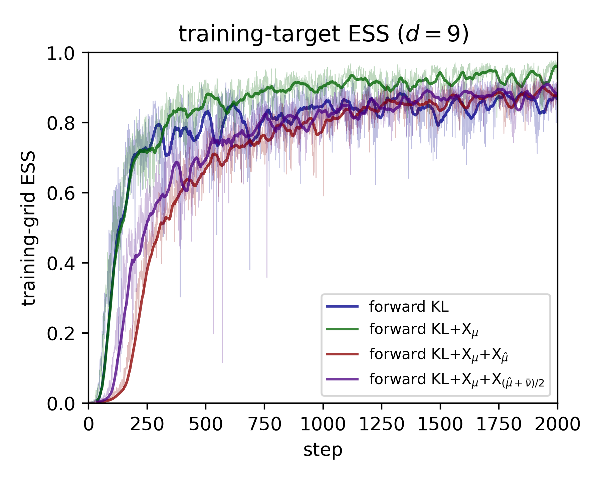

# Fourier_Modes — summary

A low-dimensional Bayesian–Fourier example designed to exhibit the **fake-ESS pitfall** of bare forward KL training, and the rescue by the X-augmented losses. This is the cleanest single result from the May 2026 multi-example screening: bare KL posts a near-perfect ESS on the support it reaches while covering only one of four posterior modes; the QT-driven `X_μ̂` and mixture variants recover full mode coverage at no real ESS cost.

## Problem setup

**Field.** A real scalar field $u:[0,1]^2\to\mathbb R$ on the 2-torus, parameterized by its lowest $d=9$ real Fourier coefficients $\theta=(\theta_1,\dots,\theta_9)\in\mathbb R^9$ under the half-plane convention $|k|^2 \le 2$:
$$
u(x;\theta) \;=\; \sum_{m=1}^{9} \theta_m\,\varphi_m(x),
\qquad
\varphi_m(x) \;=\;
\begin{cases}
\cos\!\bigl(2\pi (k_m\!\cdot\! x)\bigr), & \text{parity}_m=\cos,\\
\sin\!\bigl(2\pi (k_m\!\cdot\! x)\bigr), & \text{parity}_m=\sin,
\end{cases}
$$
with wavevectors $(k_m,\text{parity}_m)$ enumerated as $(0,0,\cos),\,(0,1,\cos/\sin),\,(1,-1,\cos/\sin),\,(1,0,\cos/\sin),\,(1,1,\cos/\sin)$.

**Group partition.** The $d=9$ modes are split contiguously into $G=2$ groups of sizes $(5,4)$: $\mathcal G_1=\{1,\dots,5\}$, $\mathcal G_2=\{6,\dots,9\}$. The *partial field* for group $g$ is
$$
v_g(x;\theta) \;=\; \sum_{m\in\mathcal G_g} \theta_m\,\varphi_m(x).
$$

**Source / prior** (also the source distribution $\mu_0$):
$$
\mu_0(\theta) \;=\; \mathcal N\!\bigl(0,\,\Sigma_0\bigr),
\qquad
\Sigma_0 \;=\; \mathrm{diag}\!\left(\frac{\gamma^2}{1+|k_m|^2}\right)_{m=1}^{9},
\qquad
\gamma^2 = 2.
$$

**Synthetic data.** Fix a true coefficient vector $\theta^\star = A \cdot \sqrt{\Sigma_0}\,z$ with $z\sim\mathcal N(0,I_9)$ (seed 42, amplitude $A=2.5$ for mode separation). On a coarse cell-centered $3\times 3$ spatial grid $\{x_j\}_{j=1}^{9}\subset[0,1]^2$, observe per-group squared partial-field measurements with independent Gaussian noise:
$$
y_{g,j} \;=\; \bigl[v_g(x_j;\theta^\star)\bigr]^2 \;+\; \varepsilon_{g,j},
\qquad
\varepsilon_{g,j}\sim\mathcal N(0,\sigma_{\mathrm{obs}}^2),
\qquad
\sigma_{\mathrm{obs}}=2,
$$
clamped to $\ge 0$ (independent noise seed 43, fixed throughout the experiment).

**Target potential** $U:\mathbb R^9\to\mathbb R$ (negative log-posterior, up to an additive constant):
$$
\boxed{\;\;
U(\theta) \;=\; \underbrace{\tfrac12\,\theta^{\top}\Sigma_0^{-1}\theta}_{U_{\mathrm{prior}}(\theta)}
\;+\;\underbrace{\frac{1}{2\sigma_{\mathrm{obs}}^2}\sum_{g=1}^{G}\sum_{j=1}^{J}\Bigl(\bigl[v_g(x_j;\theta)\bigr]^2 - y_{g,j}\Bigr)^{2}}_{U_{\mathrm{like}}(\theta)} \;\;}
$$
with $J=9$ coarse-grid points and $G=2$ groups. The target distribution is $\mu(\theta)\propto\exp(-U(\theta))$.

**Symmetry → exactly $2^G = 4$ posterior modes.** $U$ depends on $\theta$ only through the *squared* partial fields $v_g^2$, so it is invariant under any per-group sign flip $\theta\mapsto S_g\theta$ where $S_g$ negates the components of $\theta$ in $\mathcal G_g$ and leaves the others alone. The $2^G=4$ commuting sign-flip operators act freely on a generic $\theta^\star$, producing $4$ degenerate, well-separated modes — verified to machine precision: $U(\theta^\star) = U(S_1\theta^\star) = U(S_2\theta^\star) = U(S_1 S_2\theta^\star) = 28.66$. Pairwise mode separations $\sim 5.4$, mode radius $\sim 6.3$, whereas the centered Gaussian source has effective mass concentrated near $\theta=0$ (the common symmetry saddle), so three of the four modes are at $\sim 7\sigma$ from the source mean.

**Pinned constants.** $d=9$, $G=2$, $J=9$ (coarse $3\times 3$), $A=2.5$, $\sigma_{\mathrm{obs}}=2$, $\gamma^2=2$, `NSF_LIM=12`.

## Architecture & training

- **Flow**: NSF on $[-12, +12]^9$, `bins=16`, `transforms=6`, `hidden=(128,128)`. `flow.zeros()` warm-start (identity).
- **Loss**: four methods, all with the **one-step IS surrogate** of the paper (M=1): pushforward $y = G^{-1}(x)$, IS weights $w = \mu/\nu$ against the training target, resample, refresh with 50 Langevin steps (`step=2e-3`).
  - `KL`, `KL+X_μ`, `KL+X_μ+X_μ̂`, `KL+X_μ+X_mix` (paper defaults $\lambda=1$, $\alpha=\beta=1/2$).
- **QT pool** for $\hat\mu$: 400 particles, built once with **armijo LBFGS step 0.05** (the default 1.0 diverges to NaN on this quartic landscape — the single most important tuning fix).
- **Training**: Adam `lr=1e-3`, `BATCH=500` (a neutral default, not the gap-favoring 200 used in HD_Product), **2000 steps**, full run wall-clock $\sim$360 s on RTX 5070 Ti.
- **Evaluation**: fresh 20 000-source-sample pool; metrics computed against the *same* training-grid target for all four methods. The fine-grid eval column was dropped — see *caveats*.

## Headline result

| loss | training-grid ESS | modes\_found / 4 | Naeem $k=5$ coverage | per-mode occupancy |
|---|---|---|---|---|
| `KL` | **0.926** (fake) | **1/4** | 0.282 | $[1.00,\,0,\,0,\,0]$ |
| `KL+X_μ` | 0.859 | 1/4 | 0.258 | $[0,\,1.00,\,0,\,0]$ |
| `KL+X_μ+X_μ̂` | 0.890 | **4/4** | **1.000** | $[0.259,\,0.246,\,0.243,\,0.252]$ |
| `KL+X_μ+X_mix` | 0.886 | **4/4** | **1.000** | $[0.244,\,0.251,\,0.244,\,0.260]$ |

QT pool itself: $4/4$ modes, occupancy $[0.28, 0.25, 0.25, 0.21]$ — well-balanced; gives `X_μ̂` and the mixture the right thing to inject.



Two distinct ESS quantities appear in this experiment and they must not be confused:
- The **figure** plots the **per-step in-batch ESS** of the IS surrogate (batch 500) over training. Every method climbs above $0.85$; `KL+X_μ` (green) actually reaches the highest moving-average ($\approx 0.93$) and the highest single-batch values, with bare `KL` (blue) sitting in the middle and the two QT-driven variants slightly below. *In-training the methods all look well-calibrated.*
- The **headline table** reports the **post-training fresh-pool eval ESS** on 20 000 source samples against the same training target $U$. Here the ordering inverts: bare `KL` posts the *highest* fresh-pool ESS (0.926) — the fake-ESS pitfall — while concentrating $100\\%$ of its pushforward mass on one of four equal-mass modes; `KL+X_μ` collapses to a different single mode and posts the *lowest* fresh-pool ESS (0.859); the QT-driven `X_μ̂` and mixture variants cover 4/4 modes with balanced occupancy at fresh-pool ESS $\approx 0.89$.

## Interpretation

- **The fake-ESS pitfall in its starkest form.** Bare forward KL posts the highest fresh-pool eval ESS ($0.926$) — looks like an excellent fit — while placing $100\\%$ of its pushforward mass on a single one of four equal-mass modes. Read the ESS column in isolation and a reviewer would call this a successful training run; the coverage column exposes that three of the four basins are entirely missing.
- **`X_μ` alone is *worse*, not neutral.** With shape control but no QT injection, `KL+X_μ` collapses to a *different* single mode (its 100% lands on mode 1 instead of mode 0) and its fresh-pool eval ESS drops to $0.859$ — the lowest of the four. This is an honest negative: `X_μ` cannot rescue mode discovery on its own and here actively harms calibration, because it tightens the log-ratio on a still-monomodal pushforward.
- **`X_μ̂` and the mixture rescue mode discovery at small ESS cost.** The QT pool supplies samples at all four mode centers; the pairwise $X$ term then forces the pushforward to balance the log-ratio across them, driving the flow to cover all four basins (occupancy within $\pm 1\\%$ of the uniform $0.25$, kNN coverage $1.000$). Fresh-pool ESS drops only marginally to $\sim 0.89$ — the textbook bargain.
- **Ordering matches the paper's Threewell/Himmelblau 2D story**, now in a genuine Bayesian inverse problem rather than a hand-built mixture.

## Caveats

- **The fine-grid eval column was dropped from the headline.** An earlier rerun added a fine $5\times5$ (and originally $8\times8$) eval grid intending to also show a Sec 2.3 bias-floor improvement, but the fine-grid eval ESS saturated at $\sim 3\\times 10^{-4}$ **for all four methods, regardless of mode coverage**: the fine-grid posterior is structurally much narrower than the coarse 3×3 training posterior because squaring a low-mode field $u$ generates Fourier content up to twice the source bandwidth, and the fine grid resolves *exactly* that high-frequency content. In typical smooth-prior function-space problems high frequencies are minor, so a benchmark whose discriminator rests on resolving them is artificial — see the run notes. The single-grid mode-discovery / fake-ESS story above is robust and stands on its own.
- **$d = 9$** is at the low end of the originally-targeted $[8, 32]$ window; this is best framed as a *low-dimensional* multimodal Bayesian benchmark, not a high-dimensional one. Raising $d$ via more Fourier modes (e.g. $|k|^2 \le 4$ → $d=21$) was attempted upstream and produced too cluttered an LBFGS landscape for QT (mass on the true modes dropped below 15%).
- **The custom `mode_coverage_nearest`** (nearest-of-4 known sign-flip centers) is not the same as `HD_Product/core.py:mode_coverage`, which is hard-wired to the per-coordinate sign pattern of the product-multiwell target and is *wrong* for this group-flip geometry. Always use the local helper here.
- **Which single mode the 1/4-coverage methods collapse to is RNG-path determined**, not a robustness statement. `KL` lands on mode 0 and `KL+X_μ` on mode 1 because the X term consumes extra `torch.randperm` calls inside `loss_X`, shifting the global RNG. Reported numbers are from a single seed; no seed sweep was run. The qualitative ordering (bare KL and `+X_μ` cover 1/4; the QT variants cover 4/4) is expected to be robust, but only one seed is in evidence.
- **`knn_coverage = 1.000`** for `X_μ̂` and the mixture is the *Naeem coverage of the QT pool*: every QT sample has a flow sample within its k-NN ball. The metric is informative only because the QT pool itself happens to cover all four modes (occupancy $[0.28,0.25,0.25,0.21]$); a QT failure mode would silently inflate kNN coverage.

## Files

- `core.py` — `FourierFieldPosterior` Potential, `loss_KL`, `loss_X`, `quench_and_temper`, Naeem `coverage`, `mode_coverage_nearest`.
- `parameters.py` — pinned constants (d, AMP, sigma\_obs, grid sizes, NSF box, training schedule).
- `train.py` — one-step IS training loop for the 4 methods, status logged to `train_status.log` (no tqdm, flushed per line).
- `build_table.py` — produces `results_table.{md,csv}` from `data.pth`.
- `data.pth` — per-method `ess_history`, `ess_train`, `final_ess` (fine, saturated), `modes_found`, `occupancy`, `counts`, `knn_coverage`, `samples` (20 k × 9), plus `theta_star`, mode centers, QT pool occupancy, full config.
- `data_sanity.pth` — 200-step sanity-run state, retained as a quick reproducibility check.
- `results_table.md`, `results_table.csv` — table above.
- `train_status.log` — full per-step training log.
- `plot_results.py`, `ESS.png` — headline visualization regenerable from `data.pth`.

## Reproducing

```bash
cd Fourier_Modes/
python train.py                 # full 2000-step run; writes data.pth + status log
python build_table.py           # rebuilds results_table.{md,csv}
python plot_results.py          # rebuilds ESS.png
```
